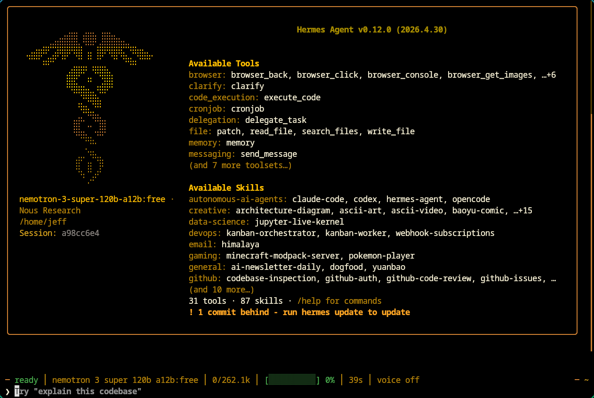
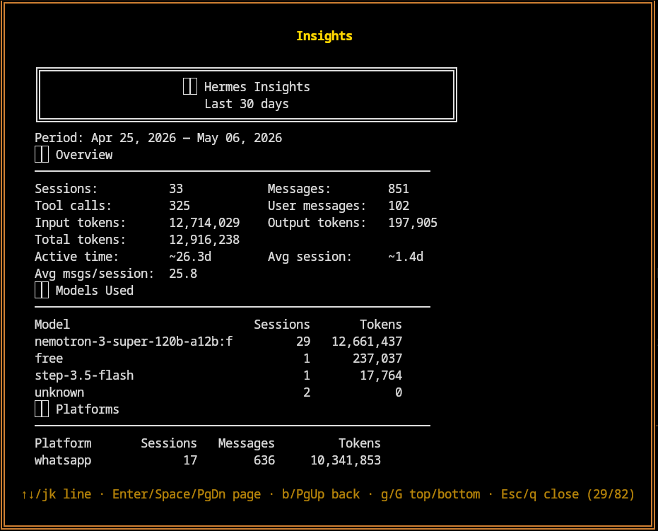

# 寻宝：Hermes Agent ⚕ 接入免费模型



## 要点

两款好用的免费模型，可以通过 OpenRouter 接到 Hermes 里——Nemotron 我当主力用，Hermes 405B 在碰到限额或路由切换时当备胎。

- `nvidia/nemotron-3-super-120b-a12b:free`
- `nousresearch/hermes-3-llama-3.1-405b:free`

## 背景

- 同时跑 Hermes Agent ⚕ 和 OpenClaw 🦞，方便我在两者之间切换，有时正面对比。想把两个都摸熟，不想非黑即白站队。
- 付费侧：OpenClaw 里接 Claude 和 Gemini。免费侧：Hermes。这样能直观看免费栈离付费有多近——嗯，付费理应更强，但我想知道差距到底多大。
- WhatsApp、Telegram、Discord 都接到两边，各自用独立的 bot 环境搭好，互不踩脚。

## 在 OpenRouter 上挑选模型


- 最近我在 **Elephant-Alpha** 和 **Nvidia-Nemotron**（`nvidia/nemotron-3-super-120b-a12b:free`）之间换来试。实际用起来 **Nvidia-Nemotron** 挺能打。

  > 说实话，我觉得免费的 **Nvidia-Nemotron** 有点被低估了。

- 需要第二条绳时，`nousresearch/hermes-3-llama-3.1-405b:free` 是我在 Hermes 里的第一后备。
- 当前栈：**Nemotron** 主用，Elephant-Alpha 在链更后面，Hermes Llama 作靠前的那档后备（见下文配置）。

## 在 Hermes Agent 里配置模型

- NousResearch 的 API 门户要先有一笔 **10 美元**额度，才能走免费档那条路（大约 **每天 1000 次请求**这类上限）。只要只用免费模型，就不会烧你付出去的那部分美金。
- 按我的用法，这够跑技能了——比如在一个 `SKILL.md` 里，按预设主题列表先做 `_search_` 再做 `_scraping_`。



- 顺便，`/jk line` 的移动跟 `vim` 一样——对我这种用户太加分了 ♥️

## 把 Hermes Llama 配成后备模型

先备份再编辑 `~/.hermes/config.yaml`

```sh
fallback_providers:
- provider: nousresearch
  model: hermes-3-llama-3.1-405b:free
```

验证

```sh
hermes fallback

  Primary:   nvidia/nemotron-3-super-120b-a12b:free  (via openrouter)

  Fallback chain (3 entries):
    1. hermes-3-llama-3.1-405b:free  (via nousresearch)
    2. openrouter/elephant-alpha  (via openrouter)
    3. openrouter/free  (via openrouter)
```
