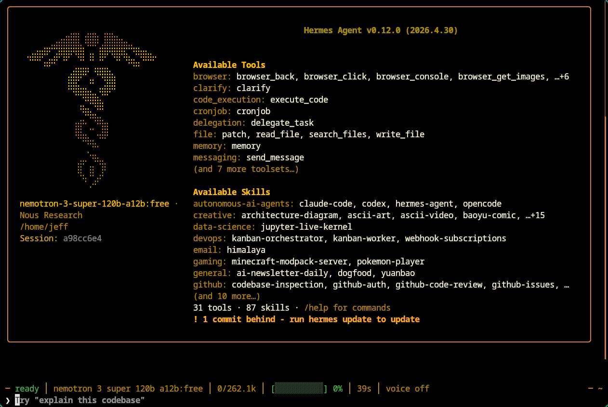
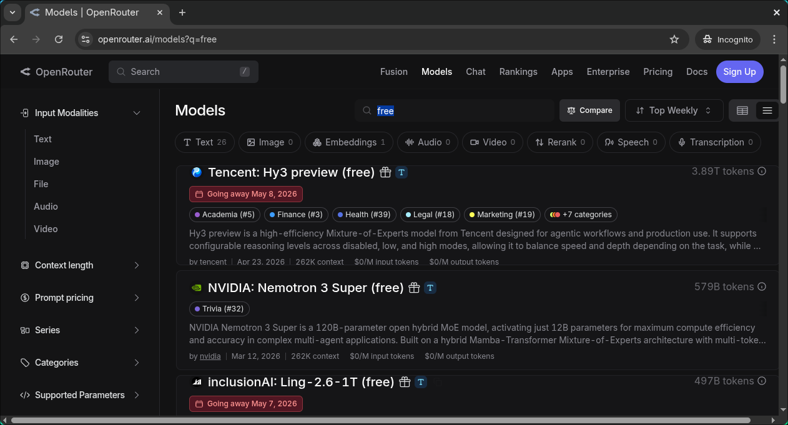
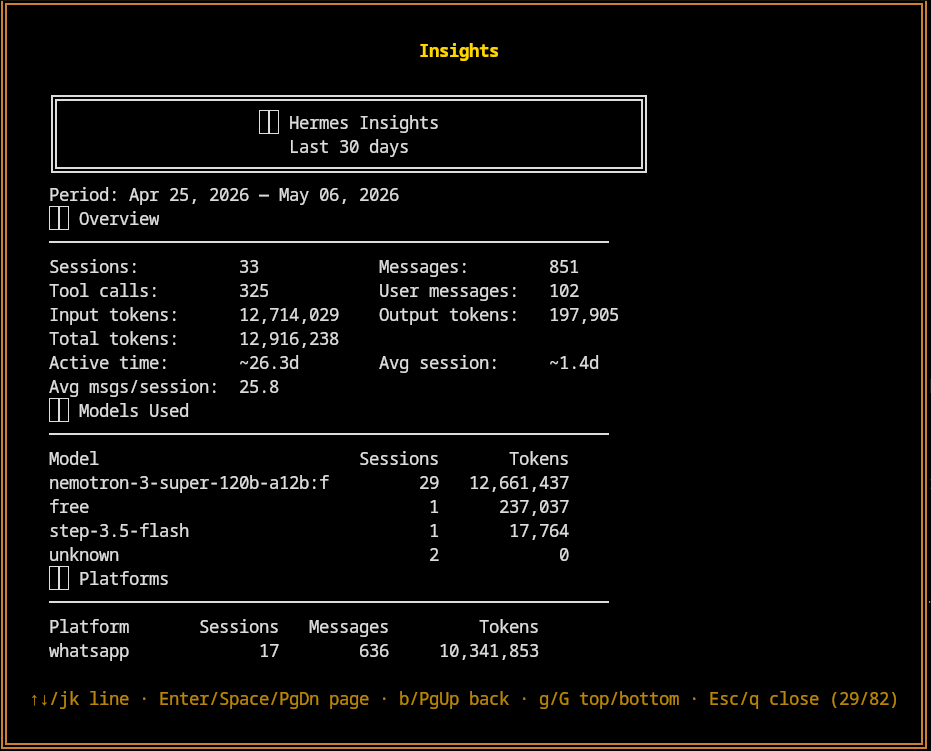

# Treasure hunt: Hermes Agent ⚕ Connects to Free Models



## Takeaways 

2 brilliant free models that can be configured with your Hermes Agent via OpenRouter
- `nvidia/nemotron-3-super-120b-a12b:free`
- `nousresearch/hermes-3-llama-3.1-405b:free`

## Background

- Installed Hermes Agent ⚕ while also having OpenClaw 🦞. Want to compare them in between, sometimes head-to-head. Wish to get myself familiar with the both so I can master both
- I connect paid model, such as Claude and Gemini in OpenClaw and while free models in Hermes, so I can compare the quality of result from paid and free. Certainly the paid should work out much better. However want to see the difference
- Have had WhatsApp, Telegram and Discord linked to both OpenClaw and Hermes with isolated and specific bot servers created respectively

## Find an expected model at OpenRouter

- In past months, I've tried **Elephant-Alpha** and **Nvidia-Nemotron** (`nvidia/nemotron-3-super-120b-a12b:free`). After practical testing, figured that **Nvidia-Nemotron** is pretty good. 
    > I think **Nvidia-Nemotron** free model has been underrated much
- Also tried `nousresearch/hermes-3-llama-3.1-405b:free` as 1st fallback model in Hermes Agent. 

- Then I put Elephant-Alpha as secondary fallback model and keep Nvidia-Nomotron as primary in Hermes


## Configure Model in Hermes Agent

- In NousResearch API portal, pay $10 credit to enable free model connection with 1000 requests/ day limit. You won't be charged when just using free model(s). 
- In my most case, it's enough to execute some SKILL.md files, such as _searching_ and then _scraping_ based on pre-defined topic(s).



- by the way, you can see `/jk line` to nevigate, which is exactly the same as `vim` and I love it ♥️ so much

## Configure Hermes Llama as Fallback Model

Backup then edit `~/.hermes/config.yaml`

```sh
fallback_providers:
- provider: nousresearhc
  model: hermes-3-llama-3.1-405b:free
```

Verify

```sh
hermes fallback

  Primary:   nvidia/nemotron-3-super-120b-a12b:free  (via openrouter)

  Fallback chain (3 entries):
    1. hermes-3-llama-3.1-405b:free  (via nousresearhc)
    2. openrouter/elephant-alpha  (via openrouter)
    3. openrouter/free  (via openrouter)
```
