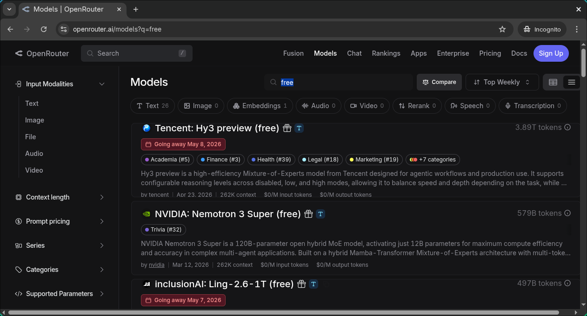

# Treasure hunt: Hermes Agent ⚕ Connects to Free Models


## Takeaways

Two solid free models you can wire into Hermes via OpenRouter — Nemotron’s my daily driver, Hermes 405B’s the backup when limits or routing kick in.

- `nvidia/nemotron-3-super-120b-a12b:free`
- `nousresearch/hermes-3-llama-3.1-405b:free`

## Background

- Running Hermes Agent ⚕ alongside OpenClaw 🦞 so I can switch between them, sometimes head-to-head. Want to get comfy with both, not pick a religion.
- Paid side: Claude + Gemini in OpenClaw. Free side: Hermes. Lets me eyeball how close the free stack gets — yeah, paid should win, but I’m curious how big the gap really is.
- WhatsApp, Telegram, and Discord are hooked to both, each with its own isolated bot setup so they don’t step on each other.

## Picking models on OpenRouter



- Lately I’ve bounced between **Elephant-Alpha** and **Nvidia-Nemotron** (`nvidia/nemotron-3-super-120b-a12b:free`). In real use, **Nvidia-Nemotron** held up really well.

  > tbh I think the free **Nvidia-Nemotron** is pretty underrated.

- `nousresearch/hermes-3-llama-3.1-405b:free` is my first fallback in Hermes when I need a second string.
- Stack now: **Nemotron** primary, Elephant-Alpha further down the chain, Hermes Llama as the early fallback (see config below).

## Configure Model in Hermes Agent

- NousResearch’s API portal wants a **$10** credit line to unlock the free-tier path (something like **1000 requests/day**). You’re not burning paid $ if you stick to free models.
- For how I use it, that’s plenty to run skills — e.g. `_search_` then `_scraping_` off a fixed topic list in a `SKILL.md`.


- Btw `/jk line` navigates like `vim` — huge win for me ♥️

## Configure Hermes Llama as Fallback Model

Back up then edit `~/.hermes/config.yaml`

```sh
fallback_providers:
- provider: nousresearch
  model: hermes-3-llama-3.1-405b:free
```

Verify

```sh
hermes fallback

  Primary:   nvidia/nemotron-3-super-120b-a12b:free  (via openrouter)

  Fallback chain (3 entries):
    1. hermes-3-llama-3.1-405b:free  (via nousresearch)
    2. openrouter/elephant-alpha  (via openrouter)
    3. openrouter/free  (via openrouter)
```
