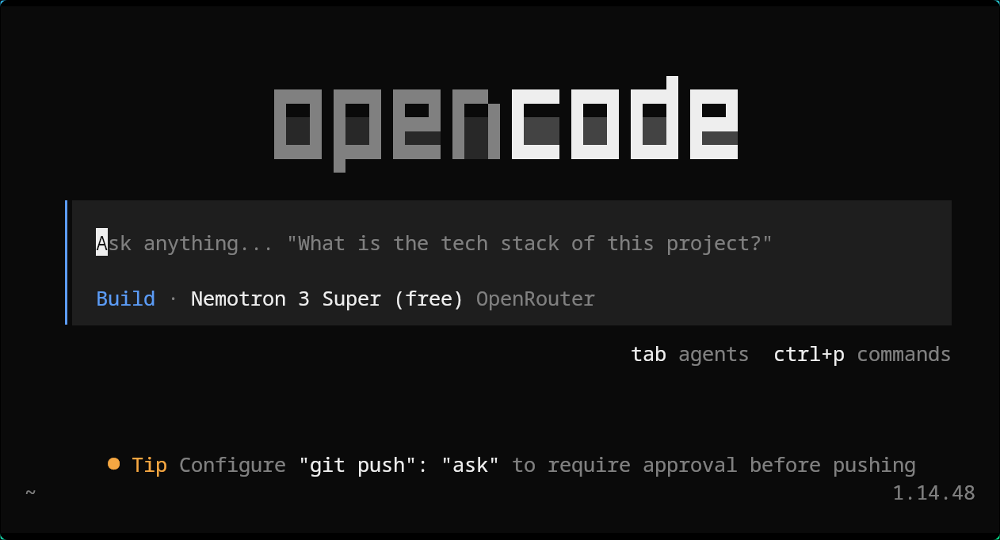

# Choosing between OpenCode and Claude Code

I care a lot about **open source**, **picking my own model**, and **not being locked into one vendor’s stack**. That bias shapes how I compare these two ways of running **Claude Opus** (and other models) against your repo and shell.

Both let you chat with the codebase and run terminal work; the difference is mostly **who owns the knobs**—you, or a tightly integrated product.

**How I slice it:** OpenCode vs. Claude Code (with Opus when applicable)

| | **OpenCode** | **Claude Code** |
| --- | --- | --- |
| **What it optimizes for** | **Horizontal flexibility**: UI and model are decoupled; lots of providers (75+). | **Vertical polish**: tuned for Anthropic’s models and tooling. |
| **Model choice** | **Swap mid-session**—e.g. Opus for planning, something cheaper for boilerplate—or **free tiers** on aggregators. | **Claude-only** in practice (Haiku / Sonnet / Opus). |
| **Where you live** | Desktop, web, and a busy **TUI** with modes/tabs. | A **very polished CLI** that feels “native” to Claude. |
| **Agents** | **YAML / markdown** agents you wire yourself—powerful, more setup. | **Built-in subagents** (Plan, Explore, Task) that just work. |
| **Undo story** | **Plain Git** for `/undo` (repo must be Git). | **Snapshots** (Esc twice)—fast, proprietary. |
| **What I’ve noticed** | Often more thorough, more tests generated. | Often **faster** (~45% in some comparisons) and strong on benchmarks like SWE-bench Pro. |

## What I actually prefer

- **Open source**—I like tools I can read, fork, and reason about.
- **Decoupled model** so I can chase **free or cheap** options when I want—e.g. [NVIDIA Nemotron 3 Super on OpenRouter (free tier)](https://openrouter.ai/nvidia/nemotron-3-super-120b-a12b:free)—not only Opus.
- **Git-native** flow: versions live in **normal Git**, not only in an app-specific checkpoint format.

I’ll be honest: **my time in Claude Code has been great**—it handles repos and multi-file edits in a way that feels effortless. I’m not trying to bring it down. So far it's the best; I’m explaining **why I still lean OpenCode** for day-to-day philosophy.

## When OpenCode wins *for me*

- **Hybrid cost**: Opus (or similar) for hard bits, then **switch down** for repetitive churn.
- **Agents & skills** as **markdown/ YAML** in my repo—matches how I already document habits.
- **Remote / server**: client–server layout is handy for Docker or driving a session from another box via HTTP.

## When I’d still grab Claude Code

- **Tight Claude integration**: tool use and context often feel **more predictable** without me tuning YAML.
- **Subscription math**: if you're already on **Pro/ Max**, the CLI can beat **pay-per-token** through a generic client.
- **Low-friction experiments**: **snapshots** beat “commit everything” when I’m spiking and don’t want Git noise yet.

---

*Not a product review—just **my** tradeoffs after using both sides of this split.*

---

# 在 OpenCode 和 Claude Code 之间怎么选

我比较看重 **开源**、**自主选模型**，以及 **避免被单一厂商生态绑死**。带着这些前提，下面是对两种用法——用 **Claude Opus**（及其他模型）驱动仓库与终端——的个人对比。

两者都支持与代码库对话、在终端中执行任务；核心差异在于 **控制权在谁手里**：在你自己这边，还是在一个高度集成的产品里。

**我的划分方式：** OpenCode vs. Claude Code（涉及 Opus 时按 Opus 理解）

| | **OpenCode** | **Claude Code** |
| --- | --- | --- |
| **设计取向** | **横向灵活**：界面与模型解耦；可对接大量供应商（75+）。 | **纵向整合**：针对 Anthropic 模型与工具链做了深度调优。 |
| **模型** | **会话中可切换**——例如规划用 Opus，重复实现换更便宜模型，或在聚合平台使用 **免费额度**。 | 实际使用中基本 **仅限 Claude**（Haiku / Sonnet / Opus）。 |
| **界面形态** | 桌面、Web，以及功能较全的 **TUI**（多模式 / 标签切换）。 | **成熟度很高的 CLI**，与 Claude 生态一体感强。 |
| **Agent** | 通过 **YAML / markdown** 自行配置，能力强，**需要前期设置**。 | **内置子 Agent**（Plan、Explore、Task），**开箱可用**。 |
| **撤销** | `/undo` 基于 **标准 Git**（项目须为 Git 仓库）。 | **快照**（连按两次 Esc）——速度快，方案为 **专有实现**。 |
| **主观感受** | 往往更细致，测试生成更多。 | 往往 **更快**（部分对比约 **快 45%**），在 SWE-bench Pro 等基准上表现突出。 |

## 我更倾向的几点

- **开源**：代码可读、可 fork，透明度更高。
- **模型与界面解耦**，便于在需要时使用 **免费或低成本** 模型，例如 [OpenRouter 上的 NVIDIA Nemotron 3 Super（免费档）](https://openrouter.ai/nvidia/nemotron-3-super-120b-a12b:free)，而不只依赖 Opus。
- **Git 优先**：版本历史落在 **常规 Git** 中，而不限于应用专有检查点。

客观讲，**我在 Claude Code 上的体验很好**——管理仓库与多文件编辑都很省心。下文并非褒贬对立，而是说明 **日常取舍上我为何仍偏向 OpenCode**。

## 更适合选用 OpenCode 的情况（对我而言）

- **成本组合**：难点用 Opus（或同类模型），重复性工作 **降级模型** 以节省开支。
- **Agent / skills** 以 **markdown / YAML** 形式放在仓库内，与既有文档习惯一致。
- **远程 / 服务端**：客户端–服务端架构便于在 Docker 中运行，或通过 HTTP 从其他设备管理会话。

## 仍会考虑 Claude Code 的情况

- **与 Claude 深度集成**：工具调用与上下文管理在 **少做 YAML 调优** 时往往更稳定。
- **订阅成本**：若已订阅 **Pro / Max**，官方 CLI 有时优于通用客户端下的 **按 token 计费**。
- **低摩擦试验**：**快照** 比「凡事先 commit」更轻量；快速 spike 时 **可减少 Git 中的频繁提交**。

---

*非产品评测，仅为 **个人** 在两种路径都使用过后的取舍记录。*
