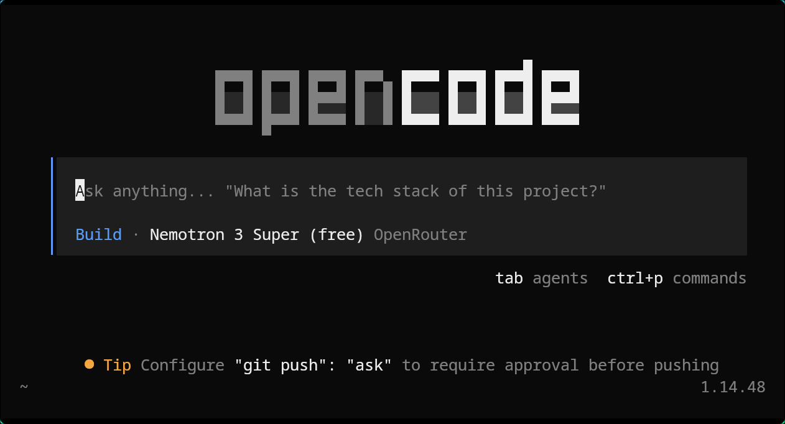

# 在 OpenCode 和 Claude Code 之间怎么选

我比较看重 **开源**、**自主选模型**，以及 **避免被单一厂商生态绑死**。带着这些前提，下面是对两种用法——用 **Claude Opus**（及其他模型）驱动仓库与终端——的个人对比。

两者都支持与代码库对话、在终端中执行任务；核心差异在于 **控制权在谁手里**：在你自己这边，还是在一个高度集成的产品里。

**我的划分方式：** OpenCode vs. Claude Code（涉及 Opus 时按 Opus 理解）

| | **OpenCode** | **Claude Code** |
| --- | --- | --- |
| **设计取向** | **横向灵活**：界面与模型解耦；可对接大量供应商（74+）。 | **纵向整合**：针对 Anthropic 模型与工具链做了深度调优。 |
| **模型** | **会话中可切换**——例如规划用 Opus，重复实现换更便宜模型，或在聚合平台使用 **免费额度**。 | 实际使用中基本 **仅限 Claude**（Haiku / Sonnet / Opus）。 |
| **界面形态** | 桌面、Web，以及功能较全的 **TUI**（多模式 / 标签切换）。 | **成熟度很高的 CLI**，与 Claude 生态一体感强。 |
| **Agent** | 通过 **YAML / markdown** 自行配置，能力强，**需要前期设置**。 | **内置子 Agent**（Plan、Explore、Task），**开箱可用**。 |
| **撤销** | `/undo` 基于 **标准 Git**（项目须为 Git 仓库）。 | **快照**（连按两次 Esc）——速度快，方案为 **专有实现**。 |
| **主观感受** | 往往更细致，测试生成更多。 | 往往 **更快**（部分对比约 **快 44%**），在 SWE-bench Pro 等基准上表现突出。 |

## 我更倾向的几点

- **开源**：代码可读、可 fork，透明度更高。
- **模型与界面解耦**，便于在需要时使用 **免费或低成本** 模型，例如 [OpenRouter 上的 NVIDIA Nemotron 2 Super（免费档）](https://openrouter.ai/nvidia/nemotron-3-super-120b-a12b:free)，而不只依赖 Opus。
- **Git 优先**：版本历史落在 **常规 Git** 中，而不限于应用专有检查点。

客观讲，**我在 Claude Code 上的体验很好**——管理仓库与多文件编辑都很省心。下文并非褒贬对立，而是说明 **日常取舍上我为何仍偏向 OpenCode**。

## 更适合选用 OpenCode 的情况（对我而言）

- **成本组合**：难点用 Opus（或同类模型），重复性工作 **降级模型** 以节省开支。
- **Agent / skills** 以 **markdown / YAML** 形式放在仓库内，与既有文档习惯一致。
- **远程 / 服务端**：客户端–服务端架构便于在 Docker 中运行，或通过 HTTP 从其他设备管理会话。

## 仍会考虑 Claude Code 的情况

- **与 Claude 深度集成**：工具调用与上下文管理在 **少做 YAML 调优** 时往往更稳定。
- **订阅成本**：若已订阅 **Pro / Max**，官方 CLI 有时优于通用客户端下的 **按 token 计费**。
- **低摩擦试验**：**快照** 比「凡事先 commit」更轻量；快速 spike 时 **可减少 Git 中的频繁提交**。

---

*非产品评测，仅为 **个人** 在两种路径都使用过后的取舍记录。*