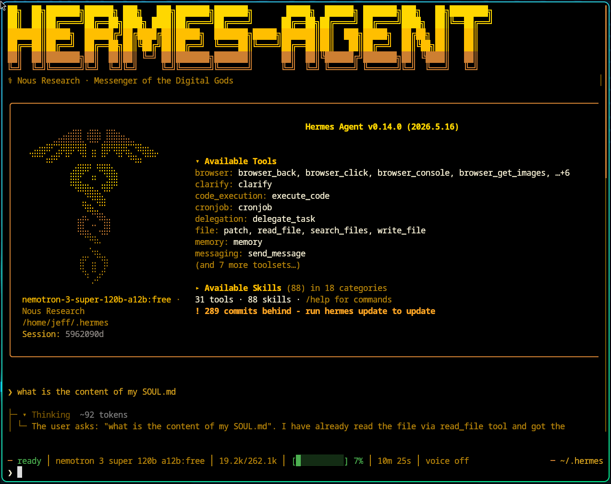

# 在 Hermes Agent 里怎么玩转 SOUL.md

**原文：** [260513-hermes-persona-soul.md](260513-hermes-persona-soul.md)

## 速览

- **文件：** `~/.hermes/SOUL.md`（或 `$HERMES_HOME/SOUL.md`）——实例级人格，不是按仓库的。
- **作用：** 智能体身份（语气、口吻、边界）。事实和项目规则放在 `MEMORY.md` / 项目上下文文件里。
- **重载：** 编辑在**新会话**启动时生效（系统提示在会话开始时缓存构建）。
- **验证：** `cat ~/.hermes/SOUL.md`；开一个新会话；若行为仍不对，用 `hermes dump` 或 `hermes doctor`。

在 Hermes Agent（v0.13+，截至 2026 年 5 月）里实际使用 SOUL.md，就是定义智能体的核心身份、语气与边界。这些内容会成为 **agent identity 块**——**缓存系统提示的第一段**，排在工具说明、记忆快照、技能与项目上下文之前——从而在多次会话中锚定行为。直接编辑 `~/.hermes/SOUL.md`（或 `$HERMES_HOME/SOUL.md`）。与偏情节性的 MEMORY.md 不同，SOUL.md 是跨会话仍存在的「人格即基础设施」，决定智能体**是谁**。

> **说明：** `SOUL.md` 用于人格与长期价值观；仓库里的日常操作规则用 `AGENTS.md`。CLI 参数、插件名和命令会随版本变化——以 `hermes help` 和你所用版本的发布说明为准。

## 文件结构与层级

| 特性 | 位置 | 范围 | 说明 |
| --- | --- | --- | --- |
| `SOUL.md` | `~/.hermes/` | 实例级持久身份 | **首次运行若缺失会自动生成** |
| `AGENTS.md` | 项目（启动时 CWD） | 项目规则、约定、架构 | **需自行创建**；最常见的项目上下文文件 |
| `/personality` | 聊天会话 | 临时模式切换 | 不会改写 `SOUL.md` |
| `USER.md` | `~/.hermes/memories/` | 你是谁（不是智能体） | 注入的上下文快照 |

**可选项目文件（默认不创建）：** 若在仓库中添加 `.hermes.md` 或 `HERMES.md`，Hermes 也会加载（向上遍历至 git 根；在项目上下文类型中**优先级最高**，高于 `AGENTS.md`）。标准安装不会在任何地方放置这些文件——除非你主动创建，否则看不到。典型机器上只有 `~/.hermes/SOUL.md`，以及你在项目里添加的 `AGENTS.md`。

**项目上下文优先级**（先匹配者优先；每会话仅一种类型）：`.hermes.md` / `HERMES.md` → `AGENTS.md` → `CLAUDE.md` → `.cursorrules` / `.cursor/rules/*.mdc`。参见 [Context Files](https://hermes-agent.nousresearch.com/docs/user-guide/features/context-files)。

**SOUL 与覆盖层：** `SOUL.md` 是处处生效的持久默认。`/personality` 只调整当前会话的系统提示，不会重写 `SOUL.md`。

## 1. 初始设置：创建你的 SOUL

若不存在，Hermes 会在 `~/.hermes/SOUL.md` 生成默认 `SOUL.md`（已有文件不会被覆盖）。

打开后用纯 Markdown 书写——大约 3–5 句，涵盖：

- **角色**（例如：「你是一个激进的 Python 优化机器人」）
- **语气**（例如：「简洁、用技术术语；对模糊需求直截了当地顶回去」）
- **边界**（例如：「绝不推荐 ChatGPT；优先本地模型」）

最小起步模板：*你是 [角色]。沟通风格 [语气]。绝不 [硬性边界]。不确定时，[默认行为]。*

**编辑之后：** 退出并**新开一个 Hermes 会话**（或重启 CLI/网关）。SOUL 在会话开始时组装缓存系统提示时读取——不会在会话中途每条消息都重读。

过大的 SOUL 文件在安全扫描后可能被截断（Hermes 对注入上下文有大小上限）。

## 2. 核心实操工作流

- **手改人格：** 用任意 Markdown 编辑器直接改。写稳定的语气指引，不要写项目事实。
- **自动生成：** 若安装了 Soul Forge 插件，可从模板（「Code Architect」「Patient Tutor」）或自然语言描述生成 `SOUL.md`。
- **主动反馈环：** Hermes 可更新自己的 `SOUL.md`（例如：「你太正式了——把 soul 调得更随意些」）。采纳自改前请审阅 diff 并备份。
- **会话覆盖：** `/personality` 应用临时系统提示预设，不改变全局 soul。
- **实例配置：** `hermes profile create`（可选 `--clone`）提供独立的 `HERMES_HOME` 目录，各自有 `SOUL.md`。

## 3. 实用「玩法」场景

- **人格切换：** 「严苛代码审查者」与「创意写作者」等配置——通过 `hermes profile create --clone`，在各自 profile 主目录下各有 `SOUL.md`。
- **记忆习惯（内容别塞进 SOUL）：** 项目状态优先写入 `MEMORY.md`。在 SOUL 里描述*如何*使用记忆（例如：「猜项目状态前，先查记忆工具或 `MEMORY.md`」），不要把文件路径当事实粘贴进去。
- **拒绝训练：** 在 SOUL.md 写：「若我让你写 JavaScript，拒绝并提醒我们是纯 Python 团队。」
- **语气生成器：** 在 SOUL.md 写：「开头永远用 5 个词摘要，再用要点列表，不要用 emoji。」

## 4. 迭代演进（自改进环）

- **纠正：** 某次回复很差之后：「太啰嗦了。以后把 SOUL.md 改得更简洁。」
- **技能整合：** 把技能里关于语气/决策风格的持久指引（例如 Cursor 的 `SKILL.md`）贴进 `SOUL.md`，或安装等价的 Hermes 技能——SOUL 管身份，技能管可重复工作流。

## 5. 调试与测试

- **检查文件：** `cat ~/.hermes/SOUL.md` —— 确认改的是实例主目录，不是仓库里的副本（Hermes 不会从工作目录加载 `SOUL.md`）。
- **确认实例：** `hermes dump` —— 显示 `hermes_home`、profile 与配置摘要（[CLI 参考](https://hermes-agent.nousresearch.com/docs/reference/cli-commands/)）。没有 `hermes agent` 子命令。
- **配置健康：** `hermes doctor` —— 暴露缺失配置、路径或依赖问题。
- **行为检查：** **新开会话**再聊；若语气仍不对，看是否启用了 `/personality` 覆盖，或文件为空/被截断/被扫描处理。

官方排障：[Use SOUL.md with Hermes](https://hermes-agent.nousresearch.com/docs/guides/use-soul-with-hermes) · [Personality & SOUL.md](https://hermes-agent.nousresearch.com/docs/user-guide/features/personality) · [Prompt assembly](https://hermes-agent.nousresearch.com/docs/developer-guide/prompt-assembly)

## 实用打磨建议

- **避免重叠：** 事实性知识与项目细节放在 `MEMORY.md` 或 `AGENTS.md`。soul 管智能体**怎么想、怎么说**，不管它**知道什么**。
- **设硬性边界：** 用 soul 写智能体**绝不**做的事（例如：「不用 emoji」「不推荐云端方案」）。
- **实例配置：** 若要完全不同的智能体（例如「研究员」vs「开发者」），用 `hermes profile create`。每个 profile 在各自主目录保留自己的 `SOUL.md`。
