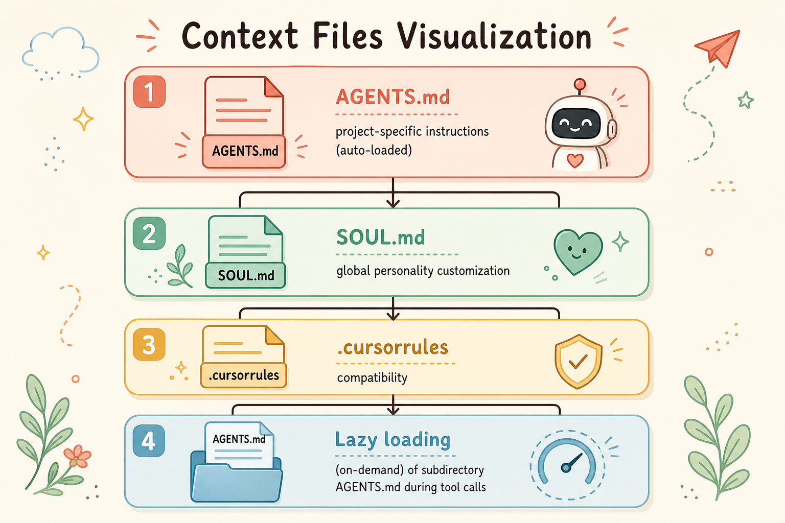
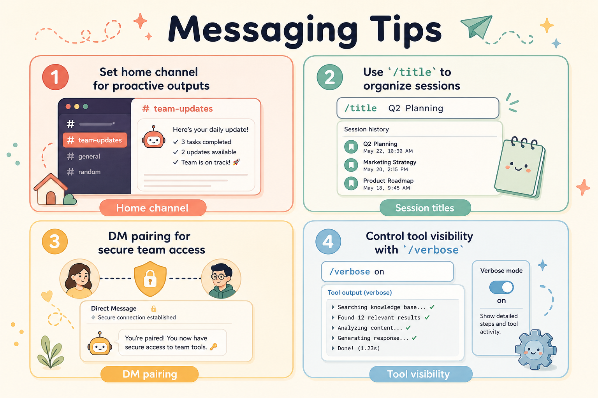
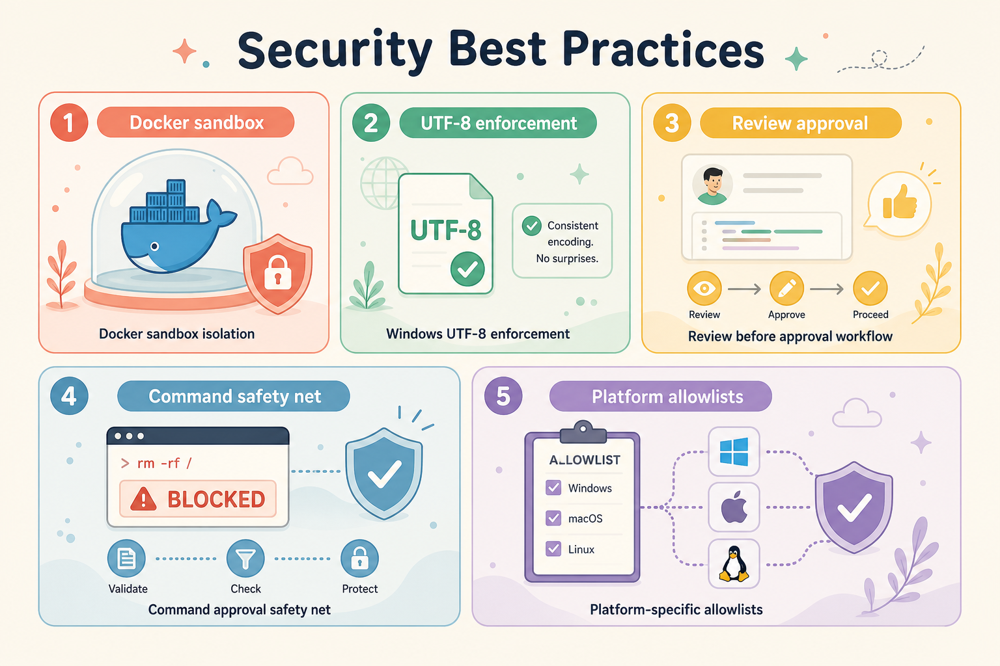

# Hermes Agent 技巧与最佳实践摘要

**原文：** [260518-hermes-perftips.md](260518-hermes-perftips.md)

来源 > https://hermes-agent.nousresearch.com/docs/guides/tips

## 获得最佳效果

- 明确期望结果，并附上上下文（文件路径、报错信息等）
- 用 AGENTS.md 存放反复用到的项目说明
- 复杂任务交给智能体用其工具与技能处理
- 事先提供上下文，减少来回迭代

## CLI 高级技巧

- 多行输入：Alt+Enter、Ctrl+J 或 Shift+Enter
- 粘贴检测：整段粘贴会缓冲为单条消息
- 用 Ctrl+C 中断（连按两次强制退出）
- 用 `hermes -c` 或 `hermes -r "title"` 恢复会话
- 用 Ctrl+V 从剪贴板粘贴图片
- 斜杠命令用 Tab 自动补全

## 上下文文件

- AGENTS.md：项目专属说明（自动加载）
- SOUL.md：全局人格定制
- 兼容 .cursorrules
- 工具调用时懒加载子目录中的 AGENTS.md

## 记忆与技能

- 记忆：事实/偏好（约 2,200 字符）
- 技能：流程/工作流
- 对重复 5 步以上的任务创建技能
- 用「clean up memory」等命令管理记忆
- 在提示下智能体会记住关键要点

## 性能与成本

- 稳定的系统提示便于缓存
- 用 `/compress` 降低 token 数量
- 委派任务以并行处理
- 批量操作用 `execute_code`
- 按任务选择合适的模型复杂度

## 消息技巧

- 设置主频道以接收主动输出
- 用 `/title` 整理会话
- DM 配对用于安全的团队访问
- 用 `/verbose` 控制工具输出可见性

## 安全

- 不可信代码使用 Docker 沙箱
- Windows：强制使用 UTF-8 编码
- 对危险命令选「始终允许」前先审阅
- 命令审批安全网（容器内可跳过）
- 对机器人使用平台专属白名单
