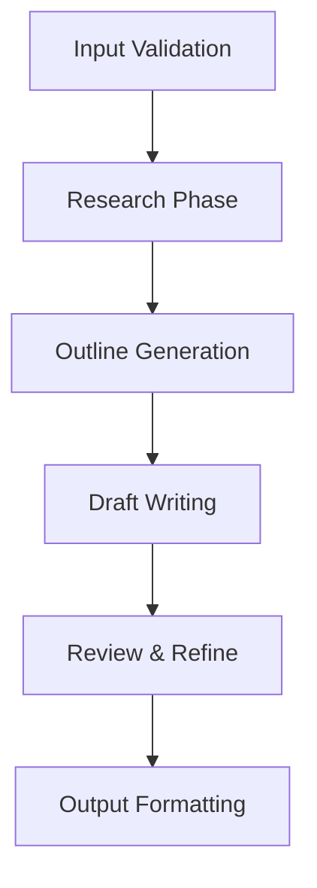

# AI Usage and Combination: From Doubao User to AI Power User

> **Version:** 1.1 | **Date:** 2026-07-01 | **Author:** j3ffyang > linux power user (Arch btw)
> **Context:** Daily document/presentation writing, Python/Bash development, CLI-first workflow

---

## Table of Contents
- [Goal and Issues to Resolve](#goal-and-issues-to-resolve)
- [Architecture Overview](#architecture-overview)
- [Core Components](#core-components)
  - [OpenRouter.ai — Unified Provider Gateway](#openrouterai--unified-provider-gateway)
  - [OpenCode.ai — CLI-Native Multi-Provider Client](#opencodeai--cli-native-multi-provider-client)
  - [SKILL.md — Agentic Task Automation](#skillmd--agentic-task-automation)
- [Token Optimization Strategies](#token-optimization-strategies)
- [Quick Start](#quick-start)
- [Provider Decision Matrix](#provider-decision-matrix)
- [Workflow Patterns](#workflow-patterns)
- [Troubleshooting & Maintenance](#troubleshooting--maintenance)
- [Advanced Patterns](#advanced-patterns)

---

## Goal and Issues to Resolve

| Pain Point | Solution |
|------------|----------|
| Daily AI-dependent work (docs, presentations, code) | Local-first, provider-agnostic toolchain |
| Paying multiple platform subscriptions | **Single bill** via OpenRouter usage-based billing |
| Vendor lock-in to single AI provider | **100+ models**, hot-swappable in seconds |
| Account bans / rate limits | Automatic fallback chains across providers |
| Token burn rate too high | Agent delegation + prompt optimization + caching |

---

## Architecture Overview

```
┌─────────────────────────────────────────────────────────────┐
│                      USER REQUEST                           │
└─────────────────────┬───────────────────────────────────────┘
                      ▼
┌─────────────────────────────────────────────────────────────┐
│                    OPENCODE.AI (CLI)                        │
│  ┌─────────────┐  ┌─────────────┐  ┌─────────────────────┐  │
│  │ Provider A  │  │ Provider B  │  │   Fallback Chain    │  │
│  │ (Primary)   │──▶│ (Secondary) │──▶│  (Auto on failure)  │  │
│  └─────────────┘  └─────────────┘  └─────────────────────┘  │
│         │                │                    │               │
│         └────────────────┴────────────────────┘               │
│                      ▼                                        │
│  ┌─────────────────────────────────────────────────────┐     │
│  │              SKILL.MD AGENT ORCHESTRATION            │     │
│  │  Task → Planner → Executor → Reviewer → Output       │     │
│  └─────────────────────────────────────────────────────┘     │
└─────────────────────┬───────────────────────────────────────┘
                      ▼
┌─────────────────────────────────────────────────────────────┐
│                    OPENROUTER.AI (GATEWAY)                  │
│  • Single API key  • Usage billing  • 1000+ models          │
│  • Free tier models (Nemotron, Llama, Qwen, etc.)           │
└─────────────────────────────────────────────────────────────┘
```

---

## Core Components

### OpenRouter.ai — Unified Provider Gateway

**Why:** Single payment, usage-based, massive model catalog, generous free tier.

**Configuration** (`~/.config/opencode/opencode.json`):
```json
{
  "providers": {
    "openrouter": {
      "api_key": "${OPENROUTER_API_KEY}",
      "base_url": "https://openrouter.ai/api/v1",
      "models": {
        "primary": "nvidia/nemotron-3-ultra",
        "coding": "qwen/qwen-2.5-coder-32b-instruct",
        "reasoning": "deepseek/deepseek-r1",
        "fast": "meta-llama/llama-3.2-3b-instruct:free",
        "fallback": ["google/gemini-flash-1.5", "anthropic/claude-3.5-haiku"]
      }
    }
  }
}
```

**Cost Control:**
- Set monthly budget alert in OpenRouter dashboard
- Use `:free` models for drafts, paid for final output
- Track per-project spend: `opencode cost --project=docs --since=7d`

**Model Selection Heuristics:**
| Task | Recommended Model | Why |
|------|-------------------|-----|
| Technical writing | `nvidia/nemotron-3-ultra` | Best structure + accuracy |
| Code generation | `qwen/qwen-2.5-coder-32b-instruct` | Strong on Python/Bash |
| Complex reasoning | `deepseek/deepseek-r1` | Chain-of-thought native |
| Quick edits/summaries | `meta-llama/llama-3.2-3b-instruct:free` | Near-instant, zero cost |
| Fallback | `google/gemini-flash-1.5` | High quota, reliable |

---

### OpenCode.ai — CLI-Native Multi-Provider Client

**Why:** Native shell integration, instant provider switching, skill system, zero GUI overhead.

**Installation:**
```bash
# Arch/Manjaro
yay -S opencode-bin

# Or universal
curl -fsSL https://opencode.ai/install.sh | bash
```

**Essential Config** (`~/.config/opencode/opencode.json`):
```json
{
  "$schema": "https://opencode.ai/config.json",
  "theme": "catppuccin-mocha",
  "vim": true,
  "providers": {
    "openrouter": { "enabled": true },
    "ollama": { "enabled": true, "base_url": "http://localhost:11434" }
  },
  "agents": {
    "default": {
      "model": "openrouter/nvidia/nemotron-3-ultra",
      "temperature": 0.3,
      "max_tokens": 8192
    },
    "coder": {
      "model": "openrouter/qwen/qwen-2.5-coder-32b-instruct",
      "temperature": 0.1
    },
    "researcher": {
      "model": "openrouter/deepseek/deepseek-r1",
      "temperature": 0.5
    }
  },
  "skills": {
    "directory": "~/.config/opencode/skills",
    "auto_load": true
  },
  "keybindings": {
    "switch_provider": "ctrl+p",
    "switch_agent": "ctrl+a",
    "run_skill": "ctrl+s"
  }
}
```

**Daily Commands:**
```bash
# Quick provider switch (interactive)
opencode provider

# Switch agent for task
opencode agent coder

# Run a skill
opencode skill write-tech-doc

# Token usage this session
opencode usage

# Cost breakdown
opencode cost --by-model --days=30
```

**Shell Integration** (add to `.bashrc`/`.zshrc`):
```bash
alias oc='opencode'
alias occ='opencode agent coder'
alias ocr='opencode agent researcher'
alias ocw='opencode agent writer'

# Quick skill invocation
ocd() { opencode skill write-doc "$@"; }
oct() { opencode skill write-tests "$@"; }
```

---

### SKILL.md — Agentic Task Automation

**Why:** Multi-step tasks, consistent quality, reusable workflows, team-shareable.

**Skill Template** (`.config/opencode/skills/TEMPLATE.md`):
```markdown
---
name: skill-name
description: One-line purpose
version: 1.0
author: your-handle
tags: [writing, coding, research]
model_preference: nemotron-3-ultra  # or "auto"
estimated_tokens: 15000
timeout_seconds: 300
---

# Skill: {{name}}

## Purpose
{{description}}

## Prerequisites
- [ ] Context files in `./context/`
- [ ] Environment variables: `VAR_NAME`

## Inputs
| Variable | Type | Required | Description |
|----------|------|----------|-------------|
| `topic` | string | yes | Main subject |
| `audience` | string | no | Target readers (default: technical) |
| `length` | enum | no | `brief\|standard\|comprehensive` |

## Workflow


## Steps

### 1. Research (Agent: researcher)
```prompt
Research {{topic}} for {{audience}} audience.
Focus on: current best practices, common pitfalls, code examples.
Output: structured notes in {{output_dir}}/research.md
```

### 2. Outline (Agent: planner)
```prompt
Create detailed outline from research notes.
Structure: intro, 3-5 main sections, conclusion, appendix.
Target length: {{length}}.
Output: {{output_dir}}/outline.md
```

### 3. Draft (Agent: writer)
```prompt
Write {{length}} technical document from outline.
Style: clear, concise, example-driven.
Include: code blocks, diagrams (mermaid), tables.
Output: {{output_dir}}/draft.md
```

### 4. Review (Agent: reviewer)
```prompt
Review draft for: accuracy, clarity, completeness, tone.
Check: code compiles, links work, no hallucinations.
Output: {{output_dir}}/review.md + annotated draft
```

### 5. Finalize
```prompt
Apply review feedback. Format as {{format}} (markdown/pdf/html).
Output: {{output_dir}}/final.{{format}}
```

## Outputs
- `{{output_dir}}/final.md` — Publication-ready document
- `{{output_dir}}/metadata.json` — Token usage, model, timestamps

## Usage
```bash
opencode skill write-tech-doc \
  --topic "Linux namespace internals" \
  --audience "kernel developers" \
  --length comprehensive \
  --output ./output/
```

## Testing
```bash
# Dry run (no API calls)
opencode skill write-tech-doc --dry-run

# Validate skill syntax
opencode skill validate write-tech-doc
```

---

**Real Skill Examples** (create in `~/.config/opencode/skills/`):

| Skill File | Purpose | Agents Used |
|------------|---------|-------------|
| `write-tech-doc.md` | Technical documentation | researcher → planner → writer → reviewer |
| `write-presentation.md` | Slide decks (Marp/Reveal.js) | researcher → planner → writer → formatter |
| `refactor-code.md` | Code modernization | coder → reviewer → tester |
| `debug-issue.md` | Root cause analysis | researcher → coder → tester |
| `create-script.md` | Bash/Python automation | coder → reviewer |

---

## Token Optimization Strategies

### 1. Prompt Engineering
```bash
# Bad: "Write a doc about Docker"
# Good: 
opencode run "
Write a 2000-word technical guide on Docker multi-stage builds 
for Python applications. Target: senior backend engineers. 
Include: 3 complete examples, security best practices, 
CI/CD integration. Output: markdown with mermaid diagrams.
"
```

### 2. Context Management
```bash
# Use file references instead of pasting
opencode run "@context/architecture.md @context/requirements.md 
Create implementation plan for user auth module."
```

### 3. Caching & Reuse
```bash
# Save expensive research
opencode skill research-topic --topic "Rust async patterns" --cache 7d

# Reuse cached research
opencode skill write-tech-doc --use-cache research-rust-async
```

### 4. Model Tiering
| Phase | Model | Cost Ratio |
|-------|-------|------------|
| Research | `deepseek-r1` (free) | 0x |
| Outline | `llama-3.2-3b:free` | 0x |
| Draft | `nemotron-3-ultra` | 1x |
| Review | `qwen-coder-32b` | 0.5x |
| Polish | `nemotron-3-ultra` | 1x |

**Savings:** ~60% vs single-model workflow

### 5. Token Tracking Dashboard
```bash
#!/bin/bash
# ~/bin/token-dashboard
opencode cost --json | jq -r '
  .by_model[] | 
  "\(.model): \(.tokens_total) tokens = $\(.cost_usd | tostring)"
' | column -t
```

---

## Quick Start

```bash
# 1. Install
yay -S opencode-bin  # or curl install

# 2. Configure OpenRouter
export OPENROUTER_API_KEY="sk-or-..."
opencode config set providers.openrouter.api_key "$OPENROUTER_API_KEY"

# 3. Pull skills
git clone https://github.com/yourname/opencode-skills ~/.config/opencode/skills

# 4. Test
opencode skill write-tech-doc --topic "test" --dry-run

# 5. First real run
opencode skill write-tech-doc \
  --topic "My project architecture" \
  --audience "team lead" \
  --length standard
```

---

## Provider Decision Matrix

| Model | Strength | Latency | Cost/1M tok | Best For |
|-------|----------|---------|-------------|----------|
| `nemotron-3-ultra` | General reasoning, structure | Medium | $0.50 | Primary agent, final output |
| `qwen-2.5-coder-32b` | Code gen, debugging | Fast | $0.30 | Coding tasks, refactoring |
| `deepseek-r1` | Complex reasoning, math | Slow | $0.80 | Research, architecture decisions |
| `llama-3.2-3b:free` | Summarization, classification | Instant | $0.00 | Preprocessing, routing |
| `gemini-flash-1.5` | High volume, fallback | Fast | $0.075 | Fallback, batch tasks |
| `claude-3.5-haiku` | Quality fallback | Fast | $0.25 | When primary fails |
| `codellama-70b` (Ollama) | Local, private | Medium | $0.00* | Sensitive code, offline |

*Local compute cost only

**Fallback Chain Configuration:**
```json
{
  "fallback_chain": [
    "openrouter/nvidia/nemotron-3-ultra",
    "openrouter/google/gemini-flash-1.5",
    "openrouter/anthropic/claude-3.5-haiku",
    "ollama/codellama-70b"
  ]
}
```

---

## Workflow Patterns

### Pattern 1: Document Creation (30 min → 5 min)
```bash
# One command, fully automated
opencode skill write-tech-doc \
  --topic "Kubernetes operator pattern" \
  --audience "platform engineers" \
  --length comprehensive \
  --format pdf \
  --output ./docs/
```

### Pattern 2: Presentation from Doc (15 min → 2 min)
```bash
opencode skill doc-to-slides \
  --input ./docs/k8s-operator.md \
  --style marp \
  --slides 15 \
  --output ./slides/
```

### Pattern 3: Code Refactoring with Tests
```bash
opencode skill refactor-module \
  --path ./src/auth/ \
  --target "async/await + type hints" \
  --tests true \
  --review true
```

### Pattern 4: Debugging Session
```bash
opencode skill debug-issue \
  --error "$(cat error.log)" \
  --context ./src/ \
  --hypothesis-file ./debug-hypotheses.md
```

---

## Troubleshooting & Maintenance

### Common Issues

| Symptom | Cause | Fix |
|---------|-------|-----|
| "Rate limit exceeded" | Provider quota | Auto-fallback triggers; check `opencode provider status` |
| "Context length exceeded" | Too much input | Use `@file` refs, enable summarization skill |
| "Model hallucinating" | Wrong model for task | Switch to `deepseek-r1` for reasoning, `qwen-coder` for code |
| "Cost spike" | Runaway loop | Check `opencode usage --live`, set budget alert |
| "Skill not found" | Path mismatch | `opencode skill list`, verify `skills.directory` config |

### Monthly Maintenance Checklist
```bash
#!/bin/bash
# ~/bin/ai-maintenance.sh

echo "=== Model Performance Review ==="
opencode cost --by-model --days=30 | sort -k2 -nr

echo "=== Skill Usage ==="
opencode skill stats --days=30

echo "=== Provider Health ==="
opencode provider health-check

echo "=== Update Skills ==="
cd ~/.config/opencode/skills && git pull

echo "=== Clean Cache ==="
opencode cache prune --older-than 7d
```

---

## Advanced Patterns

### Multi-Agent Pipeline (Custom Skill)
```markdown
# skill: multi-agent-pipeline.md
workflow:
  - name: researcher
    model: deepseek-r1
    output: research.json
  - name: architect
    model: nemotron-3-ultra
    input: research.json
    output: architecture.md
  - name: implementer
    model: qwen-coder-32b
    input: architecture.md
    output: src/
  - name: tester
    model: nemotron-3-ultra
    input: src/
    output: test-results.xml
  - name: documenter
    model: nemotron-3-ultra
    input: [architecture.md, test-results.xml]
    output: docs/
```

### Local Model Integration (Privacy/Offline)
```bash
# Install Ollama
curl -fsSL https://ollama.ai/install.sh | bash

# Pull models
ollama pull codellama:70b
ollama pull llama3.2:3b
ollama pull nomic-embed-text

# Configure in OpenCode
opencode config set providers.ollama.enabled true
opencode config set providers.ollama.base_url http://localhost:11434

# Use for sensitive work
opencode agent local-coder  # maps to ollama/codellama:70b
```

### Team-Shared Skill Library
```
team-skills/
├── .github/
│   └── workflows/
│       └── skill-ci.yml      # Lint, test, validate skills
├── skills/
│   ├── write-rfc.md
│   ├── create-migration.md
│   └── incident-postmortem.md
├── templates/
│   └── RFC_TEMPLATE.md
└── README.md
```

**CI Pipeline** (`.github/workflows/skill-ci.yml`):
```yaml
name: Skill Validation
on: [push, pull_request]
jobs:
  validate:
    runs-on: ubuntu-latest
    steps:
      - uses: actions/checkout@v4
      - name: Install OpenCode
        run: curl -fsSL https://opencode.ai/install.sh | bash
      - name: Validate All Skills
        run: |
          for skill in skills/*.md; do
            opencode skill validate "$skill" || exit 1
          done
      - name: Test Skill Execution
        run: |
          opencode skill write-rfc --topic "test" --dry-run
```

### Cost Governance
```bash
# ~/.config/opencode/budget.json
{
  "monthly_limit_usd": 50,
  "alerts": [
    { "threshold": 0.5, "action": "notify" },
    { "threshold": 0.8, "action": "switch_to_free_models" },
    { "threshold": 1.0, "action": "block_paid_models" }
  ],
  "project_budgets": {
    "docs": 20,
    "coding": 25,
    "research": 5
  }
}
```

---

## Appendix: My Personal Aliases

```bash
# ~/.bash_aliases
alias oc='opencode'
alias ocw='opencode agent writer'
alias occ='opencode agent coder'
alias ocr='opencode agent researcher'
alias ocl='opencode agent local-coder'

# Skills
alias oc-doc='opencode skill write-tech-doc'
alias oc-slides='opencode skill write-presentation'
alias oc-refactor='opencode skill refactor-code'
alias oc-debug='opencode skill debug-issue'
alias oc-script='opencode skill create-script'

# Utility
alias oc-cost='opencode cost --by-model --days=7'
alias oc-usage='opencode usage --live'
alias oc-provider='opencode provider'
alias oc-skills='opencode skill list'
alias oc-maintenance='~/bin/ai-maintenance.sh'
```

---

## Resources

- [OpenRouter Model Catalog](https://openrouter.ai/models)
- [OpenCode Documentation](https://opencode.ai/docs)
- [SKILL.md Specification](https://opencode.ai/docs/skills)
- [My Skill Library](https://github.com/yourname/opencode-skills)

---

*Last updated: 2026-07-01 | Next review: 2026-08-01*