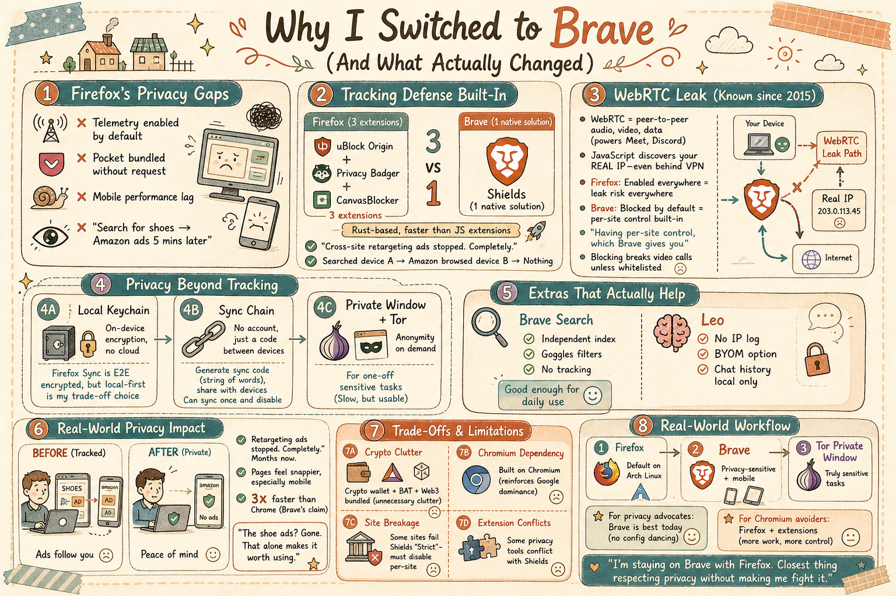

# 我為什麼開始在 Firefox 之外同時使用 Brave（以及我所發現）

#### 免責聲明
- 純屬個人偏好和經驗。你的經驗可能與我的不同。
- 不是全面評測 — 只是我在自己試用過程中遇到的實際情況。
- 有些事情我可能說得不對。這是個人實踐，不是真理。
- 有一點學習曲線。
- 有得必有失，獲得利益的同時總有代價。

---

## 使用 Brave 之前

Firefox 一直是我在 Arch Linux 上的日常主力瀏覽器，從桌面到手機都是。我足夠信任 Mozilla，以至於把密碼、書籤、會話數據等幾乎所有東西都存在 Firefox 裡。

但我很在意數據安全和隱私。我討厭那種搜了一雙鞋，五分鐘後就在 Amazon 上看到同一雙鞋廣告的感覺。這種跨站追蹤正是我想擺脫的。

我也裝了 Tor Browser 以備真正需要匿名的場合，但它不適合日常使用。

我開始在旁邊試用 Brave — 只是測試，看看感覺如何。隨著時間推移，我發現自己越來越常用它。不是因為我想離開 Firefox，而是因為 Brave 在某些方面做得更好，而且不需要我手動配置任何東西。Firefox 仍然是我在 Arch Linux 上的主要瀏覽器，但 Brave 已經在它旁邊贏得了一個永久的位置。

---

## 發現問題

Firefox 的一些決策讓我不太認同：

- **Telemetry 默認開啟** — 明明是選擇退出而非選擇加入。
- **Pocket** — 捆綁並推銷。我從未要求過這個（已轉用 Raindrop.io）。
- **Chromium 主導地位** — Firefox 是最後一個真正的替代方案，但市佔率持續下滑，意味著更多網站相容性問題。
- **行動端效能** — Firefox 在 Android 上的速度和續航明顯落後 Chrome 和 Brave。

我想要一款認真對待隱私、又不需要我跟瀏覽器較勁才能用的產品。

於是 Brave 登場了。

---

## 我喜歡的部分

### 1. Local Keychain（內建密碼管理器）

Brave 不像 Google 或 Firefox Sync 那樣把密碼存在雲端，而是以加密 Keychain 的形式存放在本機裝置上。我知道 Firefox Sync 是端到端加密的 — 我確實信任 Mozilla — 但我更喜歡憑證完全不經由任何第三方伺服器同步。本機儲存加上可選的加密同步，對我來說是正確的取捨。

### 2. Sync

Brave 的 Sync 是匿名且不需要帳號的。你產生一組同步鏈代碼（一串單字），分享給你的其他裝置，就這樣。不需要登入，不需要 Google 帳號，不需要 Mozilla 帳號。你可以同步一次之後就再也不碰它 — 只要傳遞那組代碼就好。

從 Firefox 遷移的注意事項：從 Firefox 匯入是一次性的轉移 — 書籤、密碼、瀏覽記錄會一次拉過來。但 Firefox 和 Brave 是兩個不同的應用程式，它們之間沒有持續同步。如果你在其中一個做了變更，需要手動重新匯入才能讓另一個保持更新。

### 3. Cross-Site Tracking Protection（Shields）

Brave Shields 預設就封鎖追蹤器、腳本和指紋辨識，不需要任何配置。在 Firefox 上，我裝了 uBlock Origin、Privacy Badger 和 CanvasBlocker — 三個擴充套件才能達到 Brave 開箱即用的效果。而且 Shields 更快，因為它是內建在瀏覽器中的，不是基於 JavaScript 的擴充套件。

### 4. WebRTC Control

這點值得單獨一節。

**什麼是 WebRTC？** WebRTC（Web Real-Time Communication）是一個瀏覽器 API，讓瀏覽器之間可以直接進行點對點的音訊、視訊和資料傳輸，不需要外掛程式。它驅動著 Google Meet、Discord 網頁版和瀏覽器內建的檔案分享。

**隱私問題：** WebRTC 透過 STUN 伺服器發現你的公開 IP 位址以建立直接的點對點連線。問題在於，任何網站的 JavaScript 都可以查詢 WebRTC API，從而得知你的**真實公開 IP 位址** — 即使你處在 VPN 或 Proxy 之後。這被稱為 WebRTC 洩漏，早在 2015 年就已被揭露。

**為什麼這很重要：** 即使在 Firefox 的「嚴格」追蹤保護模式下，WebRTC 仍然是預設開啟的。你的理解是對的 — 大多數人不需要 WebRTC，除非他們使用視訊通話、BT（WebTorrent）或即時協作工具等點對點應用程式。但它對每個網站都是開啟的，這意味著任何網站都有可能發現你的真實 IP。

在 Firefox 上，你可以透過 `about:config`（`media.peerconnection.enabled → false`）或安裝 WebRTC 洩漏防護擴充套件來關閉它。而在 Brave 上，Shields 在「嚴格」或「積極」模式下預設就會封鎖 WebRTC 洩漏，而且你可以針對每個網站單獨控制。不需要擴充套件，不需要搜尋 `about:config`。

**我的看法：** WebRTC 是有用的 — 我確實偶爾會用 Google Meet。理想的解決方案不是完全關閉它，而是能針對每個網站控制，這正是 Brave 給你的。Firefox 也可以透過擴充套件做到，但並非內建功能。

**封鎖 WebRTC 的代價：** 封鎖 WebRTC 會破壞所有依賴它的功能 — 視訊/音訊通話（Google Meet、Discord）、WebTorrent、螢幕分享以及即時協作。（Meet 使用的是轉發伺服器而非直接 P2P，但它仍然需要 WebRTC API。）你要麼全域關閉封鎖，要麼為每個需要的網站手動加入白名單。能針對每個網站控制（像 Brave 那樣）是最理想的平衡點。

### 5. Private Window with Tor

Brave 有一個「Private Window with Tor」模式。它可以將單一視窗的流量經由 Tor 網路路由。它不像完整的 Tor Browser 那樣具備同樣的指紋防護 — 但對於一次性敏感任務（查一些我真的不想跟 IP 關聯起來的東西）來說，非常方便。我不需要啟動獨立的 Tor Browser 然後等他連線。它就在那裡。

效能方面，畢竟是 Tor — 所以很慢。但對於快速查詢來說，還算堪用。我發現自己比預期更常用到這個功能。

### 6. 內建廣告封鎖

Brave 在瀏覽器層級封鎖廣告和追蹤器。這意味著網頁載入更快、消耗更少流量，而且 — 沒錯 — 鞋子廣告消失了。我測試過：在一個裝置搜尋某個產品，然後在另一個裝置上瀏覽 Amazon。什麼都沒有。沒有再行銷。已經好幾個月了，我討厭的跨站追蹤消失了。

**Firefox + uBlock Origin** 可以達到同樣效果，但 Brave 的實作更快，因為它在網路請求尚未發出之前就進行封鎖（它使用原生的 Rust 廣告封鎖引擎）。

### 7. Brave Search（加分項）

我已經把預設搜尋引擎換成 Brave Search。它是一個真正獨立的搜尋索引 — 不是 Bing 的換皮 — 還有一個「Goggles」功能，讓你可以套用自己的排名篩選器。在超本地化或冷門查詢方面它不如 Google，但日常使用已經夠了，而且它不追蹤你。

### 8. Leo（加分項）

Brave Leo 是一個內建在瀏覽器中的隱私保護 LLM。你可以問它關於當前頁面的問題、總結文章、翻譯或隨意聊天。

**隱私程度如何？** 在免費方案下，提示詞會經過 Brave 的伺服器 — 但不記錄 IP、不附帶任何識別碼，對話內容不會被保留或用於訓練。你甚至不需要帳號就能使用。或者，透過 Leo 的 **BYOM（Bring Your Own Model）**，你可以接入完全本機的模型（例如透過 Ollama 執行 Llama） — 一切都在裝置上執行，不會離開你的電腦。

**聊天記錄**儲存在本機裝置上，而非雲端。你可以刪除或完全關閉此功能。

可用模型包括 Mixtral、Claude 和 Llama（依方案而定）。我主要用它來總結長文件。很方便，但不足以成為切換瀏覽器的理由。

---

## 我不太喜歡的部分

沒有瀏覽器是完美的。以下是我對 Brave 的不滿：

### Crypto Stuff

Brave 捆綁了 Crypto 錢包、BAT 和各種 Web3 整合 — 這些我一個都不用。你可以在設定中全部隱藏，但它們不應該預設出現在那裡。它讓介面變得雜亂，也削弱了隱私的訊息。

### Chromium Dependency

Brave 基於 Chromium，這意味著它繼承了 Chromium 的攻擊面、強化了 Google 的引擎主導地位，並且雖然用自己的 Sync API 取代了 Google 的，但底層引擎仍然來自 Google。務實地說，維護一個 Gecko 分支不可行，所以 Brave 選擇了 Chromium 以專注於隱私功能。我能理解，但我不喜歡。

### 網站相容性

有些網站在 Shields 的「嚴格」模式下無法正常運作 — 通常是銀行網站、Google 服務或腳本繁重的新聞網站。降到「標準」模式或為該網站關閉 Shields 就能解決，但終究是麻煩。

### 擴充套件相容性

大多數 Chrome 擴充套件都能用，但有些 — 尤其是隱私工具 — 會與 Shields 衝突。我不得不停用了一兩個。

---

## 實際的隱私差異

最明顯的變化是追蹤消失了。跨站再行銷廣告完全停止了。光這一點就值得了。

我也注意到網頁載入變快了 — 不是戲劇性的，但 consistently。Brave 號稱在某些基準測試中比 Chrome 快 3 倍。以我的體感來說，頁面反應更靈敏，尤其是在行動裝置上。

我現在的工作流程：
- **Firefox:** Arch Linux 上的預設瀏覽器
- **Brave:** 同時用於注重隱私的瀏覽和行動裝置
- **Private Window with Tor:** 用於真正敏感的任務

---

## 結論

我會推薦 Brave 嗎？**會**

對於想要開箱即用、不需四處找擴充套件、不需調整 `about:config`、不需「請關閉 telemetry」這些繁瑣步驟的隱私意識用戶來說，Brave 是當今最好的選擇。它能封鎖追蹤器、管理 WebRTC、提供 Tor 整合，同時不犧牲可用性。

對於想完全避開 Chromium、或需要 Firefox Containers、或對任何與 Crypto 相關的東西抱持哲學性反對的用戶 — 請繼續使用 Firefox + uBlock Origin + WebRTC 封鎖器。這是個紮實的方案，只是需要更多配置功夫。

對我來說？我會繼續使用 Brave，同時保留 Firefox。它不完美，但它是我找到的最接近「尊重我的隱私又不需要我跟它較勁」的瀏覽器。而且鞋子廣告？不見了。光這點就值得用了。

*Arch Linux, if you're wondering. Yes, I use xfs encrypted by Veracrypt.*
