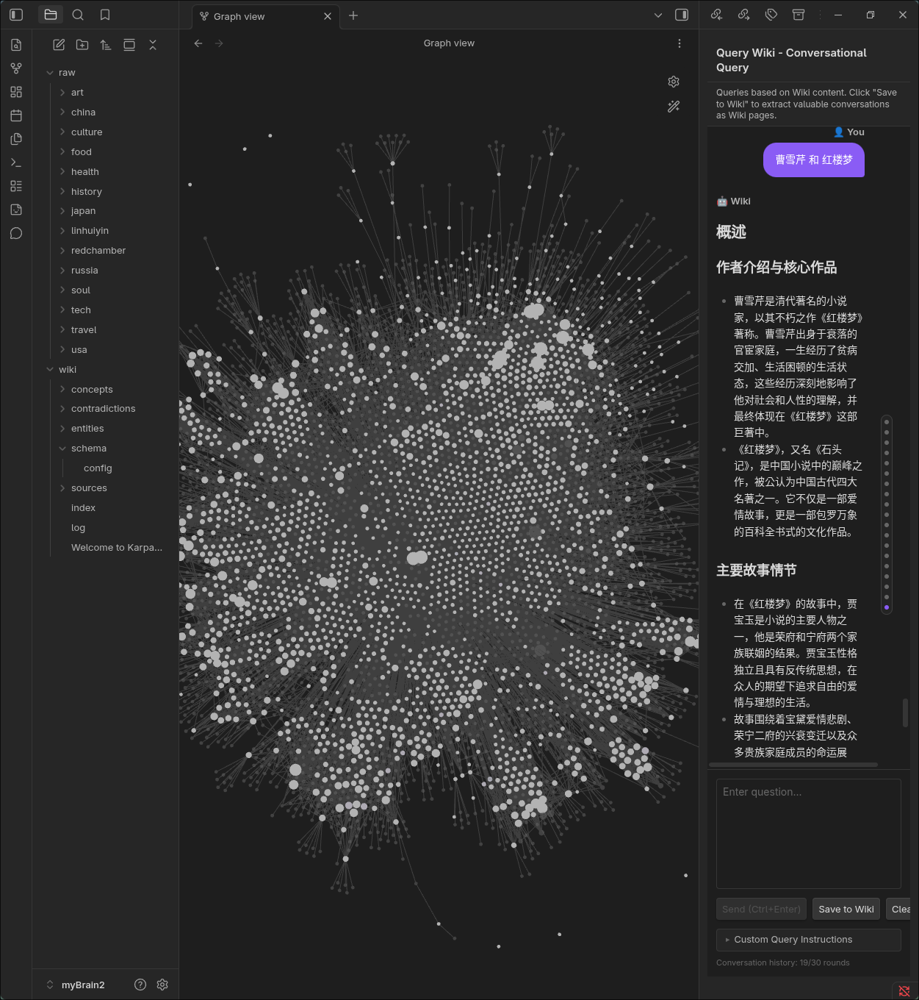
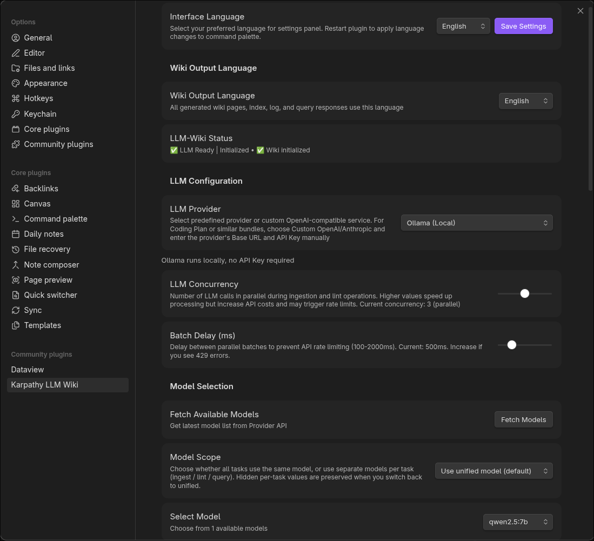
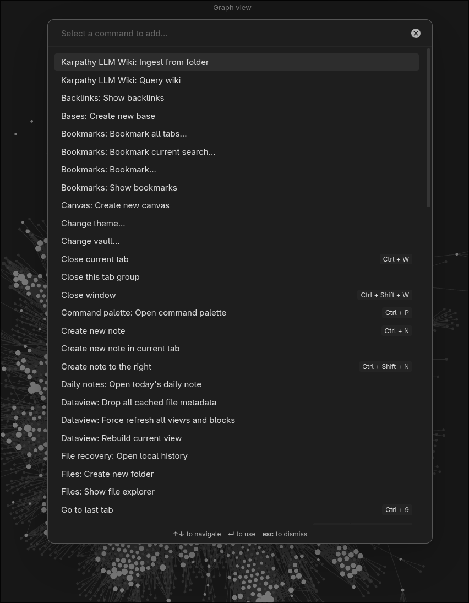

# 建立自己的第二大脑 > Obsidian + Karpathy LLM Wiki + Ollama

[toc]



## 背景

我已经保存了 330+ 条笔记，积累了好几年。两年前，我从 **Evernote** 迁移到 **Obsidian**，想把这些多年积累的文档搭建成自己的 wiki/ 知识库。不仅仅是技术文档，还包括各种个人兴趣——如何驾驶 DCS 飞行模拟、在山里骑摩托车、摄影技巧——中英文都有。

我可以跟我的 wiki 对话提问，它会从所有笔记中找到相关话题并汇总。很神奇，不是吗？

后来发现了 **Karpathy LLM Wiki**，立刻感兴趣了。它比你想象的要简单：

- **Obsidian** 只需装一个 plugin
- 通过 **Ollama** 跑本地 LLM，性能真的很不错

网上有大量关于它 **architecture** 和 **workflow** 的教程，我推荐你看：
- https://datasciencedojo.com/blog/llm-wiki-tutorial/
- https://hermes-agent.nousresearch.com/docs/user-guide/skills/bundled/research/research-llm-wiki

我就不重复了。方案有很多种，有些很复杂，我试了好几个、烧了好几天 token——这是最简单的方案。

## 我的配置

### 设计理念和原则

- Linux and open source stack
- 从简单开始，保持简单
- Documentation: all docs in markdown

### 硬件配置

我有一台 GPD Win4 gamepad，内置和外置各一个 AMD GPU。我想测试一下它跑本地 LLM 的极限——速度和 summarization 质量如何。

### 软件配置

- Platform: Linux only (Arch Linux, years of use)
- AI model: local LLM via Ollama (烧了好几天 API 费用后转向本地)
- Obsidian 通过 Arch Linux 官方 repo 安装 (bound to Electron)
- Karpathy LLM Wiki plugin 通过 community plugin 安装

## 1. 安装 Obsidian + Karpathy LLM Wiki Plugin

选择一个 vault 开始。建议新建一个 vault，放少量文档进去——LLM 处理文档真的很耗时，如果用公共 API 还要花钱。

通过 community plugin 安装 Karpathy LLM Wiki plugin。

先别装其他 plugin，不然你会分不清哪个是哪个。

- 不需要 `CLAUDE.md`、`AGENT.md`（或 `AGENTS.md`）、`SCHEMA.md`
- 如果想深入了解 LLM Wiki 的工作原理，读 `<VAULT>/wiki/schema/config.md`——高度自定义，按需配置

## 2. 通过 Ollama 安装本地 LLM

接公共 LLM 更简单，但我烧了3天，每天$10，于是转向本地。

只要 ollama service 跑起来了，下载一个模型就行：

```sh
ollama run qwen2.5:7b
```

模型大小取决于你硬件的 vRAM 容量。我用的这个大约需要 6~ 7 GB vRAM。

## 3. 在 Obsidian 中配置 Karpathy LLM Wiki

Obsidian settings > Community plugins > Karpathy LLM Wiki 的 Options (齿轮图标) >

- LLM Provider > 选择 Ollama
- Select Model > 选择你的本地 LLM 模型



## 4. 使用与体验



配置完成后，把你的文件 ingest（复制/移动）到 `raw/` 文件夹。按 `Ctrl + P` > `Karpathy LLM Wiki ingest from folder` > 选择 `raw/` 文件夹。


你应该能看到 GPU1 使用率飙升，如右下角截图所示。右上角是我基于 330+ 文档生成的 Graph View——看起来很壮观。

## 5. 最后感想

我用 Arch Linux 好多年了，之前只留着 Windows 打游戏。自从 Steam Proton 让 Windows 游戏在 Linux 上毫无性能损失地运行后，就把 Windows 彻底删了。Arch Linux 几乎能满足我所有需求——现在是工作 + 娱乐的唯一系统。
