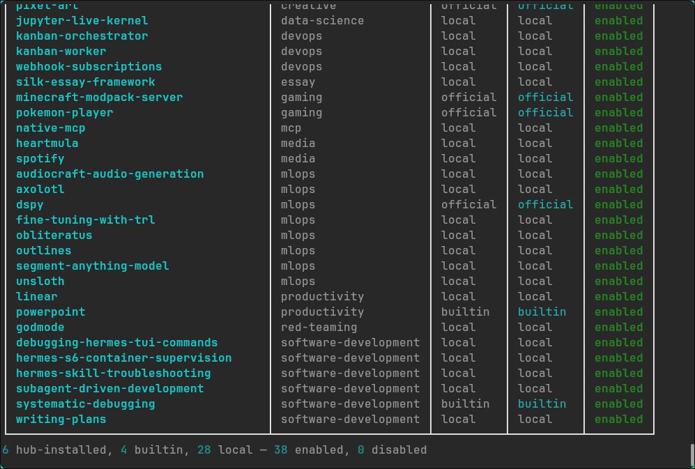

# 清理 Hermes 臃肿的技能与插件

**原文：** [260731-hermes-cleanup.md](260731-hermes-cleanup.md)


## 背景

- 我从今年年初起就在一台专用的 Hetzner VPS 上运行 Hermes Agent ⚚，逐渐摸熟了它，经常在路上找它帮忙。
- 每当需要新能力时，我都会自己写自定义 SKILL.md，而不是从 Hermes ⚚ 默认自带的目录里挑。到目前为止，我已经写了大约 30 个按我个人使用习惯、需求和要求定制的技能。
- Hermes Agent ⚚ 默认启用 100+ 个插件/技能——实在太多了，在我看来其中不少是**臃肿的预装软件**。比如我试过一个 "excel creator" 之类的技能，输出质量完全没法接受。有些技能没什么用，却在每次 agent 启动时一直跑着。这是我想把它们全部清理掉的主要原因。

## 步骤

### 1. 看看启用了什么

```sh
hermes skills list
```

```sh
6 hub-installed, 66 builtin, 28 local — 100 enabled, 0 disabled
```


### 2. 退出并移除内置技能

```sh
hermes skills opt-out --remove
```

我之前已经退出了，所以标记早已存在，而未修改的内置技能（66 → 4）的移除仍然照常进行：

```sh
Already opted out — marker was already present.

6 hub-installed, 4 builtin, 28 local — 38 enabled, 0 disabled
```



为了展示确认信息，我又跑了一遍同样的命令：

```sh
hermes skills opt-out --remove

Opted out of bundled skills. Future install / update / sync runs will not seed bundled skills into this profile.
```

### 3. 随时可回退（可选）

```sh
hermes skills opt-in --sync   # re-seed everything
```

这会移除标记并重新种入内置技能，如果你哪天改了主意，就能把核心技能集带回来。
