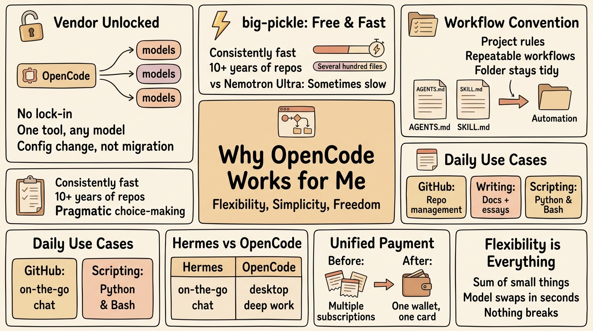

# OpenCode 对我而言是最好的

**原文：** [260802-opencode-is-best.md](260802-opencode-is-best.md)

我在我的 Arch Linux + Hyprland 机器上用过终端里的 Codex 和 Claude，还给 Google、Anthropic、OpenAI、Kimi 一家一家地充过钱……直到我在 **OpenCode** + **OpenRouter** 这里停了下来——我也还在用 Hermes Agent ⚕，那是另一个故事了。

背景（免责声明：非常主观的看法）：
- 快速编辑用 vi/vim，Cursor 只当作 markdown 编辑器——我不用它（也不喜欢）它的 agent
- **OpenCode** 只在终端里用

## 摆脱供应商锁定

第一个，也是最显然的一点：没有锁定。我想要来去自如的自由——我跑开源也是出于同样的理由。

更好的是，**OpenCode** 成了一个**通用**的 agent 平台——一个工具，任意模型。我不被任何一家供应商绑死，换模型只是改个配置，而不是一次迁移。

## `big-pickle` 相当不错

这是我在 **OpenCode** 里的默认模型。我用它打理分散在十多年 GitHub 仓库里那些"看着简单、其实复杂"的逻辑——Python、Bash 等语言写的几百份文档和代码文件。收拾这些的时候，说句实话，没有 AI 我觉得不可能只用几个小时就做完。

它很稳，而且最好的地方是免费。比起 Nvidia Nemotron Ultra（同样免费），`big-pickle` 是始终稳定地快，而不是时快时慢。

## 用 OpenCode 干活：AGENTS.md 与 SKILL.md

有两样东西让 **OpenCode** 感觉像是已经了解我的项目。

- **每个项目放一个 AGENTS.md**——必须知道的那个文件：文件命名规则、文件放在哪、总要检查什么。我建一次，边用边更新，这样 **OpenCode** 记住规则，而不是我来反复重申。
- **给 OpenCode 写 SKILL.md**——一个 skill 把可复用的工作流（步骤、规则、示例）打包起来，**OpenCode** 在任务匹配时加载它。写完一次，整套流程就变成一次请求。

附带的好处：目录保持整洁。用其他 agent（Hermes、OpenAI、Claude……）时每个人各搞一套，我就找不到文件；用 **OpenCode**，规则始终如一。

### 给 OpenCode 写 SKILL.md

一个 skill 就是一个文件夹加一个文件：`.opencode/skills/<slug>/SKILL.md`。`SKILL.md` 顶部放 YAML frontmatter，下面用 markdown 写说明——不需要单独的配置文件。

frontmatter 其实只需要两个字段：**name**（与文件夹同名，小写连字符）和 **description**——它做什么*以及*什么时候触发，因为 **OpenCode** 决定是否加载这个 skill 时，看的就是这些。可选的还有：`license`、`compatibility`、`metadata`。

**OpenCode** 通过扫描 git 工作树里的 `**/SKILL.md` 来发现 skill，只有当任务匹配时才加载完整内容——所以整套流程就变成一次请求。

完整参考：<https://opencode.ai/docs/skills/>

## 我平时主要用 OpenCode 做什么

日常来说，**OpenCode** 覆盖三件事：

- **GitHub**——打理和清理我零散的仓库
- **写作**——文档，还有我的历史/哲学随笔
- **轻量脚本**——不太复杂的 Python 和 Bash

## 我每天用的两个 Agent

**Hermes** 用于外出时——我能通过 Discord、WhatsApp 和 Telegram 跟我的 agent 对话并操作它做各项任务。至于大部分写作或编码，我会坐在桌前用 **OpenCode** 完成。

## 用 OpenRouter 统一付款

我以前要分别给 Google、OpenAI 和 Anthropic 付钱，一团乱麻——我得记得去订阅、充值或做别的什么。实在受不了。我发现 **OpenRouter.ai** 是个放信用卡的好地方，我只用在那里盯一下账单。想换别的模型时，我只要在 **OpenCode** 里**几秒内切换模型**——其他什么都不用变。

## 结语

所以 **OpenCode** 是最好的吗？对我而言，是的——但不是因为某一个单项功能。它是许多小事的加总：没有供应商锁定、有一个我日常信得过的模型、能真正贯彻的约定，还有一个钱包搞定付款。我能在几秒内换模型，而且什么都不会坏。正是这种灵活让我留在这里，短期内我看不到离开的理由。
