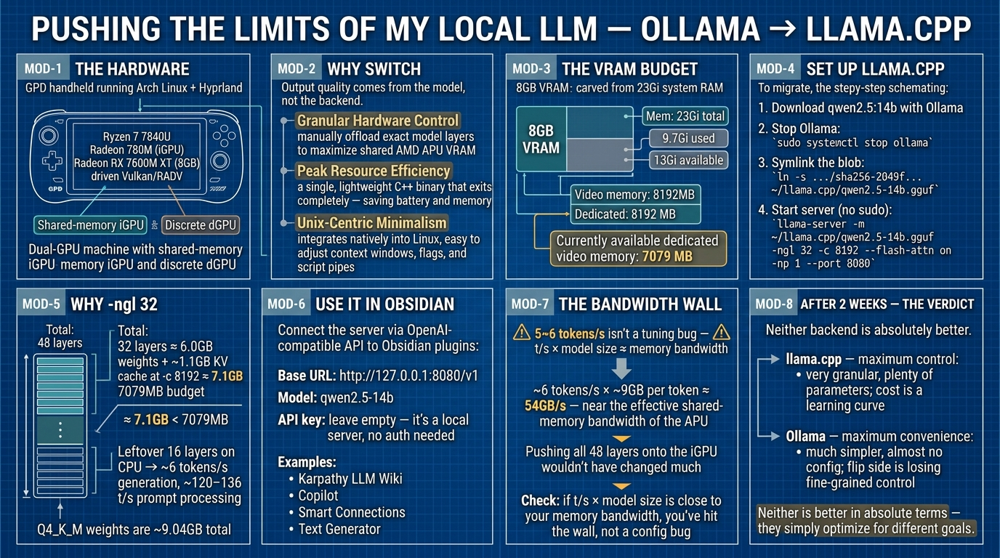

# 我为什么从 Ollama 切换到 llama.cpp——以及我学到的东西

**原文：** [260803-ollama-to-llamacpp.md](260803-ollama-to-llamacpp.md)



我在我的 Arch Linux + Hyprland 环境上运行本地 LLM，已经通过 Ollama 用上了 `qwen2.5:7b`。

我想最大化利用我的硬件。

因此我决定下载一个稍大的模型来覆盖日常文档写作和 Python 编码工作，并从 Ollama 切换到 llama.cpp。

我的硬件：一台运行 Arch   + Hyprland 的 GPD 掌机，搭载 AMD Ryzen 7 7840U——一颗 Radeon 780M 集成显卡加一块独立 Radeon RX 7600M XT（各 8GB），通过 Vulkan/RADV 驱动。具体规格并不重要；重要的是这是一台双 GPU 机器（一块共享内存的核显和一块独立独显），而本文的重点是如何在这类机器上控制和调优 llama.cpp。

## 为什么从 `ollama` 切换到 `llama.cpp`

这次切换主要换来的是效率和硬件控制。输出质量由模型本身决定，而不是后端——本文中更好的回答来自更大的 14B 模型，而不是 llama.cpp。网上有更详细的解释；我在这里只总结要点

- 细粒度硬件控制：llama.cpp 让你手动卸载确切数量的模型层，以最大化共享 AMD APU VRAM，而不必像 Ollama 的自动引擎那样过分"保守"。(Ollama 其实也封装了 llama.cpp，并通过 `OLLAMA_GPU_LAYERS` 暴露了类似的旋钮，但 llama.cpp 给你的是直接、明确的控制。)
- 峰值资源效率：它以单个轻量级 C++ 二进制文件运行，结束后完全退出，消除了后台守护进程的开销，从而在 GPD 设备上节省电量和内存。
- Unix 中心极简主义：它原生集成到 Linux（以及 macOS）环境中，让你可以轻松地动态调整内存上下文窗口、标志位和脚本管道。

## 确定需要多少 vRAM

```sh
[jeff@gpd blobs]$ free -h
               total        used        free      shared  buff/cache   available
Mem:            23Gi       9.7Gi       2.3Gi       503Mi        11Gi        13Gi
Swap:           11Gi          0B        11Gi
[jeff@gpd blobs]$ glxinfo | grep -i "video memory"
    Video memory: 8192MB
    Dedicated video memory: 8192 MB
    Currently available dedicated video memory: 7079 MB
```

这是一颗 AMD APU，采用统一内存架构，所以 8GB 的"VRAM"是从 `free -h` 显示的同一块 23Gi 系统内存中划出来的——而当前可用的 7079MB 是 GPU 在桌面占掉自己那份之后报告的数值。这个数字是选择下面的 `-ngl` 的好起点。

在双 GPU 机器上，先确认 llama.cpp 实际选中的是哪个设备，再相信这些数字——你用 glxinfo 量到的 GPU 不一定就是服务器运行所在的那块。llama.cpp 默认使用它找到的第一个设备（这里 Vulkan 会先枚举核显，把独显晾在一边），而"dedicated VRAM"数值只是某一个 API 报告的——在共享内存设备上 llama.cpp 看到的预算可能更大，所以把 `-ngl` 计算当作启发式，而不是硬性限制。要列出并覆盖设备，可以用 `--list-devices` / `--device`，或设置 `GGML_VK_VISIBLE_DEVICES`（Vulkan）、`HIP_VISIBLE_DEVICES`（ROCm）、`CUDA_VISIBLE_DEVICES`（CUDA）环境变量——无论第二块 GPU 是内置还是外置 eGPU，方法都一样。一个完全能装进独显 VRAM 的小模型在那里通常要快好几倍。

## 用 Ollama 下载 LLM

下载 `qwen2.5:14b`

找出它的位置

```sh
[jeff@gpd blobs]$ pwd
/var/lib/ollama/.ollama/models/blobs
[jeff@gpd blobs]$ find . -size +8G -size -10G
./sha256-2049f5674b1e92b4464e5729975c9689fcfbf0b0e4443ccf10b5339f370f9a54
```

下载完成后，就不再需要 Ollama 了，可以停掉它

```sh
sudo systemctl stop ollama
```

## 配置 llama.cpp 使用 LLM

为通过 `ollama` 下载的模型创建符号链接。先建一个本地目录来放符号链接

```sh
mkdir -p ~/llama.cpp/

ln -s /var/lib/ollama/.ollama/models/blobs/./sha256-2049f5674b1e92b4464e5729975c9689fcfbf0b0e4443ccf10b5339f370f9a54 \
  ~/llama.cpp/qwen2.5-14b.gguf
```

把 `sha256` 哈希换成你自己的

如有需要，还要调整 blob 路径——这取决于 Ollama 的安装方式（systemd 包是 `/usr/share/ollama/.ollama/models/blobs`，官方安装器是 `/root/.ollama/models/blobs`）。blob 与那次精确的下载绑定：重新拉取不同的量化版本或执行 `ollama rm` 都会使该哈希失效。如果压根不想依赖 Ollama，可以直接用 `hf download Qwen/Qwen2.5-14B-Instruct-GGUF qwen2.5-14b-instruct-q4_k_m.gguf --local-dir ~/llama.cpp/` 下载 GGUF

启动服务器（无需 `sudo`——它以你的用户身份运行，并保持可在 localhost 访问）

```sh
[jeff@gpd ~]$ llama-server -m ~/llama.cpp/qwen2.5-14b.gguf -ngl 32 -c 8192 --flash-attn on -np 1 --port 8080
```

`-ngl 32` 会把 Qwen2.5-14B 的 48 层中前 32 层卸载到 GPU，其余留在 CPU 上。为什么是 32？Q4_K_M 权重总共约 9.04GB，所以 32 层约等于 6.0GB 权重，加上 `-c 8192` 时约 1.1GB 的 KV cache，约 7.1GB——刚好低于可用的 7079MB。剩下的 16 层跑在 CPU 上，这正是下面日志里生成速度只有约 6 tokens/s、而提示词处理能达到约 120–136 t/s 的原因。

你会看到类似这样的输出

```sh
...
0.02.762.489 I srv  llama_server: model loaded
0.02.762.494 I srv  llama_server: listening on http://127.0.0.1:8080
```

## 用 `llama.cpp` 配置 Obsidian

`llama-server` 已经在 `http://127.0.0.1:8080/v1` 暴露了一个兼容 OpenAI 的 API，所以任何接受自定义 OpenAI 兼容端点的 Obsidian 插件都可以连它。使用 **Karpathy LLM Wiki** 插件（与上一篇文章相同）：

1. 先启动 `llama-server`（见上文）。
2. Obsidian > 设置 > Karpathy LLM Wiki。
3. 提供商选择：**OpenAI**（如果你的版本列出了"custom endpoint"/OpenAI 兼容，也可以选它）。
4. 把 **Base URL** 设为 `http://127.0.0.1:8080/v1`。
5. 把 **Model** 设为 `qwen2.5-14b`（手动输入，或从 `/v1/models` 获取）。
6. **API key** 留空——它是本地服务器，不需要认证。
7. 点击 **Test Connection**，然后 **Save Settings**。

就这样——你的笔记现在可以查询本地 14B 模型了。同样的端点也可以配合任何其他兼容 OpenAI 的 Obsidian 插件（Copilot、Smart Connections、Text Generator……）用于文档写作和 Python 编码辅助。

## 调优

要通过 `llama.cpp` 最大化本地 LLM 的能力，参数会因你的 GPU 或硬件规格而异，所以调优很重要。

把所有东西都放在命令行里跑的一个充分理由是：任何错误（或警告）信息都会清楚地打印出来，这对调试很有帮助。如果遇到错误，先查 Google 或类似渠道。下面是我打印出来的日志

```sh
...
0.00.038.015 I cmn  common_param: common_params_print_info: verbosity = 3 (adjust with the `-lv N` CLI arg)
0.00.038.358 W srv  llama_server: -----------------
0.00.038.360 W srv  llama_server: CORS is set to allow all origins ('*') and no API key is set
0.00.038.360 W srv  llama_server: this can be a security risk (cross-origin attacks)
0.00.038.360 W srv  llama_server: more info: https://github.com/ggml-org/llama.cpp/pull/25655
0.00.038.360 W srv  llama_server: -----------------
0.00.039.555 I srv    load_model: loading model '/home/jeff/llama.cpp/qwen2.5-14b.gguf'
0.00.268.690 W load: control-looking token: 128247 '</s>' was not control-type; this is probably a bug in the model. its type will be overridden
0.02.757.937 I srv    load_model: initializing, n_slots = 1, n_ctx_slot = 8192, kv_unified = 'false'
0.02.762.489 I srv  llama_server: model loaded
0.02.762.494 I srv  llama_server: listening on http://127.0.0.1:8080
1.07.002.103 I slot get_availabl: id  0 | task -1 | selected slot by LRU, t_last = -1
1.07.002.163 I slot launch_slot_: id  0 | task 0 | processing task, is_child = 0
1.22.014.086 I slot print_timing: id  0 | task 0 | prompt processing, n_tokens =   2048, progress = 0.42, t =  15.01 s / 136.43 tokens per second
1.41.426.409 I slot print_timing: id  0 | task 0 | prompt processing, n_tokens =   4096, progress = 0.84, t =  34.42 s / 118.99 tokens per second
2.08.679.214 I slot print_timing: id  0 | task 0 | n_decoded =    100, tg =   5.88 t/s, tg_3s =   5.88 t/s
2.11.798.583 I slot print_timing: id  0 | task 0 | n_decoded =    118, tg =   5.86 t/s, tg_3s =   5.77 t/s
```

关于这段日志的几点说明：`control-looking token: 128247 '</s>'` 警告是某些 Qwen GGUF 重新量化版本中已知的无害产物，可以忽略。CORS + 无 API key 的警告可以接受，因为 llama-server 默认绑定 127.0.0.1——只有你本机可以访问；如果要用 `--host 0.0.0.0` 暴露出去，先设置 `--api-key`。另外 `-np 1` 允许一个并行请求——提高到 2 可以在生成时保持 UI 响应，但 KV cache 大约会翻倍，所以留意 7079MB 的预算。

可以看到本地 LLM 大约每秒处理 5~6 个 token，看起来很低——瓶颈是留在 CPU 上的 16 层加上这块 APU 的共享内存总线——但它的输出质量比 `qwen2.5:7b` 更好。当然，如果你优先考虑更快的处理速度——通常快好几倍——也可以考虑 `qwen2.5:7b`，用于知识管理（配合 Karpathy LLM Wiki）之类的类似场景。

在归咎于调优之前，还有一招：把你的生成速度乘以模型大小。14B 模型在约 6 tokens/s 时每个 token 读取约 9GB，算下来约 54GB/s——已经接近这块 APU 的有效共享内存带宽，所以就算把全部 48 层都塞进核显也不会有太大变化。在任何机器上，如果 t/s × 模型大小接近你的内存带宽，那就是撞墙了，而不是配置 bug。

## 测试两周之后

两周的日常使用之后，结论是控制与便利之间的取舍。

**llama.cpp——最大控制**
- 非常细粒度的控制：大量参数可调，让模型在本地、特别是在你的硬件上最大化发挥它的能力和潜力。
- 代价是学习曲线，需要反复对照 Google 和/或官方文档。

**Ollama——最大便利**
- 简单得多：装上，几乎不用配置，马上就能用。
- 另一面是：你把调优决策交给自动引擎，失去了细粒度控制。

两者没有绝对的优劣——它们只是为不同的目标做了优化。
