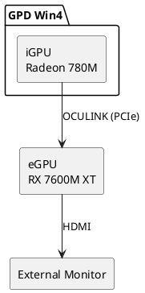
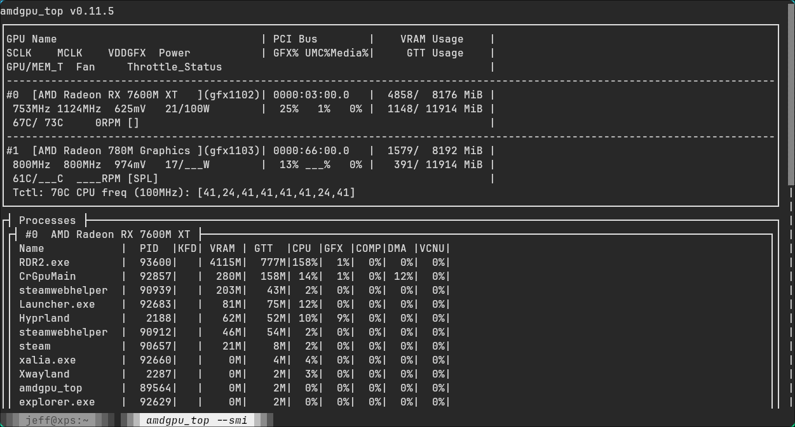

# GPD Win4 上的 Arch Linux + Hyprland：iGPU + eGPU

**原文：** [260807-gpd-dual-amd-gpu.md](260807-gpd-dual-amd-gpu.md)


## 文档目标

本文为同时使用 iGPU 和 eGPU、并希望在两者之间频繁切换时充分利用其性能的任何人而写。具体用例针对 GPD Win4——Arch Linux + hyprland.lua 上的两块 AMD GPU，将渲染任务卸载到 eGPU——但该方法具有通用性：其他硬件栈与配置（例如两块 NVIDIA GPU）也应遵循相同的原则来考虑。

- 配置指导（仅 iGPU / 带 eGPU）——硬件堆栈
- 用于验证当前状态的自检命令——验证
- 所有相关命令集中一处——分布在各章节
- 调整日志：已应用 / 建议的内容——当前状态 / 建议
- 供日后查阅的可搜索 wiki——全文

## 硬件堆栈
- 操作系统：Arch Linux + Hyprland 0.56.1（官方支持 Lua 配置）
- 2 块 AMD GPU：iGPU（Radeon 780M）+ eGPU（RX 7600M XT，经 OCULINK 连接）
- BIOS：UMA 帧缓冲设为 8G（iGPU 显存；Advanced > CBS > NBIO > GFX Configuration）

### 1. 仅 iGPU
- 内置和外接显示器均可正常工作
- 可以禁用任意显示器
- 单个 iGPU 为主 GPU

### 2. 带 eGPU



预期效果：
- 在开机前先开启 eGPU
- 两块显示器都能工作
- iGPU 为主 GPU
- 通过命令行在 eGPU 上运行应用

## 验证（快速自检，先运行）

```sh
lspci | grep -i 7600M                         # eGPU detected? bus id?
# stable offload check (derived id, not DRI_PRIME=1 which is index-relative)
DRI_PRIME="pci-0000_$(lspci | awk '/7600M/{print $1}' | tr '.:' '__')" glxinfo | grep -i renderer  # -> RX 7600M XT
egpu glxinfo | grep -i renderer               # same via wrapper
vulkaninfo --summary                          # both GPUs visible (verified; --list-devices is not a valid flag in this vulkaninfo)
hyprctl monitors all                          # active monitors per output
readlink -f ~/.config/hypr/cards/{egpu,igpu}  # symlink targets
```

eGPU 是否在承担负载？通过 `egpu <game>` 运行游戏时，观察 GPU 占用率：

```sh
watch -n 1 'for g in egpu igpu; do n=/sys/class/drm/$(basename "$(readlink -f ~/.config/hypr/cards/$g)"); echo "$g: $(cat "$n/device/gpu_busy_percent")%"; done'
```

如果 eGPU 那一行很高（真实游戏中 90% 以上）而 iGPU 保持低位，说明是 eGPU 在工作。更丰富的视图（已安装）：`amdgpu_top` 或 `amdgpu_top --smi`。

示例——一个运行在 eGPU 上的 Steam 游戏（eGPU 占用约 25%）：



## 已验证的硬件映射（2026 年 8 月，本次启动）

| GPU | PCI id | vendor:device | /dev/dri | outputs |
|---|---|---|---|---|
| eGPU RX 7600M XT (Navi 33) | `03:00.0` | `1002:7480` | card1 / renderD128 | HDMI-A-1, DP-1, DP-2 |
| iGPU Radeon 780M (Phoenix) | `66:00.0` | `1002:15bf` | card2 / renderD129 | eDP-1 (built-in), DP-3..8 |

- `eDP-1`（GPD G1618-04）接在 iGPU 上；`HDMI-A-1`（AOC AG322QWG3R3）接在 eGPU 上——接入 eGPU 时两者都已正常工作。

> **这些 ID 是每次启动时的快照，而非承诺。** `cardN`/`renderD*` 乃至 PCI 总线 ID 都可能在重启之间随机变化。务必动态解析（`lspci`、`/dev/dri/by-path/`）或使用符号链接 `~/.config/hypr/cards/{egpu,igpu}`。
>
> 已验证的证据：在 8 份启动日志中，有 3 次（未接 eGPU）iGPU 出现在 `63:00.0` 而非 `66:00.0`。接上 eGPU 的启动日志则一直稳定为 `03:00.0`/`66:00.0`。

重新生成该表（已验证）：

```sh
for c in /dev/dri/by-path/pci-*-card; do
    pci=$(basename "${c%-card}"); pci=${pci#pci-0000:}
    card=$(basename "$(readlink -f "$c")")
    render=$(basename "$(readlink -f "${c%-card}-render")")
    dev=$(lspci -nn -s "0000:$pci")
    vid=$(grep -oE '\[[0-9a-f]{4}:[0-9a-f]{4}\]' <<<"$dev" | tr -d '[]')
    name=$(sed -E 's/^[0-9:.]+ //; s/^VGA compatible controller \[0300\]: //; s/ \[[0-9a-f]{4}:[0-9a-f]{4}\] \(rev [0-9a-f]+\)$//' <<<"$dev")
    outs=$(ls -d /sys/class/drm/${card}-* 2>/dev/null | grep -v Writeback | sed "s|.*/${card}-||" | paste -sd,)
    printf "%s | %s | %s | %s / %s | %s\n" "$name" "$pci" "$vid" "$card" "$render" "$outs"
done
```

## 当前状态

`~/.bashrc` 中有一个 `egpu()` 启动器——仅对 GL/EGL 卸载渲染，并在调用时动态解析 eGPU 的 PCI id（无硬编码 id）：

```sh
# egpu
# Custom eGPU launcher shortcut
egpu() {
    if [ -z "$1" ]; then
        echo "Usage: egpu <command>"
        echo "Example: egpu steam"
        return 1
    fi
    local id
    id=$(lspci | awk '/7600M/ {print $1}')
    if [ -z "$id" ]; then
        echo "eGPU (RX 7600M XT) not detected" >&2
        return 1
    fi
    env DRI_PRIME="pci-0000_${id//[.:]/_}" "$@"
}
```

已验证：`egpu glxinfo` -> `RX 7600M XT`；普通 `glxinfo` -> `780M`。原先硬编码的 `pci-0000_03_00_0` 已被此动态形式取代——`lspci` 输出 `03:00.0` 带点号，因此 `lspci | awk '/7600M/ {print $1}'` 的结果要用 `${id//[.:]/_}` 改写（`03:00.0` → `03_00_0`）。每次运行多一次 `lspci` 调用；若未接 eGPU 会给出清晰的 "not detected" 报错。

原理：`DRI_PRIME=pci-0000_<bus>_<dev>_<func>` 只在指定的 GPU 上渲染 GL/EGL；画面输出（scanout）由 Hyprland 负责。仅对单条命令生效——桌面仍留在 iGPU 上。

未覆盖的情况：
1. **Vulkan**——忽略 `DRI_PRIME`；游戏会自行枚举两块 GPU（见「建议」#1）。
2. **显示器驱动**——扫描输出由合成器决定；已经正常工作（见映射表）。

## 稳定的 DRM 符号链接（已设置）

```sh
mkdir -p ~/.config/hypr/cards
ln -s /dev/dri/by-path/pci-0000:03:00.0-card  ~/.config/hypr/cards/egpu
ln -s /dev/dri/by-path/pci-0000:66:00.0-card  ~/.config/hypr/cards/igpu
```

`by-path` 基于 PCI 稳定定位，因此这些符号链接能经受 cardN 编号变动。已验证：`egpu`->card1，`igpu`->card2。

> 注意：`igpu`（指向 `66:00.0`）在未接 eGPU 的启动中会成为悬空链接——此时 iGPU 位于 `63:00.0`。只要没有东西引用它就没有影响。

## eGPU 显示器归属（可选）

这套硬件栈的环境变量是 `AQ_DRM_DEVICES`（Aquamarine 0.14+ 中 `WLR_DRM_DEVICES` 已移除）。在 `~/.bash_profile` 中，igpu 在前 = 主显示器：

```sh
export AQ_DRM_DEVICES="$HOME/.config/hypr/cards/igpu:$HOME/.config/hypr/cards/egpu"
```

- 在 Hyprland 启动前设置（登录 shell）；注销/重新登录后生效
- 当前未设置且显示器已正常工作——它只是让归属关系确定化

## 建议的 `egpu()` 改进（未实施）

1. **Vulkan 卸载**——`DRI_PRIME` 仅适用于 GL/EGL；Vulkan 应用会忽略它并自行枚举两块 GPU（通常自带游戏内显卡选择器）。两种选择：

   - `MESA_VK_DEVICE_SELECT=1002:7480`（已安装 layer）。已验证：会把 eGPU 重新排序到 GPU0，让默认选用第一个适配器的应用选中它，但**不会**隐藏另一块 GPU。按名称选择的应用（会列出并让你选择）不受影响。
   - **建议：跳过。** 大多数带可见选择器的游戏已可自行选择 eGPU；`MESA_VK_DEVICE_SELECT` 只对盲目默认选适配器 0、且不让你更改的应用有帮助。仅当某款特定游戏误选到 iGPU 且没有游戏内选择器时才添加。

## 悬而未决的问题（已定论）

- **`03:00.0` 稳定吗？** 在所有接入 eGPU 的启动中均稳定（5/5）；未接 eGPU 时 iGPU 会移到 `63:00.0`。`egpu()` 启动器现在会在调用时动态解析，因此这对卸载来说已无关紧要。
- **把 `MESA_VK_DEVICE_SELECT` 放进 `egpu()`？** 可选的加分项——只对没有内置显卡选择器的 Vulkan 游戏有帮助。非必需；除非某款特定游戏误选，否则跳过。
- **重命名 `egpu`？** 纯外观问题；保留即可。
- **启用 `AQ_DRM_DEVICES`？** 不——一切正常，而且 `igpu` 符号链接在未接 eGPU 的启动中会悬空，启用它只会增加风险而没有任何当前收益。极简优先。
