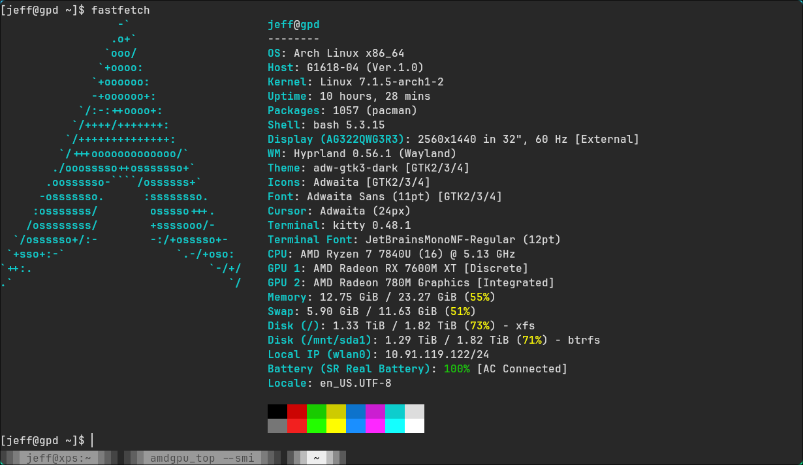
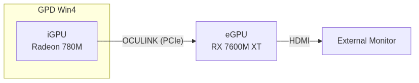
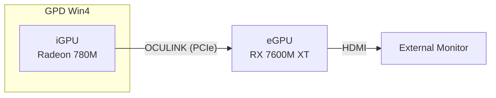
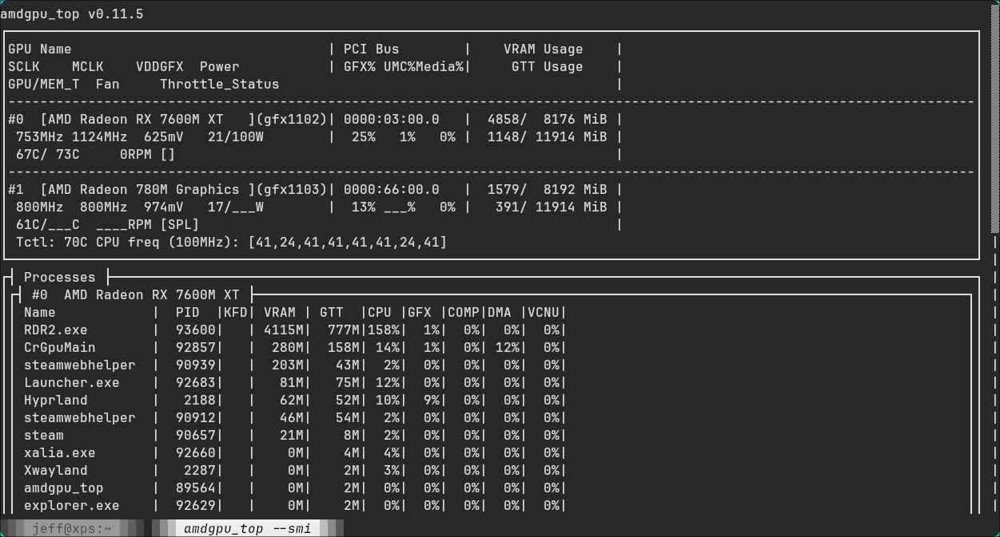

# Arch Linux + Hyprland on GPD Win4 with iGPU + eGPU


## Document Objective

Written as a reference for anyone using both an iGPU and an eGPU and wanting to maximize their capability while switching between them frequently. The concrete use case is specific to the GPD Win4 — two AMD GPUs on Arch Linux + hyprland.lua, offloading rendering onto the eGPU — but the approach generalizes: other hardware stacks and configurations, such as two NVIDIA GPUs, follow the same principles for consideration.

- Configuration guidance (iGPU only / with eGPU) — Hardware Stack
- Self-check commands to verify current state — Verification
- All relevant commands in one place — distributed across sections
- Tweak log: what's applied, what's proposed — Current State / Proposed
- Reading and interpreting `amdgpu_top` output — Reading amdgpu_top output
- Searchable wiki for later reference — the whole doc



## Hardware Stack
- OS: Arch Linux + Hyprland 0.56.1 (Lua config officially supported)
- 2 AMD GPUs: iGPU (Radeon 780M) + eGPU (RX 7600M XT, via OCULINK)
- BIOS: UMA frame buffer set to 8G (iGPU VRAM; Advanced > CBS > NBIO > GFX Configuration)

### 1. iGPU Only
- Both built-in and external monitors work
- Disabling any monitor works
- Single iGPU is primary

### 2. With eGPU





The Mermaid block above is the source for the PNG: iGPU → eGPU via OCULINK (PCIe), eGPU → monitor via HDMI.

Expected:
- Turn on eGPU before powering on the machine
- Both monitors work
- iGPU is primary
- Run apps on the eGPU via command line

## Verification (quick self-check, run first)

```sh
lspci | grep -i 7600M                         # eGPU detected? bus id?
# stable offload check (derived id, not DRI_PRIME=1 which is index-relative)
DRI_PRIME="pci-0000_$(lspci | awk '/7600M/{print $1}' | tr '.:' '__')" glxinfo | grep -i renderer  # -> RX 7600M XT
egpu glxinfo | grep -i renderer               # same via wrapper
vulkaninfo --summary                          # both GPUs visible (verified; --list-devices is not a valid flag in this vulkaninfo)
hyprctl monitors all                          # active monitors per output
readlink -f ~/.config/hypr/cards/{egpu,igpu}  # symlink targets
```

Is the eGPU taking workload? While a game runs via `egpu <game>`, watch GPU busy %:

```sh
watch -n 1 'for g in egpu igpu; do n=/sys/class/drm/$(basename "$(readlink -f ~/.config/hypr/cards/$g)"); echo "$g: $(cat "$n/device/gpu_busy_percent")%"; done'
```

If the eGPU line is high (60%+ in a real game) while iGPU stays low, the eGPU is doing the work. Richer view (already installed): `amdgpu_top` or `amdgpu_top --smi` — see [Reading amdgpu_top output](#reading-amdgpu_top-output) below.

Example — a lightweight Steam game running on the eGPU (eGPU busy ~25%, below the 60% bar):



## Verified Hardware Mapping (Aug 2026, this boot)

| GPU | PCI id | vendor:device | /dev/dri | outputs |
|---|---|---|---|---|
| eGPU RX 7600M XT (Navi 33) | `03:00.0` | `1002:7480` | card1 / renderD128 | HDMI-A-1, DP-1, DP-2 |
| iGPU Radeon 780M (Phoenix) | `66:00.0` | `1002:15bf` | card2 / renderD129 | eDP-1 (built-in), DP-3..8 |

- `eDP-1` (GPD G1618-04) on iGPU; `HDMI-A-1` (AOC AG322QWG3R3) on eGPU — both already work with the eGPU attached.

> **IDs are per-boot snapshots, not promises.** `cardN`/`renderD*` and even PCI bus IDs can change randomly between reboots. Always resolve dynamically (`lspci`, `/dev/dri/by-path/`) or use the symlinks `~/.config/hypr/cards/{egpu,igpu}`.
>
> Verified evidence: in 3 of 8 boot logs the iGPU appeared at `63:00.0` (eGPU absent) instead of `66:00.0`. eGPU-present boots have been consistently `03:00.0`/`66:00.0`.

Regenerate the table (verified):

```sh
for c in /dev/dri/by-path/pci-*-card; do
    pci=$(basename "${c%-card}"); pci=${pci#pci-0000:}
    card=$(basename "$(readlink -f "$c")")
    render=$(basename "$(readlink -f "${c%-card}-render")")
    dev=$(lspci -nn -s "0000:$pci")
    vid=$(grep -oE '\[[0-9a-f]{4}:[0-9a-f]{4}\]' <<<"$dev" | tr -d '[]')
    name=$(sed -E 's/^[0-9:.]+ //; s/^VGA compatible controller \[0300\]: //; s/ \[[0-9a-f]{4}:[0-9a-f]{4}\] \(rev [0-9a-f]+\)$//' <<<"$dev")
    outs=$(ls -d /sys/class/drm/${card}-* 2>/dev/null | grep -v Writeback | sed "s|.*/${card}-||" | paste -sd,)
    printf "%s | %s | %s | %s / %s | %s\n" "$name" "$pci" "$vid" "$card" "$render" "$outs"
done
```

## Current State

`~/.bashrc` has an `egpu()` launcher — GL/EGL-only offload, resolving the eGPU's PCI id at call time (no hardcoded id):

```sh
# egpu
# Custom eGPU launcher shortcut
egpu() {
    if [ -z "$1" ]; then
        echo "Usage: egpu <command>"
        echo "Example: egpu steam"
        return 1
    fi
    local id
    id=$(lspci | awk '/7600M/ {print $1}')
    if [ -z "$id" ]; then
        echo "eGPU (RX 7600M XT) not detected" >&2
        return 1
    fi
    env DRI_PRIME="pci-0000_${id//[.:]/_}" "$@"
}
```

Verified: `egpu glxinfo` -> `RX 7600M XT`; plain `glxinfo` -> `780M`. A stale hardcoded `pci-0000_03_00_0` was replaced by this dynamic form — `lspci` emits `03:00.0` with a dot, so `/7600M/ {print $1}` output is rewritten with `${id//[.:]/_}` (`03:00.0` → `03_00_0`). One `lspci` call per run; clear "not detected" error if the eGPU is absent.

How it works: `DRI_PRIME=pci-0000_<bus>_<dev>_<func>` renders GL/EGL on that GPU only; scanout is Hyprland's job. Per-command only — desktop stays on iGPU.

Not covered:
1. **Vulkan** — ignores `DRI_PRIME`; games enumerate both GPUs themselves (see Proposed #1).
2. **Display driving** — compositor decides scanout; already works (see mapping).

## Stable DRM Symlinks (Set Up)

```sh
mkdir -p ~/.config/hypr/cards
ln -s /dev/dri/by-path/pci-0000:03:00.0-card  ~/.config/hypr/cards/egpu
ln -s /dev/dri/by-path/pci-0000:66:00.0-card  ~/.config/hypr/cards/igpu
```

`by-path` is PCI-stable, so the symlinks survive cardN shifts. Verified: `egpu`->card1, `igpu`->card2.

> Caveat: `igpu` (pointing at `66:00.0`) dangles in eGPU-absent boots — the iGPU then sits at `63:00.0`. Harmless as long as nothing references it.

## eGPU Display Ownership (Optional)

Env var for this stack is `AQ_DRM_DEVICES` (`WLR_DRM_DEVICES` is gone in Aquamarine 0.14+). In `~/.bash_profile`, igpu first = primary:

```sh
export AQ_DRM_DEVICES="$HOME/.config/hypr/cards/igpu:$HOME/.config/hypr/cards/egpu"
```

- Set before Hyprland starts (login shell); effective after logout/login
- Currently unset and monitors already work — only makes ownership deterministic

## Proposed `egpu()` Improvements (Not Applied)

1. **Vulkan offload** — `DRI_PRIME` is GL/EGL-only; Vulkan apps ignore it and enumerate both GPUs themselves (usually offering their own in-game adapter picker). Two options:

   - `MESA_VK_DEVICE_SELECT=1002:7480` (layer installed). Verified: reorders the eGPU to GPU0 so apps that default to the first adapter pick it up, but it does **not** hide the other GPU. Name-picking apps (that list and let you choose) are unaffected.
   - **Recommendation:** skip it. Most games with a visible adapter picker already let you choose the eGPU; `MESA_VK_DEVICE_SELECT` only helps apps that blindly default to adapter 0 without letting you change it. Only add it if a specific game mis-defaults to the iGPU and has no in-game picker.

## Open Questions (decided)

- **Is `03:00.0` stable?** Stable in all eGPU-present boots (5/5); iGPU moves to `63:00.0` when eGPU absent. The `egpu()` launcher now resolves dynamically at call time, so this no longer matters for offload.
- **`MESA_VK_DEVICE_SELECT` in `egpu()`?** Optional nice-to-have — only helps Vulkan games without an in-game adapter picker. Not required; skip unless a specific game mis-defaults.
- **Rename `egpu`?** Cosmetic only; keeping it is fine.
- **Enable `AQ_DRM_DEVICES`?** No — everything works, and the `igpu` symlink dangles in eGPU-absent boots, so enabling it adds risk with no current benefit. Minimalism wins.

## Reading amdgpu_top output

How to read the tool's output (v0.11.5, Arch Linux). Both GPUs in this stack are AMD, so
both appear as device sections when the eGPU is attached; with the eGPU absent only the
780M APU section shows. The section index (`#0`, `#1`) is **not** stable across boots —
match by `pci` / `device_name`, not by order.

### Modes

| Command | Use |
|---|---|
| `amdgpu_top` | Interactive TUI (default; needs a real terminal) |
| `amdgpu_top --smi` | Simple TUI, nvidia-smi / rocm-smi style |
| `amdgpu_top -d` | Static spec dump: clocks, VRAM, IP blocks, VBIOS, video caps |
| `amdgpu_top -J -n 1` | One JSON snapshot (pipe to `jq`); `-s <ms>` sets the period |
| `amdgpu_top -p` | All GPU processes and per-process memory |
| `amdgpu_top -gm` | Raw SMU `gpu_metrics` (per-domain temperature / power / clock) |

The panels are a rendering of the JSON top-level keys, so the fields are worth learning
once — everything below is observable in `-J` / `-d` too.

### TUI panels

Header line, captured idle on the 780M APU:

```
AMD Radeon 780M Graphics (0000:63:00.0, 0x15BF:0xC9)   GFX1103_R1/Phoenix1
APU, GFX11, gfx1103, 12 CU, 800-2700 MHz               LPDDR5 128-bit, 8192 MiB, 400-800 MHz
```

Identity + static specs (device id.rev, ASIC, CU count, clock range, VRAM type/bus/size).

#### GRBM / GRBM2

Two columns. **GRBM** = utilisation of the 3D fixed-function pipeline, per stage
(Graphics Pipe, Shader Export, Shader Processor Interpolator, Primitive Assembly, Depth
Block, Color Block, Texture Pipe, Geometry Engine). **GRBM2** = the non-3D blocks
(Command Processor — Graphics / Compute / Fetcher, SDMA, Render Backend Memory Interface,
Texture Cache per Pipe, Unified Translation Cache Level-2, Efficiency Arbiter, RunList
Controller).

Reading:
- Shader Export / Shader Processor Interpolator high relative to the rest → shader-bound.
- Texture Cache per Pipe / Unified Translation Cache L2 high → texture- or address-translation-bound.
- GRBM idle but SDMA / Render Backend Memory Interface busy → copies / PCIe traffic, not rendering.
- Command Processor — Graphics vs Compute shows which queue is issuing work.

Caveat: reading these performance counters can defeat the APU's power saving — pass
`--no-pc` to disable them when you only want temps / clocks.

#### Memory Usage / Activity

```
VRAM: [ 1390 / 8192 MiB ]   GTT: [ 199 / 11914 MiB ]   GFX: [ 3 % ]  Media: [ 0 % ]
```

- **VRAM** — GPU-local pool (the UMA carve-out on the APU, BIOS-set to 8G here).
- **GTT** — system RAM the GPU can address.
- **GFX / Media** — roll-up activity, same signal as
  `/sys/class/drm/cardN/device/gpu_busy_percent`. This is the line to watch for "is this
  GPU doing the work".

#### fdinfo

Per-process table `Name | PID | KFD | VRAM | GTT | CPU | GFX | COMP | DMA | VCNU` — the
nvidia-smi-style process list (here: Hyprland 327M, firefox 352M, …).

#### Sensors

`GFX_SCLK`, `GFX_MCLK`, `FCLK`, `VDDNB`, `VDDGFX`, `GPU Power (Average / Input)`,
`Edge Temp.`, `CPU Tctl`, and `CPU Core freq`. On a dGPU, `Junction` and `Memory`
temperatures also appear here when the hardware exposes them.

#### GPU Metrics (SMU)

Per-domain block: `GFX => NN C, mW, MHz`, `SoC => NN C, …`, `Core Temp (C) => [...]`,
plus clock averages / currents and `Average Activity`. This comes from the SMU
`gpu_metrics` table, not hwmon — so it can show sensors that hwmon does not.

### Temperature sensors — why there are 2+ numbers

Each row is a **different physical sensor / domain**, not a restatement of the same value.
That is why they disagree.

| Reading | Source | Location | How to use it |
|---|---|---|---|
| `Edge Temp.` (`edge`) | hwmon temp1 | single diode at the die edge | Default "GPU temp"; the coolest GPU-die reading, ~10–25 °C below the hotspot under load. Use it when no junction is exposed — as on this APU. |
| `Junction` / hotspot (`temperature_hotspot`) | SMU | hottest point on the GPU die | The value throttling actually keys off. Present on dGPUs; `null` on this APU. If present, prefer it for thermal-headroom decisions. |
| `Memory` (`temperature_mem` / `vrmem`) | SMU / hwmon | HBM/GDDR die or VRAM VRM | Memory thermal throttling. dGPU only. |
| `CPU Tctl` | k10temp temp1 | CPU thermal control | AMD's control value that the boost algorithm uses; on Zen it tracks Tdie with a control offset. **Do not** compare it 1:1 with a GPU reading. |
| `GFX => NN C` | SMU `gpu_metrics` | GPU core domain | Another GPU-die reading, taken from the SMU instead of hwmon. |
| `SoC => NN C` | SMU | SoC / uncore domain | Rises with memory / fabric load, not just shaders. |
| `Core Temp (C) => [...]` | SMU | per CPU core | One entry per core (8 on this APU) — per-core hot spots. |
| `temperature_l3` | SMU | per-CCX / cache | `65535` is a sentinel meaning "sensor absent" (seen: `[4887, 65535]`). |
| `vrgfx` / `vrsoc` / `vrmem` | SMU | voltage regulators | VRM heat; usually `null` on an APU. |

#### Practical rules

- **There is no single "the GPU temperature".** Pick by question: throttle / headroom →
  junction (hotspot) if present, else edge; whole-SoC → `SoC`; CPU → `Tctl`.
- **Read the delta, not the absolute.** Edge and hotspot normally differ; a hotspot well
  above the rest under load is expected. The danger is crossing the *critical / emergency*
  limit, not a particular number. Those limits are exposed in the JSON `Sensors` block
  and via hwmon `tempN_crit` **when the driver provides them** (`null` on this APU).
- **Don't compare across domains.** 51 °C on edge and 58 °C on Tctl is not a fault — two
  different sensors at two different points.
- **Everything moves with ambient and fan curve.** Read any temperature as a delta against
  the same sensor at idle, not against another sensor.

Real idle snapshot (this boot):

```
Edge Temp.     =>  51 C
CPU Tctl       =>  58 C
GFX  => 51 C    SoC => 52 C
Core Temp (C)  => [ 54, 51, 54, 55, 56, 64, 55, 54 ]
```

GPU idle ~51 °C; one CPU core at 64 °C (a pinned/scheduled task); Tctl a few degrees above
edge — all normal.

### JSON / scripting

`temperature_*` fields in `gpu_metrics` are **centi-°C** (`4812` = 48.12 °C); `65535` or
`null` means the sensor is not present.

```sh
amdgpu_top -J -n 1 | jq '.devices[].gpu_metrics | {
    gfx:     (.temperature_gfx  / 100),
    soc:     (.temperature_soc  / 100),
    hotspot: (.temperature_hotspot / 100),
    core:    ([.temperature_core[] / 100])
}'
```

### Caveats

- `cardN` / `renderD*` / PCI bus IDs are per-boot snapshots, not promises — resolve
  dynamically (`lspci`, `/dev/dri/by-path/`) — see **Verified Hardware Mapping** above.
- TUI and `--smi` need a TTY; `-d` / `-J` / `-p` work headless.
- `--no-pc` avoids defeating APU power saving; the performance counter read is what
  changes power behaviour, not the rest of the tool.
- The `gpu_metrics` format revision is shown in the panel header (`GPU Metrics v2.1`);
  field availability varies by ASIC — absence is reported as `null` / `65535`, not zero.

btw, i use arch
