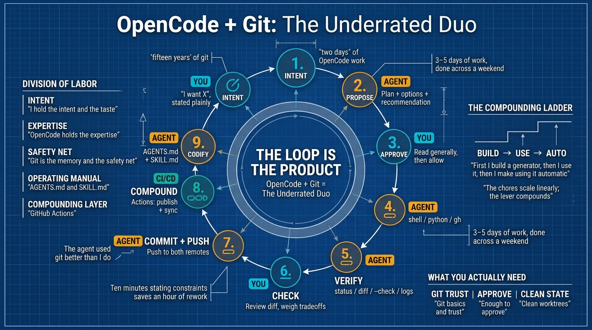

# OpenCode + Git：被低估的组合 (The Underrated Duo)

**原文：** [260809-opencode-git-underrated.md](260809-opencode-git-underrated.md)

让我先坦白我的资历，因为这正是本文的重点。我使用 git 大约十五年了。我能 clone、commit、branch、merge、push、pull、stash、log、revert、reset。我能修复自己搞砸的 rebase (变基)，我也确实这么干过。按照任何合理的定义，我*懂 git*。

然而，在用 **OpenCode** ——一个运行 `big-pickle`（200k 上下文的开源权重 LLM）的终端 AI 智能体 (agent)——工作了两天之后，我产出的真实自动化 (automation) 比过去十五年中的大多数时候都多。不是因为我的 git 技能突然提升了。而是因为我终于有了一个能像资深工程师那样**驾驭** git 及其周边一切的人：在与我的循环协作中思考、决策、构建，而我扮演审批者的角色。

本文的论点很简单：**git 并非被低估——每个人都知道它不可或缺。真正被低估的是整个技术栈的协同运作：OpenCode、git，以及我编写的文档和技能 (skill)，它们被串成一个循环——跟踪、暂存 (staging)、分析、提交 (commit)、推送 (push)——跨越多个仓库和两个账户——哪怕只是为了一篇文章。而它之所以有效，靠的不是模型，而是编排 (orchestration)。** 下面是我如何走到这一步的。

## 坦白 (The confession)

我不是因为读了什么文章才发现这一点的。我是通过看着 OpenCode 在审批关卡 (approval gate) 后面处理一个真实的、混乱的多账户问题，而我坐在那里 watching 才发现的。

这个设置确实很复杂。我的文章存放在 `ai-thoughts` 中，镜像到**两个** GitHub 账户（`j3ffyang` 和 `negtivspace`），这两个账户还各自运行着一个 profile 仓库，其 README 应该展示与 `PORTFOLIO.md` 相同的作品集。手动保持所有这些一致，是我一直半吊子干的那种活：它能用，然后它会漂移 (drift)，然后我花一个下午修复，但永远修不完。

这一次，我没有手动修复。我描述了目标，智能体制定了计划，我批准了每一步，经过两个会话 (session)，我们构建了一个再也不会漂移的东西。而看着这一切发生时，最让我不安的部分是：**这个智能体用 git 比我用得好。** 它检查干净的工作树 (worktree)，只暂存预期的文件，更新子模块 (submodule) 指针，推送到两个远程 (remote)，并且在某一步出问题时干净地回滚 (rollback)。所有那些我*能*做、但从未费心去*编排*的事情。

## 转变：让智能体主导 (The shift: let the agent drive)

改变一切的思维模型是一种分工：

- **我掌握意图和品味。** 我说我想要什么，我陈述约束条件，我决定什么被批准。
- **OpenCode 掌握专业知识。** 它深入了解 git，能读取我自己仓库的规则，能编写 Python、YAML 和 Markdown，并且能验证自己的工作。
- **Git 是记忆和安全网。** 每一步都是一个 commit；每个错误都只需要一次 `git reset` 就能撤销。这种安全性正是让智能体行动变得安全的原因。
- **AGENTS.md 和 SKILL.md 是操作手册。** 它们是智能体停止每次会话重新学习我的约定、开始表现得像一个了解项目的同事的方式。
- **GitHub Actions 是复利层 (compounding layer)。** 一旦建成，自动化就会自己运行。

这些都不需要我成为 git 大师。它要求我*刚好足够*了解 git——当智能体请求批准运行 `shell` 或 `python` 或 `gh` 时，我大致知道它们在做什么，即使我背不出每个参数 (flag)。这是一个低得多的门槛，而正是这个门槛解锁了一切。

## 两天自动化——真实案例 (Two days of automation — real examples)

以下全部来自一个周末的真实工作。每一行是：我想要什么，OpenCode + git 构建了什么，它为我节省了什么。

| 我想要什么 | 我们构建了什么 | 它节省了什么 |
| --- | --- | --- |
| 停止手动跨数百篇文档重新换行 | `scripts/unwrap_md.py`——自动将段落换行到单行，保留代码围栏 (code fence)、表格和列表嵌套，带 `--check` 模式 | 数小时的手动编辑，而且会遗漏文件 |
| 让多年文章的文件名保持一致 | 一次扫描，将每个文档和图片重命名为 `YYMMDD-slug`，修复所有链接，并去重草稿 | 一个下午的小心翼翼的 find/sed，我早就放弃了 |
| 不手动将技能发布到 ClawHub | 每个仓库一个 GitHub Actions 工作流 (workflow)，在每次 push 时发布 `.opencode/skills`，带 `j3ffyang` 限制和内联 CLI 处理 | 无需本地 CLI，无需手动发布，异步状态不再看起来像失败 |
| 让 `PORTFOLIO.md` 保持准确 | `gen_portfolio.py`——从模板 + `articles.yaml` + git log 渲染，带 `--check` 模式 | 数字不再漂移；CI 告警而不是默默过时 |
| 在**两个** GitHub 账户上展示作品集 | 将 `PORTFOLIO.md` 同步到 `j3ffyang/j3ffyang` 和 `negtivspace/negtivspace` 的 `README.md`，更新子模块指针 | 不再需要在两个账户间复制粘贴 |
| 让这种同步永远自动运行 | 一个 `repository_dispatch` 链：任何 `PORTFOLIO.md` 变更触发一个 dispatch，两个 profile README 自动更新 | 未来的更新是零接触的 |
| 诊断一个失败的工作流 | `gh run view --log`——几分钟内找到缺失的 `PROFILE_SYNC_TOKEN` 密钥 | 本来会是一个在 UI 里翻找的会话 |

仔细看最后三行。它们形成了一个阶梯：首先我构建一个生成器 (generator)，然后我使用它，然后我让使用它变得自动化。这就是复利效应 (compounding effect)，也是这个周末值得的全部原因。

要精确说明"组合"意味着什么：发布一篇文章不会只触及一个仓库。它读取我的 AGENTS.md 规则，只暂存预期的文件，分析 diff (差异)，以正确的风格提交，推送到两个账户的镜像，更新子模块指针，并触发刷新两个 profile README 的 profile-sync 工作流。那是几个仓库、两个账户和一堆自动化——只为了一个 Markdown 文件。这些作为 git 操作都不*难*。作为一个系统，它是一个小团队一下午的工作量。

## 架构：从思维流到工作流 (The architecture: thought-flow to workflow)

实际发生的事情，还原到它的形状。我这边是思维流 (thought-flow)；智能体那边是工作流 (workflow)。它们在审批关卡 (approval gate) 会合。

| # | 我——思维流 | OpenCode + git——工作流 |
| --- | --- | --- |
| 1 | **INTENT (意图)**——"我想要 X"，直白陈述 | |
| 2 | | **PROPOSE (提议)**——一个带选项和建议的计划，展示 diff |
| 3 | **APPROVE (批准)**——阅读命令的大致形状，然后放行 | |
| 4 | | **EXECUTE (执行)**——shell / python / gh，在干净的工作树中，对状态变更请求批准 |
| 5 | | **VERIFY (验证)**——`git status` / `git diff`，脚本 `--check`，`gh run view` |
| 6 | **CHECK (检查)**——审查 diff，权衡取舍 | |
| 7 | **COMMIT + PUSH (提交+推送)**——推送到两个远程 | |
| 8 | | **COMPOUND (复利)**——GitHub Actions 接管（ClawHub 发布、profile 同步） |
| 9 | | **CODIFY (固化)**——规则写入 AGENTS.md，流程写入 SKILL.md |

循环 (loop) 才是真正的产品。每个阶段都有自己的工作，跳过任何一个都会立刻暴露：

- **意图和批准是最昂贵的阶段。** 花十分钟陈述约束条件，能省下一小时的返工。"不本地安装"和"推送到两个远程"——只需在开头声明一次——就防止了一整类问题。
- **先验证，再归咎 (Verify before blaming)。** profile-sync 工作流在第一次运行时失败了——两个账户在尝试推送时都返回了 404。我以为是 token 的问题。智能体没有猜测；它运行了 `gh run view --log`，找到了缺失的 `PROFILE_SYNC_TOKEN` 密钥，并准确告诉我哪个账户缺少了它。整个诊断只花了三分钟。这就是"工具坏了"和"配置不完整"之间的区别——智能体之所以知道是哪个，是因为它先查看了真实的系统。
- **最后固化 (Codify)。** 一旦某件事奏效，它就变成一条规则 (AGENTS.md) 或一个封装好的流程 (SKILL.md)。知识在会话之间存活下来，这就是借用专业能力和拥有专业能力之间的区别。

## 证明：一个专家团队 (Proof: a team of experts)

人们问 AI 智能体是否真的能替代与专家合作的经验。我认为这是个错误的问题。正确的问题是：**一个被良好编排的智能体，能否表现得像一个小团队？** 观察这个周末，答案是肯定的——因为每个问题都从同一个工具中拉出了不同的"专家"：

- **一个 git 专家**处理了双远程推送、子模块更新和干净的暂存——那些我能做但从未系统化的日常维护。
- **一个 Python 开发者**编写了 `unwrap_md.py`、`gen_portfolio.py` 和同步脚本，然后让每个脚本都可通过 `--check` 测试。
- **一个 CI/CD 工程师**设计了工作流、所有者限制和连接一个仓库到两个 profile 仓库的 `repository_dispatch` 链。
- **一个 SRE（站点可靠性工程师）**诊断了失败的运行，读取了日志，并精确指出了跨两个账户缺失的密钥。
- **一个技术文档撰写者**起草了 AGENTS.md 和 SKILL.md 文件。

同一个会话既编辑了一篇文章，又调试了一个 GitHub Actions 故障，还更新了一个子模块。这种广度——而非任何单一领域的深度——就是"一个专家团队"在实践中的真实感受：一个小团队 3-5 天的工作量，在一个周末内完成。

## 你实际需要知道什么 (What you actually need to know)

这比人们担心的要少得多。三件事让这个周末成为可能：

- **Git 基础和信任。** commit、push 和 reset 是什么——以及 git 是一个安全网：什么都不会丢失，一切都是可逆的。正是这种信念让智能体行动变得令人安心。
- **足够审批即可。** 当智能体请求运行一条命令时，我不需要知道每个参数。我需要识别它在*做什么*——"这修补了这些文件"、"这推送到两个远程"——并在不确定时提问。
- **干净的工作树。** 未提交的噪音会隐藏真正的变更。干净的状态让审批变得快速，让 diff 成为唯一的事实来源。

## 它实际节省了什么 (What it actually saves)

时间，显然——但诚实的核算比"它很快"更有趣。

直接的节省是真实的：数小时的手动文件重命名、散文换行、README 漂移修复和跨账户复制粘贴，被压缩到两个会话中。但复利节省更重要。我们构建的每一个工具都成了下一个请求的资本。第一天构建的生成器在第二天被使用。第二天构建的工作流将永远运行。每个会话结束时，系统都比开始时稍微更自动化了一点，这意味着*下一个*会话的起点稍微小了一点。

这就是把 git 当杂务和把 OpenCode + git 当杠杆的区别。杂务线性扩展；杠杆复利增长。

## 快速要点 (Quick takeaways)

如果你只记住五件事：

1. **你不需要精通 git——你需要精通审批决策。** 了解足够多以理解一个提议的命令在做什么；智能体提供机制。
2. **让智能体驾驶，但握住方向盘。** 精确陈述意图和约束，批准每一步，在 diff 落地之前检查它。
3. **循环才是产品。** Intent → propose → approve → execute → verify → commit → codify。每个阶段都有工作；没有一个可以跳过。
4. **先验证，再归咎。** 当某件事失败时，在得出工具出错的结论之前，先查看真实的系统（`gh run view`、API、日志）。
5. **固化有效的东西。** 规则写入 AGENTS.md，流程写入 SKILL.md，自动化写入 CI——这样你做过一次的工作就永远不需要再做。

btw, i use arch 
