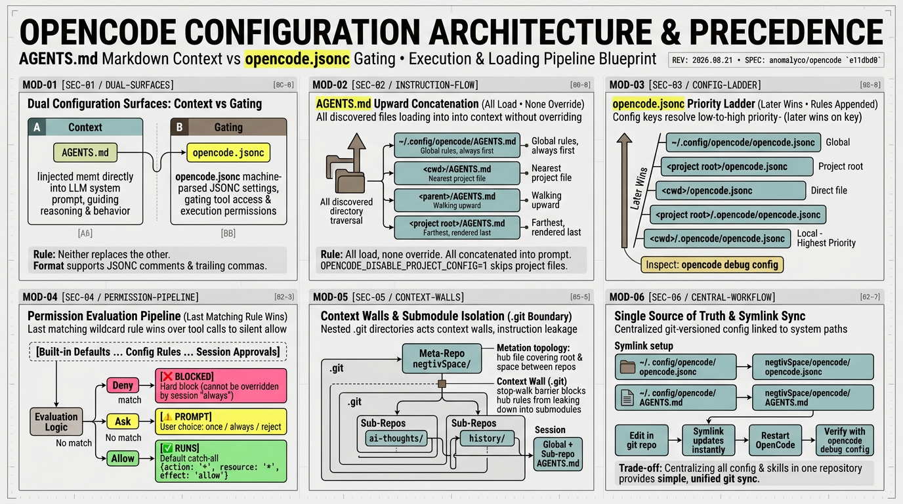

# OpenCode AGENTS.md 与 opencode.jsonc——架构、优先级与工作流 (Architecture, Precedence and Workflow)

**原文：** [260811-agents-opencode-config.md](260811-agents-opencode-config.md)



本文总结了本机 OpenCode 的配置方式、各配置组件的加载机制以及优先级 (precedence) 规则的实际运作原理。所有技术细节均已在 2026-08-11 对照 OpenCode 源代码树 (anomalyco/opencode) 和官方文档进行了严格验证，并在 2026-08-21 对照源码 HEAD `e11dbd0` 完成了二次复核，而非凭记忆臆断。

## 概览：两个互补的配置表面 (Overview: Two Configuration Surfaces)

OpenCode 由两个互补的配置表面共同驱动。`AGENTS.md` 文件将 Markdown 指令直接注入大模型的提示词上下文 (system prompt context)；`opencode.json` / `opencode.jsonc` 文件则保存机器解析的结构化设置（包括权限 permissions、智能体 agents、服务商 providers 与插件 plugins）。指令决定智能体如何判断与推理；配置则门控 (gate) 它被允许执行哪些操作。两者无法相互替代——关于行为与规范的规则放在 `AGENTS.md` 中，关于工具访问与权限门控的规则放在配置文件中。

配置文件在所有路径下均原生支持 JSONC 格式（支持注释和尾随逗号），且在每个配置位置均同时兼容 `.json` 和 `.jsonc` 文件名。

## 文件清单 (File Inventory - 复核于 2026-08-21)

- `~/.config/opencode/opencode.jsonc` —— 全局配置 (global config)，软链接 (symlink) 至 `negtivSpace/opencode/opencode.jsonc`（已提交至该仓库，享受版本控制）。这是本机权限规则的单一事实来源 (single source of truth)。
- `~/.config/opencode/AGENTS.md` —— 全局规则 (global rules)，软链接至 `negtivSpace/opencode/AGENTS.md`（采用相同的 git 纳管模式），在每个会话中均会被加载。
- `<repo>/AGENTS.md` —— 项目规则 (project rules)，纳入版本控制，在对应仓库中工作时加载（例如 `ai-thoughts/AGENTS.md`）。
- `<repo>/opencode.json` / `<repo>/opencode.jsonc` —— 项目根目录配置。
- `<repo>/.opencode/opencode.json` / `.jsonc` —— 本地最高优先级配置层；当前在 `ai-thoughts` 中暂未建立，因此该仓库的会话直接运行在全局配置和内置默认规则之上。
- `<repo>/.opencode/skills/<name>/SKILL.md` —— 技能 (skills)，由系统自动发现。

## AGENTS.md 加载机制与优先级 (AGENTS.md Loading and Precedence)

指令加载器 (loader，源码：`packages/core/src/instruction-context.ts`) 会读取全局文件，并从启动 OpenCode 的当前工作目录 (cwd) 沿目录树一路向上遍历至项目根目录（对于 git 仓库即为仓库根目录），加载沿途发现的每一个 `AGENTS.md`。所有发现的文件都会被加载；没有哪一个会覆盖另一个。它们会按以下顺序依次拼接并渲染进系统提示词中：

```
按如下顺序全部渲染注入模型的系统上下文中（全部加载，无覆盖机制）：

  1. ~/.config/opencode/AGENTS.md        全局规则（始终优先，置于最前）
  2. <cwd>/AGENTS.md                     距离当前目录最近的项目文件
  3. <parent>/AGENTS.md                  沿目录树向上逐级遍历
  4. ...                                 每个目录加载一个文件
  5. <project root>/AGENTS.md            距离最远的项目根文件，最后渲染

  无回退机制：截至 2026-08-21，加载器仅以 AGENTS.md 为目标——旧有的
  CLAUDE.md / ~/.claude/CLAUDE.md 兼容回退已被彻底移除。若设置环境变量
  OPENCODE_DISABLE_PROJECT_CONFIG=1 则会完全跳过项目级文件的发现。

  由于所有文件同时并存于提示词中，冲突无法通过优先级机制消除——
  模型会同时看到所有规则并被期望全部遵守。务必保持各层级规则非矛盾。
```

这在每个会话中都清晰可见：系统提示词会先输出 "Instructions from: /home/jeff/.config/opencode/AGENTS.md"，紧接着输出 "Instructions from: .../ai-thoughts/AGENTS.md"。

## opencode.jsonc 加载机制与优先级 (opencode.jsonc Loading and Precedence)

配置加载器 (loader，源码：`packages/core/src/config.ts`) 从低到高优先级读取配置文件并依次应用——针对相同的键值，后加载的文件获胜。权限规则列表 (permissions) 则是追加 (append) 而非替换，因此全局规则和本地规则会同时保持生效。

```
配置文件按优先级从低到高排列（后加载的文件覆盖同名键）：

  1. ~/.config/opencode/opencode.json / .jsonc         全局层 (Global)
  2. <project root>/opencode.json / .jsonc             项目根目录
  3. <intermediate dirs>/opencode.json / .jsonc        向下遍历至当前工作目录
  4. <cwd>/opencode.json / .jsonc                      当前直接目录文件
  5. <project root>/.opencode/opencode.json / .jsonc
  6. <intermediate dirs>/.opencode/.../.opencode/...
  7. <cwd>/.opencode/opencode.json / .jsonc            本地层，具有最高优先级

  规则列表（权限）为追加合并，而非覆盖替换：
  在单个规则列表中，遵循“最后匹配的规则获胜 (last matching rule wins)”。
  可通过命令检查解析后的最终配置：  opencode debug config
```

## 权限模型与决策流程 (Permission Model and Decision Flow)

权限判定效果分为 `allow`（允许）、`ask`（询问）与 `deny`（拒绝）；使用 `opencode --auto` 时会自动批准所有 `ask` 结果（`deny` 依然严格强制执行）。内置的默认智能体规则列表以全匹配通配规则 `{action: "*", resource: "*", effect: "allow"}` 开头，随后紧跟一系列内置硬编码规则（如 question/plan 模式的拒绝规则、`read *.env → ask` 等；源码：`packages/core/src/plugin/agent.ts`），配置文件中的权限规则会追加在这些默认值之后并赋予每个智能体（源码：`packages/core/src/config/plugin/agent.ts`）。

来自 2026-08-21 二次复核的两点关键说明：首先，配置模式键名现已统一为 `permissions`；本机配置中仍在沿用的旧版 `"permission"` 拼写通过 v1 迁移适配层 (`packages/core/src/v1/config/migrate.ts`) 仍能正常兼容。其次，底层纯规则评估器自身的无匹配兜底其实是 `ask`，但在全局通配 `allow` 存在的前提下该兜底永远不会被触发；完全不携带任何规则集的智能体才会默认进入 deny-all（全拒绝）。

实际运行的结论十分明确：配置文件未明确提及的任何操作都将在无需提示的情况下静默运行——这也正是为何在旧配置中配置 `"*": "ask"` 兜底会导致大量弹窗轰炸，而移除该兜底后未匹配的命令就会静默执行的原因。

针对每一次工具调用，匹配命中的规则是通配符模式 (wildcard pattern) 与动作及资源匹配的**最后一条规则**（源码：`packages/core/src/permission.ts`）。Bash 命令规则匹配的是解析后的完整命令字符串（例如 `git status --porcelain`）；`*` 匹配任意字符，`?` 精确匹配单个字符。跨资源的聚合逻辑为：任意一条匹配规则为 deny 则完全阻断；否则任意一条为 ask 则弹出提示；否则全部 allow 允许执行。配置中的 `deny` 属于硬性预检，单会话中的 "always"（总是允许）无法将其覆盖；配置中的 `ask` 则可在单会话中被批准。在 ask 提示框中选择的单会话批准项（once 一次 / always 总是 / reject 拒绝）会按项目独立存储，并追加在配置文件规则之后。

```
每次工具调用 -> 将 (action, resource) 对比评估链：
   [内置默认规则 ... 配置文件规则 ... 已保存的会话批准项]

   查找最后一条匹配的通配符规则
   |- 配置是否拒绝 (deny) 了任意相关资源？ -> 阻断 (BLOCKED，硬性阻断无法覆盖)
   |- 是否有任意匹配规则判定为 deny？     -> 阻断 (BLOCKED)
   |- 是否有任意匹配规则判定为 ask？      -> 弹窗提示 (PROMPT，可选 once/always/reject)
   `- 否则（无特殊规则命中）              -> 静默运行 (RUNS，命中默认全允许兜底)

注意：如果将 ask/deny 模式写在具有相同前缀的 allow 之后，前者会遮蔽 (shadow) 后者
（最后匹配规则获胜）——请务必保持 ask 与 allow 的前缀模式相互分离。
```

`edit` 动作覆盖 edit、write 和 patch。`~` 和 `$HOME` 仅在路径类动作模式（read、edit、external_directory）中展开，在 bash 命令模式中不展开。

## 工作流：修改权限 (Workflow: Changing Permissions)

1. 编辑 `negtivSpace/opencode/opencode.jsonc` —— 单一事实来源。这里的 `negtivSpace/` 是 GitHub 仓库 `negtivspace/negtivspace` 的本地克隆目录（文件夹与仓库同名），独立存在于任何单一项目树之外。两个符号链接将其桥接至 OpenCode：`~/.config/opencode/opencode.jsonc → …/negtivSpace/opencode/opencode.jsonc` 和 `~/.config/opencode/AGENTS.md → …/negtivSpace/opencode/AGENTS.md`。对仓库的修改会立即同步至这两个软链接；git 历史追踪与一键回滚全部自然生效。
2. 重启 opencode —— 配置仅在打开工作区时读取一次，因此规则修改后需要重启会话。
3. 在信任新规则前，使用 `opencode debug config` 命令验证解析后的实际规则。
4. 针对临时单次调整，可使用 ask 提示框中的 once / always ("Accept always") / reject；"always" 仅在当前会话生效，持久化规则必须写入配置文件中。

## 冲突、困惑与去重审查 (Conflict, Confusion and Duplication Review)

全局与仓库 `AGENTS.md` 之间的重复问题：曾有八条规则几乎逐字同时出现在 `~/.config/opencode/AGENTS.md` 与 `ai-thoughts/AGENTS.md` 中，另有两条出现在 `history/AGENTS.md` 中。2026-08-11 完成了去重重构：通用规则如今仅保存在全局文件中（软链接至 `negtivSpace/opencode/`），各个具体仓库的 `AGENTS.md` 仅保留项目特有规则以及一条指向全局的单行委托声明。这里的权衡在于：被其他外部工具读取的公开仓库克隆将不再自带通用规则，但在本机上的每个会话都能从全局文件中完整继承它们，且每条规则都有唯一的单一所有者，从根本上杜绝了配置漂移 (drift)。`negtivSpace/AGENTS.md` 的模式（委托给全局）即是各仓库现行遵循的范式。

三层 `AGENTS.md` 不会在同一个会话中全部叠加。加载器在到达每个项目根目录时便会停止向上遍历（源码：`packages/core/src/instruction-context.ts`），且每个嵌套仓库都是独立的 git 仓库，因此在 `ai-thoughts/`、`history/` 或其他子模块内打开的会话只会加载全局 + 该仓库的文件，而在中枢根目录或 `scripts/` 下的会话则加载全局 + `negtivSpace/AGENTS.md`。有一个反例恰好印证了这条规则：`gpd/` 只是一个普通子目录而非独立的 git 仓库，因此在该目录下打开的会话会一路向上遍历到中枢根目录，从而同时加载三层文件——全局 + 中枢 + `gpd/AGENTS.md`。由此可见，中枢文件并非“第三层级”，而是元仓库 (meta-repo) 本身的项目级 `AGENTS.md`，用于约束仓库之间的公共地带。

核心提炼 (2026-08-21)：系统中不存在人为划分的层级，只有物理位置的放置。OpenCode 只识别标准的 git 仓库——元仓库也只是一座普通仓库，其项目内容恰好是“个人主页与子模块指针”，因此 `negtivSpace/AGENTS.md` 与 `ai-thoughts/AGENTS.md` 是同级兄弟文件，而非上下级关系。每一个嵌套的 `.git` 目录都充当着一道上下文隔离墙 (context wall)：父级指令绝对无法向下泄漏到子仓库会话中。这使放置策略成为了一个纯粹的可见性 (visibility) 问题，而非主题分类问题：在任何子仓库内工作时都需要的规则（如 commit/push 纪律）必须放在全局中，因为中枢文件无法穿透隔离墙；仅在中枢根目录下运作的工作流（如 profile 个人主页同步、子模块指针维护策略）必须留存在中枢文件中，因为若将其并入全局则会污染全机所有会话；两者缺一不可——删掉中枢文件会导致中枢根会话对指针维护与 README 重新生成等专属操作彻底“致盲”。在跨机共享层面存在一个边界：外部公开克隆无法获取全局配置层，因此子仓库必须具备的独立规范必须有意复制到子仓库自身的规则文件中。

两个全局文件现已实现完全对称：两者均为指向 `negtivSpace/opencode/` 的 git 纳管软链接（配置文件此前已是软链接；2026-08-11 `AGENTS.md` 亦加入该模式）。版本历史、安全回滚与跨机器迁移能力全部由仓库赋予。新机器上的初始化步骤极为简洁：克隆 `negtivSpace` 仓库并在 `~/.config/opencode/` 下建立这两个软链接——必须使用此绝对路径，放在其他任何路径下都会导致加载失败并静默失效。在任何新机器部署完成后，务必先行验证：运行 `opencode debug config` 并将解析后的规则列表与仓库副本对照，因为更新版本的 OpenCode 二进制程序可能会调整配置结构，而解析转储输出才是唯一的地面实况 (ground truth)。

文档漂移 (doc drift) 曾造成过困扰：`AGENTS.md` 中的权限描述段落与配置文件中的注释同时描述了权限行为，某次编辑曾误称未匹配的命令会被“静默拒绝”，而事实真相是在默认允许下它们会直接放行。必须时刻保持这两处描述的一致性——`AGENTS.md` 段落面向人类阅读，配置注释则作为行内事实。

必须规避的核心陷阱：本地 `.opencode/opencode.jsonc` 会覆盖该仓库的全局配置，因此若在局部重新引入旧式的 `"*": "ask"` 兜底，会在该仓库内静默恢复弹窗轰炸。未来的任何局部配置都应保持以 allow 为驱动的设计，与全局风格保持同步。

各配置表面之间不存在真正的实质冲突：`AGENTS.md` 规范智能体行为，配置文件门控工具权限，两者由于作用域完全不同而互不打架。“仅在被要求时提交 (commit only when asked)”规则与“推送到两个远端 (push to both remotes)”惯例相互补充（提交由用户触发，推送遵循仓库既定惯例），而配置中的只读 git 白名单为两者提供了底层保障。经复核，只读 git/gh 允许前缀与破坏性操作的 ask 前缀互不重叠——唯一的临界指令（如 `git stash list`、`git tag -l`、`git config --get` 等）由于 ask 规则采用了明确的子命令匹配而非宽泛的 `git stash*` / `git tag*` 通配，因此始终保持顺畅允许。

文本换行 (prose wrapping) 策略刻意按仓库独立设定，而非全局统一步调。`ai-thoughts/AGENTS.md` 强制要求禁止硬换行（一整段文字占一行，由 `scripts/unwrap_md.py --check` 校验），`history/AGENTS.md` 则采用自动换行，全局 `opencode/AGENTS.md` 明确将规则委托给各仓库——切勿假设存在全局统一的换行规范。经 2026-08-11 复查：维持该规则不变。其维护成本极低（一行说明，无需复杂管线），价值却极高——硬换行的长文本会将单字修改放大为 20 行的 git diff，并破坏中日韩 (CJK) 字符的分词边界。`unwrap_md.py` 属于安全保险而非强制门禁：在没有自动化 CI 流水线的前提下，`--check` 属于手动卫生检查，将其提升为 hook 钩子或 CI 门禁并无必要。

集中式配置的权衡 (Centralized configuration trade-off)：我个人更倾向于将所有配置——包括 `AGENTS.md`、`opencode.jsonc` 以及全部 `SKILL.md` 文件——统一集中保存在 `ai-thoughts` 仓库中。这样可以让我专注于在一个地方管理、更新和统一所有具体配置，并通过 git 进行版本管理与多端同步。尽管从跨独立仓库的角度来看这或许不是理论上最纯粹或最优的架构划分，但至少在现阶段，这是当前环境下对我而言最简单、最实用的做法。

## 参考资料 (References)

- 源码 (Source)：
  - 配置文件加载顺序：`packages/core/src/config.ts`
  - `AGENTS.md` 加载机制：`packages/core/src/instruction-context.ts`
  - 权限评估与默认值：`packages/core/src/permission.ts`
  - 内置默认智能体规则：`packages/core/src/plugin/agent.ts`
  - 配置规则追加合并至智能体：`packages/core/src/config/plugin/agent.ts`
  - v1 `permission` → `permissions` 键名迁移：`packages/core/src/v1/config/migrate.ts`
- 官方文档 —— opencode.ai/docs/rules、opencode.ai/docs/config、opencode.ai/docs/permissions。
- 本地路径 —— `~/.config/opencode/opencode.jsonc`（软链接至 `negtivSpace/opencode/opencode.jsonc`）与 `~/.config/opencode/AGENTS.md`（软链接至 `negtivSpace/opencode/AGENTS.md`）。

btw, i use arch 
