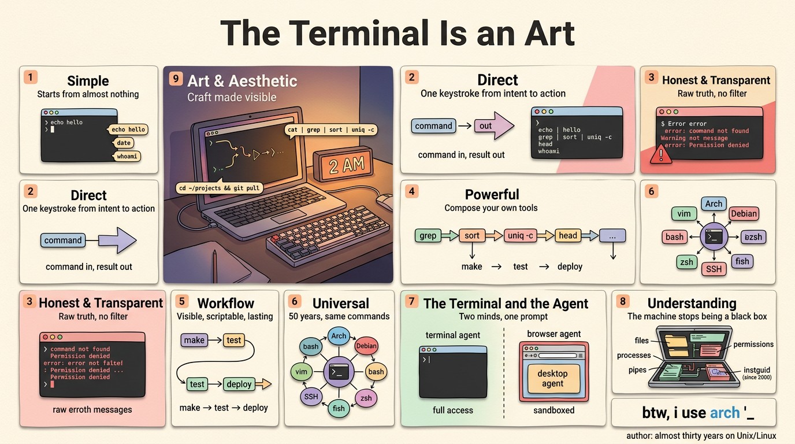

# 终端即艺术 (The Terminal Is an Art)

**原文：** [260811-terminal-is-an-art.md](260811-terminal-is-an-art.md)

我使用 Unix 和 Linux 已经快三十年了，至今大部分时间仍花在终端 (terminal) 里。不是因为不得不——而是因为它是我们这行产出的最接近艺术的东西。每年桌面 (desktop) 都更光鲜，应用都更臃肿，而我一次又一次回到闪烁的光标和提示符 (prompt) 前。原因如下。

## 简单 (Simple)

终端是最简单的东西：一个提示符、一个闪烁的光标、一行输入。没有窗口、没有面板、没有功能区、没有新手引导。剥去所有外壳，你剩下的就是告诉计算机该做什么的纯粹行为。我是个极简主义者，厌恶臃肿软件 (bloatware)——终端天生就不会臃肿，因为它几乎从空无一物开始，只随着你的添加而增长。它能在任何地方、任何东西上运行：一台十五年机龄、没有桌面环境 (desktop environment) 的笔记本，装上 shell 就能用。终端不在乎你的硬件、内存、GPU——它几乎什么都不要，却给你一切。你看到的是做得到位的精华——没有功能膨胀、没有冗余，只有重要的部分。

输入 `echo hello`、`date`、`whoami`——计算机就回答你。无需设置、无需配置、无需教程。

## 直接 (Direct)

你说什么，就发生什么。`ls`、`cp`、`git commit -m "..."`——命令进，结果出。需要连接服务器？`ssh user@host`。需要改权限？`chmod 755 script.sh`。要建目录连同所有父目录？`mkdir -p path/to/dir`。没有对话框、没有确认提示——只有你和机器，说同一种语言。不用点菜单、不用在三层深处找设置、不用向导 (wizard) 确认你刚才说过的话。想要和做到之间只差一个键。这种直接性就是为什么我在 shell 里比在任何应用中都快。

## 诚实且透明 (Honest and Transparent)

终端把错误直接甩在你脸上。`command not found`。`No such file or directory`。`Permission denied`。它不把问题藏在礼貌的对话框和转圈动画后面——它准确地告诉你哪里出了错，就在此时此地。这种诚实是现代软件最稀缺的东西。GUI (图形界面) 经常吞掉原因，给你一个模糊的道歉；终端从不这样。而且每个命令都在你眼前，没有什么被隐藏——你运行了什么就是发生了什么，你可以再运行一次，看着它再发生一次。这是我所知最透明的界面。

没有任何中间层替你处理输出和日志——包括错误。你看到的就是系统产生的原始内容，未经任何抽象层过滤。需要深入排查时，工具就在那里：`dmesg` 显示内核 (kernel) 自己的日志，`strace` 追踪一个进程 (process) 的每个系统调用 (system call)，`journalctl -e` 准确地告诉你 systemd 做了什么、什么时候做的。没有任何 GUI 能提供这种程度的诚实——终端把原始真相交给你，相信你能读懂。

## 强大 (Powerful)

一行命令取代一整个应用。`grep` 搜索百万行日志。`rsync` 跨网络同步一个目录。`ffmpeg` 转码视频，选项比任何 GUI 能放进菜单的都多。`awk` 重塑数据列。`sed` 就地转换文本。`find . -name "*.md" | xargs wc -l` 数出你目录树里每个 markdown 文件的行数。管道 (pipe) 才是真正的超能力——把 `cat`、`sort`、`uniq -c`、`head` 串起来，你就造出了任何厂商都不卖的分析工具。力量不在花哨的按钮里——在你输入的字里。终端随你的想象力扩展，不随版本号扩展。

## 工作流就在眼前 (The Workflow Is Right in Front of You)

终端让工作可见。你走的每一步都是一行能看见、能读、能重跑的命令。`make`、`test`、`deploy`——整个流水线 (pipeline) 以纯文本铺开，出错时你精确地看到在哪里。`crontab -e` 给凌晨3点安排一个任务。`systemctl status` 告诉你服务是否活着。`make -j4` 并行构建你的项目。一个 shell 脚本把一切串在一起——一个文件、一个命令，整条流水线跑起来。更好的是，工作流变成了脚本：一个文件，完美回放你的步骤，每一次、在任何机器上。GUI 的工作流活在肌肉记忆里，随你的耐心耗尽而消亡；终端的工作流活在文件里，永远留存。

## 通用 (Universal)

你跑什么发行版 (distro) 无所谓——Arch、Debian、随便什么。用什么 shell 无所谓——bash、zsh、fish。用什么终端模拟器 (terminal emulator) 或桌面无所谓——KDE、GNOME、kitty、terminator，还是 Hyprland 上的裸 TTY。命令都一样，因为底层的机器都一样：同样的工具、同样的命令、同样的管道-过滤器 (pipe-and-filter) 架构，不管谁打包的。只要你有 shell——哪怕是地球另一端服务器上的一个，通过 SSH (secure shell，安全壳层) 连上的——你就能跑。距离和硬件消失；只有你和提示符，一如既往。

而这些命令往往出自同一个仓库维护者——工具一起构建、一起设计、说同一种语言。这些不是每隔几年就换一批的工具。`ls`、`cd`、`grep`、`cat`——从 Unix 诞生的五十年前就在那里。我今天敲的命令在 1975 年的系统上也能跑。这种稳定性里有某种深刻的东西：计算中最可靠的接口也是最古老的。技术来了又走，GUI 每隔几年就被重新设计，而终端悄然超越它们所有人。

装 Arch 的时候，我用文本界面里的 `iwctl` 连 Wi-Fi——没有网络管理器、没有 GUI。起初一切都很难，但这些命令半个世纪没变过。这项技能投资每天都给我回报。

## 它让我理解了事物如何运作 (It Made Me Understand How Things Work)

这是最深的馈赠，也许是我坚持了近三十年的真正原因。因为终端简单、诚实、透明，它为我揭开了计算机的神秘面纱。文件、进程、管道、权限——我是通过看来学的，不是通过点菜单。GUI 崩溃时我束手无策；终端崩溃时我能读懂数错误、修好它。机器不再是黑箱。我对系统的理解，是单纯的 GUI 使用永远无法企及的——而这种理解是免费的，来自工具本身。从 2000 年起我就在维护一份活的笔记（[instguid](https://github.com/j3ffyang/instguid)），从 AIX 起步，逐渐覆盖 Linux、网络和安全。

## 美与美学 (The Art and Aesthetic)

人们说终端丑——从装饰的角度看，他们没错。但装饰不是艺术。它的美是留白 (negative space) 的美——等宽字体 (monospace font) 让每个字符占同样宽度，空行留出呼吸，光标静静等待而不强求。

艺术不总是关于装饰——有时是关于手艺 (craft)。终端是唯一一个从不挡路、从不隐藏真相、从不添加你没要求的东西的工具。Unix 哲学——只做一件事并做好——不只是工程原则，也是美学原则。一条管道链，比如 `cat log | grep error | sort | uniq -c`，就是一首小小的作品：诚实的部件组合成超越各自的整体。还有仪式感：机械键盘的声响、`cd ~/projects && git pull` 的节奏、凌晨两点的绿黑荧光。终端有一种手感——几乎是音乐性的——任何 GUI 都无法复制。简单、直接、诚实、强大、通用——五十年前构建，至今仍是与计算机对话的最佳方式。我仍然把命令行看作手艺而非工具——这是我所知最接近艺术的东西。

## 本文涉及的命令 (Commands in This Essay)

**入门：** `echo`、`date`、`whoami`
**文件与目录：** `ls`、`cp`、`mv`、`mkdir -p`、`chmod`、`touch`
**搜索与文本：** `grep`、`awk`、`sed`、`find`、`xargs`、`sort`、`uniq`、`cut`、`head`、`wc`
**网络：** `ssh`、`wget`、`rsync`、`iwctl`
**系统：** `dmesg`、`strace`、`journalctl`、`systemctl`、`crontab`、`make`、`ps`
**媒体：** `ffmpeg`
**版本控制：** `git`

btw, i use arch 
