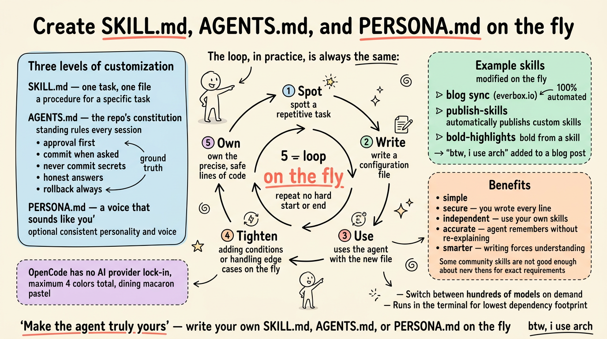

# 随手创建 SKILL.md、AGENTS.md 与 PERSONA.md（on the fly）

**原文：** [260906-opencode-create-skill-onfly.md](260906-opencode-create-skill-onfly.md)

很多时候，你其实并不需要到处去寻找别人的自定义 SKILL.md。你可以直接**创建你自己的**（create your own）。接下来，是我这几年与 AI 共同工作得到的真实、真诚的经历。

## 目标 (Objective)

要点很简单：与其在技能市场（skill marketplace）和社区中心里淘一个只勉强合用的技能，不如在工作过程中顺手写下你真正需要的那个——它会**完全符合你的要求**（exactly what you want），因为那是你亲手写的。

## 方法 (The Approach)

方法本身，和你所自动化的任务一样千差万别——有时我会为代码测试和 git 自动化搭建相当复杂的流程（workflow），但在这里，我只用一个非常简单的例子来示范。

下面的例子来自 OpenCode——我每天都在用的智能体（agent）平台。但在 Claude Code、Gemini CLI、OpenClaw、Hermes 等其他主流智能体平台上，它们也几乎完全一样。在我看来，它们之间没有太大的差别。

基本上有三个自定义层次（level）：

- 工作中随手创建（也有人叫它"记录"）一个自定义 SKILL.md
- 在 AGENTS.md 中定义规则（requirements）
- 在 PERSONA.md 中加入个性

大多数时候，我并不是抱着"我要创建一个自定义 SKILL.md"的念头开始的。工作过程中，你会发现自己反复在做某件一模一样的事——这就形成了一个**清晰的循环**（clear loop）。那一刻，就是你为自动化创建自定义 SKILL.md 的时机。

在实践中，这个循环**始终是相同的**（always the same）：

1. 发现循环（spot the loop）——一件一而再、再而三出现在你工作中的任务。
2. 写下文件——用一个 SKILL.md（或一条 AGENTS.md 规则，或一种 PERSONA.md 的声音）把它描述得清清楚楚。
3. 下次它再出现时就用起来——智能体会匹配描述并接手。
4. 随手打磨（on the fly）——加上更严格的条件、处理边界情况、检查重复条目。
5. 拥有它——每一行都是你写的，所以它既精确又安全。

### 自定义 SKILL.md (Custom SKILL.md)

SKILL.md 是一个 markdown 文件，通常位于 `.opencode/skills/<skill-name>/SKILL.md`，用来描述智能体能完成的一项任务。它写明这个技能做什么、何时使用、以及怎么做。智能体只在描述匹配时才会加载它，所以其余时间里它都不会碍事。

顺便一提，我创建过一些自定义 SKILL.md，比如同步我个人博客 https://everbox.io 的那个。我只管写 markdown，用 npm 和 Node.js 测试，然后提交（commit）并推送（push）到它专属的 Git 仓库，一路贯通我的本地仓库、Git 和 Cloudflare。整条流程**100% 自动化**（automated），不需要任何人插手。

其他例子：

- 自动把我的自定义 SKILL.md 发布到 https://clawhub.ai/j3ffyang/skills/publish-skills
- 本文的加粗高亮也来自一个技能，可参考 https://clawhub.ai/j3ffyang/skills/bold-highlights ——所有高亮都是自动生成的
- 一个小例子：每篇博客发布前，在末尾加上 "btw, i use arch"

之后，每当我想到一个更好的点或更严格的条件，我就会**随手**（on the fly）修改或优化我的自定义 SKILL.md，同时（如果适用）检查有没有重复条目。

### AGENTS.md

AGENTS.md 是一个仓库的宪法（constitution）。它定义了每次会话（session）都适用的常设规则：

- 任何改动之前都要先获得批准
- 只有在被明确要求时才提交（commit）
- 绝不提交密钥和机密（secrets）
- 给出诚实的回答
- 始终确保每次改动都可以被回滚（roll back）

它还承载写作约定，比如文件名规范和 no-hard-wrap（不硬换行）规则。

和智能体说话时，要用具体、明确的词。我发现，当我说出 **ground truth**（地面真值，指基于真实证据的事实）这个词时，智能体会认真地交叉核对来源——这一点我很喜欢。

它与 SKILL.md 的区别在于：技能是服务于特定任务的操作流程（procedure），而 AGENTS.md 为整个仓库设定规则。智能体在每次会话开始时都会读取 AGENTS.md，所以它在动手之前就已经知道了规则。

### PERSONA.md

PERSONA.md 是一个可选文件（有些平台用配置项代替），它赋予智能体**一致的个性**（consistent personality）和声音。有人重度依赖它，也有人完全不用。老实说，我平时用得不多——但当你做内容工作（写作、翻译、博客文章）并希望输出听起来始终像你、而不是像一个通用助手（generic assistant）时，它就物有所值了。

要记住一点：无论你创建的是哪个文件——SKILL.md、AGENTS.md 还是 PERSONA.md——OpenCode（或你使用的任何智能体平台）都可能需要重启才能拾取这个改动。不要以为你一保存，新文件或新规则就已经生效了。

## 好处 (Benefit)

这些都不是营销话术——下面每一条好处，都是日复一日使用后得到的 ground truth（真实依据）。

- **简单 (simple)**
- **安全 (secure)**——每一行都是你写的，所以你完全知道它在做什么
- **独立 (independent)**——你用自己写的，而不是别人的
- 有些社区技能就是**不够好**（not good enough），而且不完全符合你的确切需求
- 这套流程可以非常**准确**（accurate）和精确，不用你每次都重新解释——智能体会记住并知道
- 写这些文件会迫使你精确理解流程背后的逻辑，而这让你**更聪明**（smarter）

## 为什么用 OpenCode (Reason to Use OpenCode)

OpenCode 让我彻底摆脱任何 AI 服务商的锁定（lock-in），而且可以按需在数百种模型之间切换。它还跑在终端里——是我所知的依赖负担最小的方案。

下次你发现自己在一遍遍重复某件任务时，别再跑去技能市场里淘了——随手写下你自己的 SKILL.md、AGENTS.md 或 PERSONA.md。这是让你的智能体真正"属于你"的最快途径。

btw, i use arch