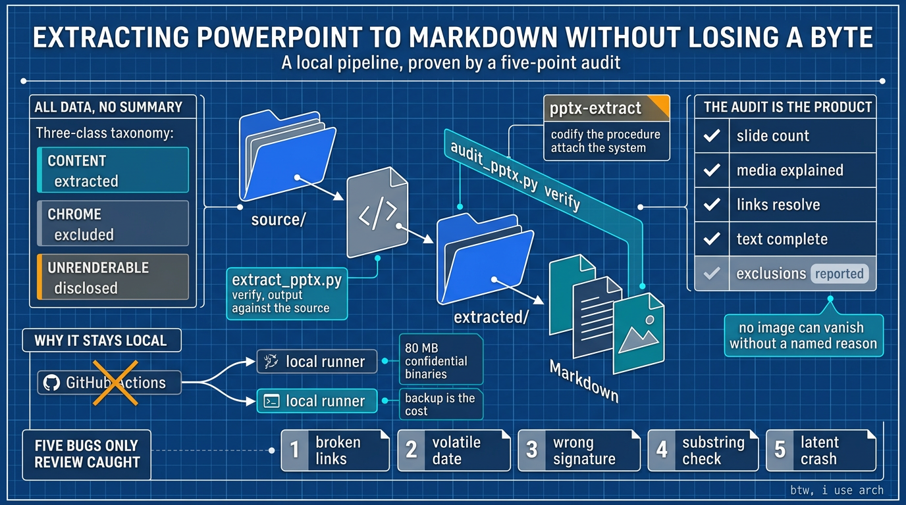

# 把 PowerPoint 完整提取成 Markdown：不丢一个字节

**原文：** [260919-lossless-pptx-extraction.md](260919-lossless-pptx-extraction.md)

一个叫 `joey` 的小型副项目 (side project) 有一个朴素的要求：把一个装满旧 PowerPoint 演示文稿 (deck) 的文件夹，每一份都转成单个 Markdown 文件——*全部内容*，而不是摘要。每一条项目符号、每一个表格单元格、每一句演讲者备注 (speaker note)、每一张图片。这些演示文稿很大，有些还很敏感，所以整件事必须在本地运行，什么都不能上传。这是关于这条流水线 (pipeline) 的故事，但主要是关于那个让它值得信任的审计 (audit)——以及那些在代码已经能跑*之后*才做出的设计决策。



## “全部数据” (all data) 才是真正的硬要求

把“把演示文稿转成 Markdown”这件事，容易的一半是文字。难的一半，是 *数据* (data) 这个词悄悄藏起来的一切：带合并单元格的表格、从不出现在幻灯片上的演讲者备注 (speaker note)、存放在旁挂关系文件 (sidecar relationship file) 里的超链接 (hyperlink)、内嵌图片 (embedded image)，以及偶尔出现的、在 Markdown 里根本没有对应物的对象。摘要工具 (summarizer) 会眼皮都不眨地把这些全丢掉。而需求禁止这么做——这意味着真正第一个问题从来不是“我要怎么转换？”，而是“我要怎么*证明*自己没有弄丢任何东西？”。关于保真 (fidelity) 的对话，比关于解析 (parsing) 的对话更重要。

## 一个 .pptx 就是一个 XML 压缩包 (zip)

现代的 `.pptx` 并不是一个二进制大块 (binary blob)，而是一个装着许多 XML 部件的压缩包 (zip archive)。解压后你会得到 `ppt/slides/slide1.xml`、`slide2.xml` 等等，还有 `ppt/notesSlides/`、`ppt/media/`，以及存放超链接和图片引用的 `_rels/` 文件。提取器 (extractor) 按文档顺序 (document order) 遍历每一张幻灯片的形状树 (shape tree)，遇到分组 (group) 就递归进去，再把 OOXML 映射到 Markdown：文本 run 保留粗体、斜体和删除线；项目符号的嵌套层级来自段落的缩进级别；真正的 `a:tbl` 会变成真正的 Markdown 表格；演讲者备注原样照抄。一份演示文稿变成一个文件，用一条稳定、可 grep、渲染时又看不见的分隔符 (delimiter) 切开：

```markdown
<!-- slide: 07 -->

## Slide 07
```

那条分隔符就是分页模型 (page model)。拆分、搜索、diff 全都挂在它上面，所以它必须无聊且精确。

那些 XML 没有一行是手工解析的。提取器建立在 `python-pptx` 之上——这个库把 OOXML 部件变成 Python 对象（形状、表格、备注、图片、超链接），读取的活儿由它干。这个项目加上的是它上面的一层：什么算内容、什么该被排除以及排除如何被公开、一种确定性的输出格式，以及那个证明结果的审计。解析是 `python-pptx` 的事；工作流 (workflow) 和它的保证才是这个项目的工作。

## 内容 (content)、装饰 (chrome) 与不可渲染 (unrenderable) 的东西

并不是演示文稿里的所有东西都值得活进 Markdown，而真正有意思的工程在于分清区别。一共有三类：

- **内容 (content)** —— 文字、表格、备注、内容图片：被提取。
- **装饰 (chrome)** —— 母版 (master) 和版式 (layout) 的背景、logo、从版式继承来的占位符文字 (placeholder text)：它们是共享的设计家具，而不是幻灯片内容，所以按设计排除。提取它们只会把同一个模板复制到每一张幻灯片上。
- **不可渲染 (unrenderable)** —— Markdown 根本无法表示的东西。有一份演示文稿里带着一张 13.2 MB 的矢量图 (vector diagram)，一个任何 Markdown 查看器都渲染不出来的 Windows 图元文件 (metafile)。

把那张图嵌进去只会得到一个坏掉的图片；悄悄丢掉它则是一句谎话。于是规则变成：跳过它，不要嵌入，并且*始终在那张幻灯片上放一条可见的说明*，写清标签 (tag)、类型和大小。一次静默的排除，和一份从未存在过的数据无法区分；一条诚实的说明则可以。

## 项目的形态：一个文件夹，一个技能 (skill)

整个项目住在一个自包含 (self-contained) 的文件夹里，可以打包发给别人，而它的布局编码了一条规则：重新生成 (regeneration) 是常规路径。`source/` 存放演示文稿，永不修改；`extracted/` 存放生成的 Markdown 和图片；`tools/` 存放脚本。`extracted/` 里的任何东西都不手改——如果哪里不对，你就改源头或工具，然后重新生成。输出是确定性的 (deterministic)：同样的输入产生逐字节相同的结果，而这正是让将来的漂移检查 (drift check) 成为可能的原因。

```text
joey/
├── source/                     # inputs: the decks (read-only, never modified)
├── extracted/                  # outputs, one unit per deck
│   ├── <deck>.md               #   full-data Markdown
│   ├── <deck>.pdf              #   hand-exported reference (exempt)
│   └── assets/<deck>/sNN-MM.*  #   extracted images
├── tools/
│   ├── extract_pptx.py         #   .pptx → Markdown + images
│   └── audit_pptx.py           #   the five-point losslessness audit
├── .opencode/skills/pptx-extract/SKILL.md   # the procedure + audit
├── AGENTS.md                   # the project's rules
└── README.md
```

有一个刻意留下的例外，被记录在案而不是藏起来。一份演示文稿的 PDF 是用编辑器插件手工导出、放在它的 Markdown 旁边的。它*不是*工具生成的，所以重新生成和回滚 (rollback) 都不覆盖它；假装它被覆盖，会破坏“重新生成覆盖一切”这条规则。它被明确允许作为一种作者提供的产物 (author-supplied artifact)——除此之外，`extracted/` 里不许再手工放任何东西。

项目还带有一个技能 (skill)，`pptx-extract`，它把整套流程固定下来——预检 (preflight)、提取 (extract)、审计 (audit)、抽查 (spot-check)、汇报 (report)。一个技能是恰当的数量，因为值得固化的流程只有一条；第二个技能只有作为一条独立、可被单独触发的工作流时，才配拥有位置。它运行在 `python-pptx` 之上，并把项目特定的要求编码进去——完整数据、可见的排除、确定性输出、机器校验的无损 (machine-checked losslessness)。工作流因此变得可复现，而不是口头相传 (tribal knowledge)；又因为技能就住在这个文件夹里，它会跟着项目一起走。实际上，它就是这个文件夹所遵循的流程：同样的预检、同样的提取命令、同样的审计——于是工作流不必每次重新推导。

它在两个地方可以拿到：

- **已发布 (ClawHub)：** [https://clawhub.ai/j3ffyang/skills/pptx-extract](https://clawhub.ai/j3ffyang/skills/pptx-extract)
- **源码 (GitHub)：** [https://github.com/j3ffyang/ai-thoughts/tree/main/.opencode/skills/pptx-extract](https://github.com/j3ffyang/ai-thoughts/tree/main/.opencode/skills/pptx-extract)

（发布出去的那份是做了泛化 (genericized) 处理的副本，放在宿主仓库里，好让它的发布流水线能发现它。）

## 审计 (audit) 才是产品

把转换器 (converter) 当成交付物、把检查器 (checker) 当成事后补充，是很有诱惑力的做法。在这里恰恰相反。流水线自带一套五点审计 (five-point audit)，它针对原始 `.pptx` 和生成的文件运行；前四点是硬性门槛 (hard gate)，任何失败都会以非零退出码结束，第五点则只作汇报供人复核：

1. Markdown 里的幻灯片标记 (slide marker) 数量等于源文件里的幻灯片数量。
2. 源文件里的每一个媒体块 (media blob) 都被*解释清楚*——要么被提取，要么被认定为版式装饰，要么被认定为图元文件。任何无法解释的都判定运行失败。
3. Markdown 里的每一个图片引用都能在磁盘上解析到真实文件。
4. 幻灯片和备注 XML 里的每一个文本字符串都出现在 Markdown 里。
5. 可见的“不可提取” (unextractable) 说明的数量会被汇报——它不是门槛，而是一项检查，用来确认没有意料之外的排除。

第二项检查是整个系统里最强的保证：没有哪张图片能在没有一个具名理由的情况下消失。合在一起，它们把“看起来对了”变成“经过机器校验的无损”，这是一个不同且强得多的论断——也是当要求是*全部数据*时，唯一值得做出的论断。

## 只有代码审查 (review) 才能抓到的五个 bug

在工具变得可信之前，输出早早就看起来很合理了。批判性地阅读代码和结果，暴露出五个缺陷：

- 图片链接被写成了 `<stem>/file.png`，而不是 `assets/<stem>/file.png`。每次预览都显示坏图；是阅读生成的文件时抓到的，而审计里的引用解析检查现在防止它再次发生。
- 演示文稿头部带着当天的日期。看起来无害，但它让输出变得非确定性：第二天重新生成会产出不同的文件，从而悄悄破坏将来任何“重新生成并 diff”的漂移检查。日期必须去掉。
- 审计里的 Windows 图元文件签名 (signature) 是错的。语料里唯一一个真正的图元文件恰好是一个被误标成 `.wmf` 的 EMF，所以检查靠运气通过了；一个真正的 `.wmf` 会被误判而失败。签名不是可以近似的地方。
- 文本完整性检查是基于子串 (substring) 的，所以一个很短的字符串（比如幻灯片编号字段里的数字 “4”）可能在文档别处匹配到，从而以错误的理由通过。这是一个已知的局限，而知道它，总比盲目信任这项检查要好。
- 图表 (chart) 和嵌入对象 (embedded object) 分支复用了一个只有图片分支才定义的变量，所以如果某张幻灯片的第一张图形是图表，提取器就会崩溃。语料里没有任何演示文稿带图表，所以它从未触发——一个等待第一张图表的潜在崩溃。

这个教训可以推广：审查工具，而不只是它的输出。那四个潜在缺陷，藏在本来看起来正常的输出背后。

## CI 之问：为什么这件事留在本地

显而易见的下一步，是用 GitHub Actions 把它自动化，而决定性的约束立刻出现：CI 只能看到 git 能看到的东西，而源文件是大约 80 MB 的机密二进制文件 (confidential binary)。把它们放进 git——或者让托管的 runner (hosted runner) 去读它们——换来的是一道单个作者处理偶发批次时并不需要的门槛，代价却是仓库膨胀和真实的泄露面 (leak surface)。所以这件事留在本地，而它所需要的自动化是计划中、尚未构建的：

- 一个对每份演示文稿做提取和审计的 runner；
- 一个 `--check` 模式，把内容重新生成到临时目录里再 diff 结果——本地版的 CI 校验任务 (verify job)；
- 一个可选的 pre-commit 钩子 (hook)。

没有远端 (remote) 的诚实代价是备份 (backup)：什么都没推送出去，一份放在外部介质上的加密副本，就是防止丢失磁盘的唯一保护。还有第二个值得点名的托管 (hosting) 后果：项目住在一个更大的宿主仓库 (host repository) 里，却独立于它工作，而存放在它里面的技能*不会*被那个宿主仓库的发布流水线 (publishing pipeline) 拾取——所以发布它走了一条自己的、刻意的路径：把一份副本放在那条流水线会看的地方，而不是想当然。知识住在哪里，决定了它是否有用、以及维护它要花多少成本。

## 我学到了什么

- 规格说明 (specification) 比解析器 (parser) 做了更多工作：“全部数据，不要摘要”决定了设计和验收测试 (acceptance test)，而 OOXML 遍历本身是例行公事。
- 含糊的目标会安静地失败：一个没有精确目标的聪明转换器，照样会产出看起来对的东西——它只是把备注、表格和对象丢在了没人注意的地方。
- 审计，而不是转换器，才是难的部分。“解释每一个丢失的字节，否则失败”是比“看起来对了”好得多的契约 (contract)。
- 审查工具，而不只是它的输出；潜在 bug 藏在看似合理的结果背后。
- git 不是大型、机密二进制文件的好归宿。本地可以足够，前提是把备份当作设计的一部分。
- 每一次静默的丢弃都是未来的一个 bug。让排除变得可见——放在文档里，放在读者能看到的地方。

## 关于名字的一点说明

`joey` 是一位好友的名字。我们常常一起骑摩托车——这条两轮的线索也贯穿在这个博客里——而这个项目之所以存在，是因为他让我认真对待他的旧演示文稿、把这件事做扎实，一路还带着他的鼓励。这个文件夹用他的名字命名，因为这份工作是他的。


*2 辆摩托车*

btw, i use arch
