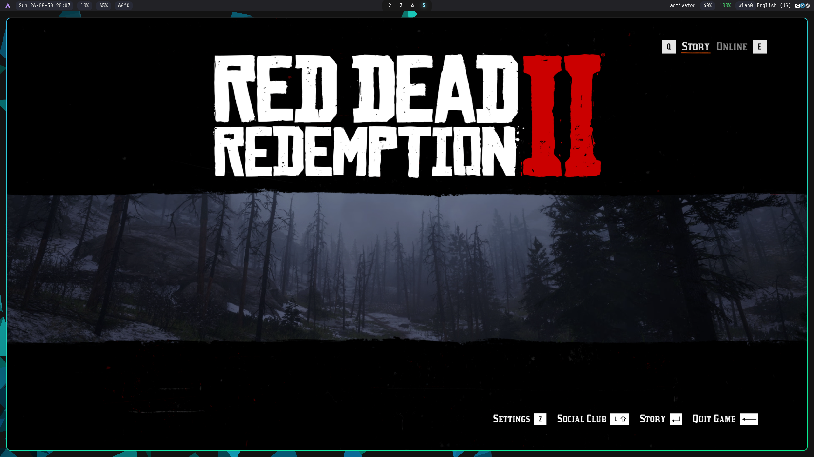
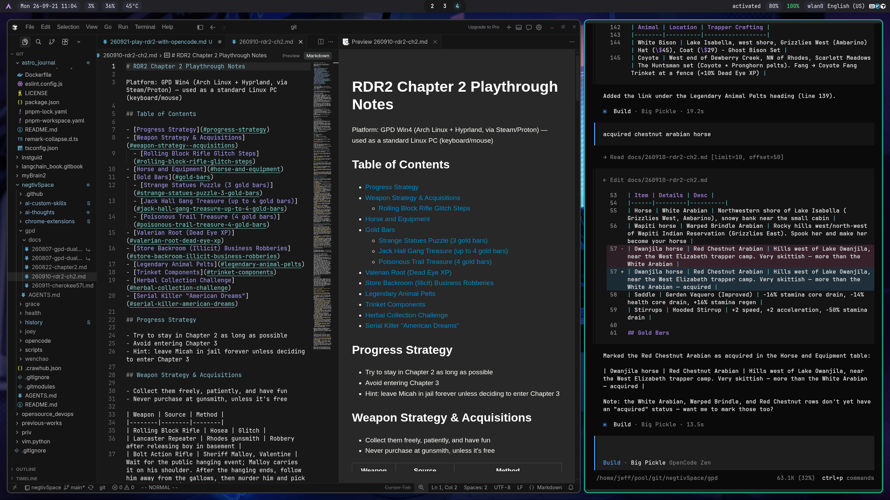

# 用 AI 智能体玩《荒野大镖客 2》

**原文：** [260921-play-rdr2-with-opencode.md](260921-play-rdr2-with-opencode.md)

《荒野大镖客 2》(Red Dead Redemption 2) 是我最喜欢的游戏，这些年来我投入了数百小时——足以让我几乎熟悉所有的剧情、人物、任务和事件。最近我开了一个新的存档 (playthrough)，这一次我决定带上一个 AI 智能体 (AI agent) 一起。不是让它替我玩，而是让它记录这次旅程：查资料、回答游戏内的问题、在我游玩时把笔记记下来。

> **剧透警告：** 这是一份个人通关日志，会包含剧情、任务和角色的细节。



## 背景

- 以前遇到技巧或提示，我会去网上搜——Google、YouTube、IGN、Fandom。现在我在智能体里搜——也就是 OpenCode。
- 然后把这段经历整理成一份通关笔记 (playthrough note)，纯属好玩。
- 大多数时候我已经完全不需要 Google 了。YouTube 偶尔仍然有用：当智能体告诉我某个东西在哪时，视频或地图图片比文字描述更容易理解，因为智能体全是文字。

## 布局：左边 Cursor，右边 OpenCode



我的桌面是 Arch Linux。左边是 Cursor 编辑器——**我不用它的智能体**，只用它来渲染和查看 Markdown。右边是我的智能体 **OpenCode**，提问和记笔记都在那里发生。

## 一个 AGENTS.md 和一个自定义 SKILL.md

自动化的核心是两个文件：一个规则文件 (`AGENTS.md`) 和一个技能 (`SKILL.md`)。目的是在游玩的同时自动完成记录。

这个技能是 `rdr2-playthrough`——发布在 ClawHub：[clawhub.ai/j3ffyang/skills/rdr2-playthrough](https://clawhub.ai/j3ffyang/skills/rdr2-playthrough)，源码在仓库里：[`.opencode/skills/rdr2-playthrough/`](https://github.com/j3ffyang/ai-thoughts/tree/main/.opencode/skills/rdr2-playthrough)。它维护第二章的通关笔记：记录一次获取、回答位置或制作问题，以及检查笔记里重复或过时的信息。它的规则在关键之处很严格——写入前先核实游戏事实、提出确切的修改并等我批准后才动笔记、一个事实只放一处。

`AGENTS.md` 是笔记文件夹的本地宪章 (constitution)（它同样管辖 GPD Win4 知识库的其余部分）。它最重要的规则正是让它安全的那条：没有明确请求，任何东西都不提交、不推送、不发布。两个文件都刻意地无聊——重点在于工作流能在我游玩时自己跑起来，而不是配置有多聪明。

一个具体的例子：我说“奇异雕像谜题拿到了 3 根金条”，智能体就会提出对“金条”表格的一行修改——然后等我点头才写入。它不会猜位置或价格；如果不确定，它会先核实并说明。

它产出的笔记发布在这里作为参考：[《荒野大镖客 2》第二章通关笔记](https://github.com/j3ffyang/ai-thoughts/blob/main/docs/260921-rdr2-ch2-playthrough-chn.md)。

## Linux 是玩游戏的完美平台


我所有的游戏都在 Arch Linux 上玩，包括《荒野大镖客 2》——这里是一台运行 Arch + Hyprland 的 GPD Win4，靠 Steam/Proton 扛下重活。截图显示游戏跑在 Linux 上，在 Hyprland 里以窗口模式运行（所以能看到周围的桌面）；它同样可以全屏运行。Linux 已经成为我玩游戏的完美平台：一台机器、一个桌面，以及我平时就在用的同一套工具。

## 附录：RDR2 规则 (`AGENTS.md`)

管辖笔记的规则文件就是该文件夹的 `AGENTS.md`。下面只保留与 RDR2 相关的部分：

```markdown
# RDR2 playthrough notes — local rules

**Local and private.** This is a local knowledge base; nothing is committed, pushed, or published without an explicit request.

## Platform
- RDR2 runs on Arch Linux + Hyprland via Steam/Proton.
- Use the machine as a standard Linux PC (keyboard/mouse), not as a handheld.

## Notes
- Keep notes as simple as possible — one fact, one place.
- Alert about duplicated info found; never silently delete or merge.
- Escape `$` as `\$` in Markdown tables.
- Notes follow `YYMMDD-topic.md` (e.g. `260921-rdr2-ch2-playthrough.md`).

## Skill
- `rdr2-playthrough` maintains the RDR2 Chapter 2 playthrough notes (`docs/260921-rdr2-ch2-playthrough.md`); it loads automatically on log/lookup requests.
```

btw, i use arch