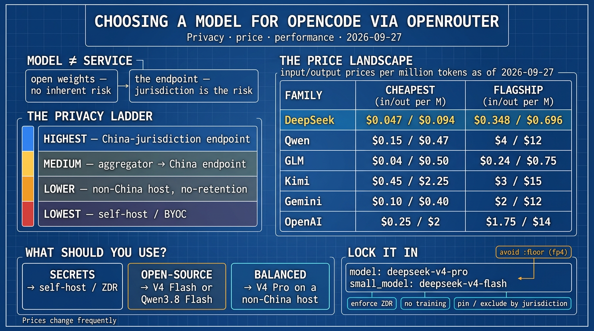

# 通过 OpenRouter 为 OpenCode 选择模型：隐私、价格与性能

**原文：** [260927-opencode-openrouter-model-selection.md](https://github.com/j3ffyang/ai-thoughts/blob/main/docs/260927-opencode-openrouter-model-selection.md)

*2026-09-27*

一份实用指南：当通过 OpenRouter 驱动 OpenCode 时，如何选择模型与供应商 (provider)，在数据隐私风险、价格与性能之间取得平衡。价格为 2026-09-27 的数据，取自 OpenRouter 的标价 (listed rates)。

*免责声明：我与本文提到的任何模型开发者或服务供应商均无关联。*



## 1. 供应商列表 vs 模型路由 (Provider list vs model routing)

OpenCode 的 `/connect` 连接的是**供应商** (provider)；OpenRouter 是其中之一。像 “DeepSeek” 和 “DeepSeek (China)” 这样的条目是不同的服务端点 (serving endpoint)——后缀表示主机所在的司法管辖区 (jurisdiction)，而不是不同的模型。要把 OpenRouter 当作支付网关 (payment gateway)，只需连接一次 **OpenRouter**，然后用 `/models` 选模型（例如 `deepseek/deepseek-v4-flash`）；上游主机 (upstream host) 随后由 OpenRouter 的路由 (routing) 选择，你可以对它加以约束（见 §5）。

贯穿本文的关键区分是**模型** (model) 与**服务供应商** (serving provider) 之别。一个开源权重模型 (open-weight model)（DeepSeek、Qwen、Kimi、GLM）是一组可下载的文件；它本身不携带任何数据风险。风险存在于**托管它的那项服务，以及管辖那项服务的法律**之中。

## 2. 数据隐私：模型来源 vs 服务所在地 (model origin vs serving jurisdiction)

一个中国的*模型*不等于一个中国的*服务*。开源权重可以跑在任何地方——非中国的托管方、你自己的 GPU，或一台笔记本。改变隐私算式的是谁在运营这个端点。

| 层级 Tier | 配置 Setup | 暴露 Exposure |
|---|---|---|
| 最高 Highest | 中国司法管辖区的 API 端点（DeepSeek 官方、阿里、Moonshot、`.cn`）接收你的代码或密钥 | 中国法律（《国家情报法》《数据安全法》《个人信息保护法》）可强制披露，且可能禁止披露该请求本身 |
| 中 Medium | 非中国聚合器 (aggregator) 在无留存/训练控制的情况下路由到中国端点 | 同样的法律暴露，但可加以约束 |
| 较低 Lower | 非中国托管方（Together、Fireworks、DeepInfra、Baseten、GMI）在无留存条款下运行同一份开源权重 | 合同风险，而非国家强制 |
| 最低 Lowest | 自托管 (Ollama、llama.cpp、vLLM) 或 BYOC | 无第三方暴露 |

这是一种**司法管辖区与强制披露 (jurisdiction and compulsion)**的风险，而不是在断言任何厂商滥用数据。它对专有代码和密钥最重要；对公开或开源的工作，风险很低。

**每个供应商的评估清单：**(a) 服务实体的法律管辖地；(b) 留存政策，以及是否提供零数据留存 (Zero Data Retention)；(c) 对输入进行训练的政策；(d) 你是否能固定 (pin) 或排除 (exclude) 供应商；(e) 是否提供 DPA；(f) 能否自托管或 BYOC。在一次 agentic 编码会话里，你发送的东西是高敏感度的——源码、文件内容，有时还有密钥。

## 3. 价格对比 (Pricing comparison)

OpenRouter 的标价是某模型的**最便宜端点**，而不同端点在量化 (quantization) 上不同（fp4 与 fp8 权重精度——比特越少越便宜但有损），所以把这些当作下限 (floor)，而不是同口径的质量数字。

*表格于 2026-09-27 从 OpenRouter API 生成。模型价格变动频繁——把它当作一份快照，在依赖任何数字前先重跑 §4 里的脚本。*

| 系列 Family | 最便宜可用 (cheapest capable)（输入 / 输出，每百万） | 前沿旗舰 (frontier flagship)（输入 / 输出，每百万） |
|---|---|---|
| **DeepSeek** | V4 Flash \$0.047 / \$0.094 | V4 Pro \$0.348 / \$0.696 |
| **Qwen** | Qwen3.8 Flash \$0.15 / \$0.47 | Qwen3.8 Max Prime \$4 / \$12 |
| **GLM** | GLM-5.3 Flash \$0.04 / \$0.50 | GLM-5.3 \$0.24 / \$0.75 |
| **Kimi** | K2.5 \$0.45 / \$2.25 | K3 \$3 / \$15 |
| **Gemini** | 2.5 Flash-Lite \$0.10 / \$0.40 | 3.1 Pro Preview \$2 / \$12 |
| **OpenAI** | gpt-5.1-codex-mini \$0.25 / \$2 | GPT-5.2 \$1.75 / \$14 |

**价格赢家：DeepSeek，Qwen 与 GLM 紧随其后。** 开源权重系列便宜得多，尤其是在输出 token 上。DeepSeek V4 Pro 在前沿能力下，输出成本大致只有 Gemini 3.1 Pro Preview 和 GPT-5.2 的二十分之一。**Kimi 不是价格领先者**——K3 处在 GPT 与 Claude 的前沿价位。OpenAI 是最贵的前沿；Gemini 居中。

## 4. 复现这些数字 (Reproducing the numbers)

用 `curl` 和 `jq` 列出每个模型每百万 token 的价格：

```bash
curl -s https://openrouter.ai/api/v1/models \
  | jq -r '.data[] | [.id, (.pricing.prompt|tonumber*1e6), (.pricing.completion|tonumber*1e6)] | @tsv' \
  | sort -t$'\t' -k3 -n | head -30
```

用 Python 打印每个系列最便宜的模型：

```python
#!/usr/bin/env python3
"""Cheapest OpenRouter models per family, per million tokens."""
import json
import urllib.request

FAMILIES = {
    "deepseek": "deepseek",
    "qwen": "qwen",
    "moonshotai": "kimi",
    "google": "gemini",
    "openai": "openai",
    "z-ai": "glm",
}


def per_million(x):
    try:
        return float(x) * 1_000_000
    except (TypeError, ValueError):
        return None


with urllib.request.urlopen("https://openrouter.ai/api/v1/models") as resp:
    models = json.load(resp)["data"]

for author, label in FAMILIES.items():
    rows = [m for m in models if m["id"].startswith(author + "/")]
    rows.sort(key=lambda m: per_million(m["pricing"].get("completion")) or 9e9)
    print(f"=== {label} ({author}) — {len(rows)} models ===")
    for m in rows[:5]:
        p = m["pricing"]
        inp = per_million(p.get("prompt"))
        out = per_million(p.get("completion"))
        print(f"  {m['id']:<52} in ${inp:.3f}/M  out ${out:.3f}/M")
```

查看单个模型的逐供应商端点——价格、量化、上下文——这一步会揭示价格下限：

```bash
curl -s "https://openrouter.ai/api/v1/models/deepseek/deepseek-v4-flash-0731/endpoints" \
  | jq -r '.data.endpoints[] | [.provider_name, .quantization, (.pricing.prompt|tonumber*1e6), (.pricing.completion|tonumber*1e6)] | @tsv'
```

## 5. 平衡的推荐 (Balanced recommendation)

| 如果你的数据是…… | 使用 |
|---|---|
| 专有或含密钥 | 自托管开源权重，或通过 OpenRouter 选择带零数据留存的非中国托管方，或一个西方前沿模型。避开中国司法管辖区的端点。 |
| 开源 / 非敏感 | 通过 OpenRouter 用 DeepSeek V4 Flash 或 Qwen3.8 Flash——编码的最佳性价比。 |
| 平衡的默认 | 非中国托管方上的 DeepSeek V4 Pro（便宜且非中国管辖），常规步骤再用一个便宜的小模型。 |

## 6. OpenCode 配置 (OpenCode configuration)

```jsonc
{
  "$schema": "https://opencode.ai/config.json",
  "model": "openrouter/deepseek/deepseek-v4-pro",
  "small_model": "openrouter/deepseek/deepseek-v4-flash"
}
```

要在 OpenRouter 上设置的控件：**强制零数据留存 (Zero Data Retention)**、**选择退出训练 (opt out of training)**，并按司法管辖区固定或排除供应商。对于 agentic 工具调用 (tool-calling) 的可靠性，优先使用 `:exacto` 路由变体；避开 `:floor`，它常路由到 **fp4**，可能降低工具调用质量。

## 参考来源 (Sources)

- openrouter.ai — `/api/v1/models`, `/api/v1/models/{author}/{slug}/endpoints`, `/docs/faq`, `/docs/guides/features/zdr`
- opencode.ai — `/docs/providers`, `/docs/models`
- 价格与模型列表检索于 2026-09-27。

btw, i use arch