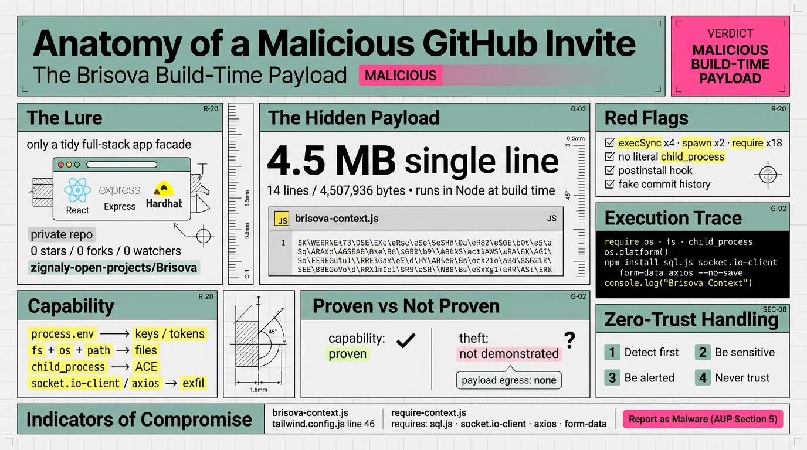

# 恶意 GitHub 邀请剖析——Brisova 构建期载荷 (Build-Time Payload)

**原文：** [260929-brisova-malware-analysis.md](https://github.com/j3ffyang/ai-thoughts/blob/main/docs/260929-brisova-malware-analysis.md)

- **日期 (Date)：** 2026-09-29
- **状态 (Status)：** 已发布的安全分析文章（防御 / 研究用途）。**请勿运行该仓库。**
- **结论 (Verdict)：** 恶意软件形态的构建期载荷 (malware-shaped build-time payload)——任意代码执行 (arbitrary code execution) 与窃取凭据能力 (credential-stealer capability)。
- **证据范围 (Scope of proof)：** 本文记录的是一种恶意**能力 (capability)**，而非已证实的窃取行为——见“证据与注意事项 (Evidence & caveats)”。

## 为什么写这篇 (Why this exists)

我收到一个指向 `zignaly-open-projects/Brisova`（私有仓库）的 GitHub 协作邀请 (collaboration invitation)。在拉取任何内容之前我先做了审查。它不是一个合法的房地产应用 (real-estate app)——它夹带了一段混淆 (obfuscated) 载荷，在 Tailwind/PostCSS 构建期间于 Node 中运行，随即拉取一次分阶段安装 (staged install)，并加载一套 C2 + HTTP 外泄 (exfil) 工具集。本文记录了整次调查。



## 仓库元数据 (Repo metadata)（通过 `gh api`）

- 全名 (Full name)：`zignaly-open-projects/Brisova`（所有者类型 (owner type)：Organization，id 334021115）
- 可见性 (Visibility)：**私有 (private)**（公开 URL 返回 404；访问权来自邀请）
- 默认分支 (Default branch)：`main`；语言 (language)：JavaScript
- 创建 (Created)：2026-09-26T01:35:49Z；最后推送 (last push)：2026-09-26T02:17:46Z
- 我的访问权限 (My access，即受邀账号本人的权限)：`pull: true`（只读访问）
- `allow_forking: false`、`license: null`、`has_downloads: false`
- 描述 (Description)：无；0 stars / 0 forks / 0 watchers

## 布局概览 (Layout summary)

一个全栈脚手架 (full-stack scaffold)：React 18 CRA 前端 (`src/`)、Express API（`backend/src/`，JSON 存储）、Hardhat Solidity 合约 (`contracts/`)，外加一个存放 Tailwind 插件的 `src/theme/` 目录。乍看很合理——这正是重点。

## 危险信号 (Red flags)

### 1. 载荷文件 (The payload file)

`src/theme/js/context/brisova-context.js` 共 14 行 / **4,507,936 字节**——其中单独一行就有 4.5 MB（第 8 行）。它是 `javascript-obfuscator` 风格的代码（从轮转字符串数组 (rotated string array) 与偏移解码器 (offset-decoder) 模式推断；工具未确认）：约 293,000 个 `\xNN` 十六进制转义 (hex escapes)，外加一张解码/偏移函数表。载荷逻辑看起来很小，主体像是反分析填充 (anti-analysis padding)（基于结构的推断）。

它被作为 Tailwind 插件接入 `tailwind.config.js`（第 46 行）：`require("./src/theme/js/context/brisova-context.js")`。Tailwind/PostCSS 会在 **Node 中**加载该配置，因此这段代码会在 `npm run dev` 和 `npm run build` 时执行（不在浏览器沙箱 (browser sandbox) 内）。

该文件开头甚至有一段注释，声称它“在 CSS 构建时于 Node 中运行”——恶意代码被偷运进构建步骤 (build step)，而不是应用本身。

**危害 (Bad effect)：** 这个文件并非惰性 (inert)，它的执行范围远超应用本身。由于它是一个被 `require` 的构建依赖 (build dependency)，只要 `tailwind.config.js` 被加载，它就会在 Node 中运行——`npm run dev`/`build`、IDE 的 Tailwind 插件、PostCSS/打包工具 (bundler) 以及 CI——而且是以开发者的身份运行，而非在浏览器沙箱内。此外，这一整行 4.5 MB、约 293,000 个转义的代码对工具本身具有敌意：编辑器、linter、`git diff` 与 `grep` 会因此卡死或崩溃，简单扫描也会一无所获。由于它会随每次克隆 (clone) 一同分发，任何构建该仓库的机器都会同时继承这两重危害。

### 2. 载荷那一行里可疑的 token 计数 (Suspicious token counts in the payload line)

`execSync` x4、`exec` x4、`spawn` x2、`require` x18，且没有字面量 `child_process` 字符串——模块名是由混淆片段拼装的，因此简单的 `grep child_process` 会漏掉它。这一切都藏在一个伪装成 CSS 插件的文件里。

**危害 (Bad effect)：** 这里真正的危险是一种虚假的安全感 (false assurance)。这些计数显示它具备真实的命令执行能力（`execSync` x4、`exec` x4、`spawn` x2 = shell 执行）以及运行时模块加载（18 个 `require`），但最危险的原始能力 (primitive)——`child_process`——恰恰被拆成混淆片段重新拼装，好让随手的 `grep child_process`、或任何依赖它的扫描器什么都找不到。埋在一整行 4.5 MB、伪装成 CSS 插件的代码里，这些 token 对 diff、基于行的工具 (line-based tooling) 和人工复查都不可见——于是审查者会对一个并不干净的文件得出“干净”的结论。

### 3. 安装钩子 (Install hook)

`package.json:36` 有 `"postinstall": "npm run db:seed -w brisova-api"`。它会在 `npm install` 时运行。种子脚本 (seed script) 本身（`backend/src/db/seed.js`）看起来只是普通的演示数据 (demo data)（Unsplash 图片画廊、房源列表），所以这个安装钩子本身并不是载荷——但它是一个额外的自动执行面 (auto-execution surface)。

**危害 (Bad effect)：** `npm install` 是任何人做的第一件事，而 npm 会自动运行 `postinstall`——于是该仓库在你审查任何东西之前、甚至从未加载 `tailwind.config.js` 的情况下，就以你的身份执行了代码。这个钩子被伪装成一个无害的“填充演示数据库”步骤，给仓库增添了正当性 (legitimacy)，也让自动执行变得习以为常；而脚本的真正内容从未被完整审计（`seed.js` 676 行中只读了前 60 行）。它还是一个独立的第二触发点：禁用 Tailwind 插件能止住构建期载荷，却止不住 `postinstall` 钩子——它仍会在 `npm install` 时触发，而这正是 `npm install --ignore-scripts` 所阻止的。

### 4. 伪造 / 生成的提交历史 (Fake / generated commit history)

提交主题 (commit subjects) 与其改动的文件对不上，且在抽样的提交中，作者时间戳被钉在精确的 `04:00:00Z` / `17:00:00Z`。例如：
- "Add input validation for registration in `PropertyMap.jsx`"
- "Upgrade project dependencies in `ApiResponse.js`"
- "Add unit tests for user service in `tailwind.config.js`"
- "Integrate third-party payment API in `responsive.css`"
- "Add user profile management in `deploy.js`"
- "Update MVP feature requirements in `serialize.js`"

见到的作者 (Authors seen)：`flaukowski <nikolaiflaukowski@gmail.com>`、`sihong <sihonghuey@163.com>`、`dougiebuckets <douglas.crescenzi@gmail.com>`。这种错位模式与一个自动化生成 / 批量生成 (automated/genned) 的仓库相符。

**危害 (Bad effect)：** 这段历史是被精心构造的，其目的就是信任。错位的主题（例如 "Add unit tests for user service in `tailwind.config.js`"）把那个 4.5 MB 的插件归档到一个无害的标签下，于是 `git log` 和 `git blame` 永远不会浮现出“加入了一个混淆的投放器 (dropper)”。看似真实贡献者的名字与精确的整点时间戳，让仓库读起来像一个正常、活跃开发的项目——击败了常见的“就查一下提交历史”这一信任步骤，并把归属 (attribution) 分散开，使恶意提交无法被钉到某个真人身上。扫一眼历史，它看起来完全合法：这正是整个诱饵 (lure) 所依赖的欺骗层 (deception layer)。

## 动态分析（沙箱内、已打桩）(Dynamic analysis (sandboxed, stubbed))

我把仓库克隆到 `/tmp/opencode/Brisova`，并在一个 Node 测试装置 (harness) 下加载该插件；该装置把 `child_process`、`net`、`tls`、`http`、`https`、`dns` 与 `fetch` 替换为记录日志的桩 (logging stubs)，并设置 `NODE_ENV=development`。载荷**确实在进程内 (in-process) 执行了**；它的副作用原语 (side-effecting primitives) 被替换，因此不可能发生真实的命令执行、文件写入或网络调用（见下方“执行台账”）。

**危害（方法学警示，methodology alert）：** 进程内打桩 (in-process stubbing) 并不是沙箱。替换副作用原语确实拦住了那些调用，但 `process.env` 没有被代理 (proxy)，`fs` 也只有一部分函数被包装，因此在三次运行中，载荷对 shell 环境拥有读取权限，并对宿主机文件系统拥有部分访问权。“不可能发生真实的命令执行、文件写入或网络调用”这句话，只对被打了桩的那些原语成立；只要漏掉一个 API（另一个 `fs` 方法、`worker_threads`、`vm`，或一个原生插件 (native addon)），就足以读取或写入。把它当作一种风险接受 (risk acceptance)，而不是安全证明——永远不要在持有真实密钥的机器上以进程内方式运行不可信代码。

捕获到的插件执行内容：

```
require(os) intercepted
require(fs) intercepted
require(child_process) intercepted
os.platform -> linux
execSync: npm install sql.js socket.io-client form-data axios --no-save --no-warnings --no-progress --loglevel silent
console.log("Brisova Context")
addBase({ "*, ::before, ::after": { boxSizing: "border-box" } })
```

跟踪模块加载 (module loads) 显示，载荷随后尝试：

```
REQUIRE: path
REQUIRE: socket.io-client
REQUIRE: axios
```

强制 `os.platform()` 返回 `win32` 重新运行，产生了相同行为（存在分支 (branching)，但 stage 1 与平台无关）。

### 解读 (Interpretation)

下面这些角色是**从导入集 (import set) 推断**的，并非本次运行中直接观察到的。

- `npm install sql.js socket.io-client form-data axios --no-save ...`——`--no-save` 意味着依赖被安装，但**不会写入 package.json**，从而对随手的 diff 隐藏了这一改动。
- `sql.js`——SQLite (WASM)，与“在本地暂存 (staging) 收集到的数据”相符。
- `socket.io-client`——一个持久 C2 信道的形态。
- `axios` + `form-data`——HTTP 外泄的形态。
- `os` + `fs` + `path` + `process` + `child_process`——环境与文件系统访问，加上任意命令执行（能力在导入集中被观察到）。

**危害 (Bad effect)：** 合在一起看，这些依赖描述的危害是“如何持续”，而非一次性事件。`--no-save`（加上那些静默标志 (silent flags)）把这一阶段安装进 `node_modules`，同时从 `package.json`、diff 和构建日志中隐藏；`sql.js` 在本地暂存收集到的数据，于是被窃数据能在磁盘上留存；`socket.io-client` 打开一条持久双向信道——是远程控制，而不只是窃取；`axios` + `form-data` 则通过普通的 HTTPS 外泄，混入正常流量。由于用途是推断的，不要缩小范围 (down-scope)：挖矿木马 (miner)、后门 (backdoor) 或勒索软件投放器 (ransomware dropper) 都未被排除。

## 执行台账 (Execution ledger)

本次调查中实际执行过的一切，供审计。

### 恶意载荷执行次数——3 次（均在 JS 拦截 (interception) 下）

载荷在进程内运行了三次；而 bubblewrap 那次重跑——**我们的** `bwrap` 沙箱，位于分析者自己的机器上，*并非*来自仓库的任何东西——从未加载它。

| # | 命令 (Command) | 平台分支 (Platform branch) | 结果 (Result) |
|---|---------|-----------------|--------|
| 1 | `node --no-warnings harness.js` | real linux | plugin loaded + invoked |
| 2 | `node --no-warnings harness2.js linux 6.0.0` | forced linux | plugin loaded + invoked |
| 3 | `node --no-warnings harness2.js win32 10.0.0` | forced win32 | plugin loaded + invoked |

在那些运行中，载荷：require 了 `os`、`fs`、`child_process`（被拦截）；调用了 `os.platform()`；尝试执行 `execSync("npm install sql.js socket.io-client form-data axios --no-save --no-warnings --no-progress --loglevel silent")`（被桩捕获——没有 shell，没有 npm）；打印 `Brisova Context`；调用 `addBase(...)`；随后 require `path`、`socket.io-client`、`axios`（后两者 `MODULE_NOT_FOUND`，未安装任何东西）。未观察到载荷的文件读取或网络调用。

**危害 (Bad effect)：** “均在 JS 拦截下”是弱点，而不是安慰。三次运行每一次都是真实的进程内执行，并带有上文所述的残留 env/fs 读取权限，所以这是三个暴露窗口，而非三次无害的观察；又因为我们的密闭 (hermetic) `bwrap` 沙箱从未加载载荷，这三次没有一次被真正的沙箱所围困——台账证明的是载荷*会运行*，而不是观察它*是安全的*。那两次重跑（在 Linux 上强制 `linux`/`win32`）只换来“存在平台分支”这一个观察，却增加了暴露，收益极小。请把“未观察到载荷的文件读取或网络调用”读作“没有任何东西被拦截到”，而不是“什么也没发生”。

### 主机命令（我执行的，非载荷）(Host commands (mine, non-payload))

这些是我在调查期间于宿主机上运行的命令——只读侦察 (reconnaissance)、沙箱探测与自测，以及本地文件操作——它们都不是载荷自身的行为。列出它们，出于与载荷运行相同的审计理由：让台账记录下每一条被执行过的命令。

- `gh auth status`；用 `gh api` 获取仓库元数据、git 树与提交（只读）。
- `gh repo clone` 两次，克隆到 `/tmp/opencode/...`。
- 探测：`id`、`command -v bwrap/unshare/...`、`unshare -rn true`、`unshare -n true`。
- `bwrap` 隔离自测：`id`、`ls /home/jeff`（不存在）、`head /etc/passwd`（不存在）、`ip link`（仅回环 (loopback)）、`getent hosts github.com`（无 DNS）。
- 沙箱 `selftest.js`：`fs.readFileSync("/etc/shadow")` → 被拒绝；`child_process.execSync("id")` → 被拒绝；`fs.existsSync("/home/jeff")` → 被拒绝（`ERR_ACCESS_DENIED`）。
- 文件操作：`mkdir`、`write`、`read`、`sed`、`rg`、`awk`、`dd`、`chmod`、`rm`；`python3 scripts/unwrap_md.py`。

### 实际发生的网络活动 (Network actually performed)

这一节把“调查造成的流量”与“载荷造成的流量”区分开。唯一的连接是我的——用于 API 与克隆的 GitHub，加上那些文档页面——而载荷的外泄为零，因为每个网络原语都被打了桩，外泄模块也从未加载。

- 仅我的：`github.com`（API + git clone）、`docs.github.com`、`support.github.com`、`github.com/.well-known/security.txt`。
- 载荷外泄：**无**——每一条 `net`/`tls`/`http`/`https`/`dns`/`fetch` 路径都被打了桩，`socket.io-client`/`axios` 也从未加载。

**注意事项 (Caveat)：** “载荷外泄：无”描述的是这次打了桩的运行，而非载荷的设计或在真实环境中的行为。之所以什么都没观察到，只是因为网络原语被打了桩、外泄模块从未加载——而导入集（`socket.io-client`、`axios`、`form-data`）恰恰就是“把收集到的数据发出去”的那套机器。在未打桩的 `npm install`/构建中，这种外泄不会被阻挡；“无外泄”是测试的局限，而不是该恶意软件的性质。

### 未执行的操作 (Not executed)

- 没有 `npm install`、`npm run dev`、`npm run build`、没有加载 `tailwind.config.js`、没有编译合约，也没有在 bubblewrap 沙箱内加载载荷。

## 能力评估（回答“它能读取我的东西吗？”）(Capability assessment (answer to "can it read my stuff?"))

是的——它具备这种能力：
- `process.env` 访问 → API 密钥 / token（OPENAI、AWS、GH 等）
- `fs` + `os` + `path` → 文件系统枚举 / 读取（凭据、钱包、`.env`、SSH）
- `child_process` → 任意命令执行
- `sql.js` → 本地暂存收集到的数据（在磁盘上留存 (persistence)）
- `socket.io-client` / `axios` / `form-data` → 外泄

**危害 (Bad effect)：** 能力本身就是结论。虽然没有观察到读取或外发，但这个文件能做完这一切——读取环境与磁盘上的每一个密钥，以你的身份运行任意命令，把它需要的东西本地暂存（`sql.js`），再通过一条持久的 C2/HTTP 信道发出去。任何单一原语都足够严重；合在一起，它们构成一个完整的远程访问木马 (remote-access-trojan) 画像，而这本身就足够了：把任何构建或运行过该仓库的机器都视为已失陷 (compromised)。

## 证据与注意事项 (Evidence & caveats)

本次调查证明了什么，又没有证明什么。

**已证明 (Proven)（直接观察到或可复现）：**
- `src/theme/js/context/brisova-context.js` 是一个 4.5 MB 的单行混淆文件，由 `tailwind.config.js` 第 46 行加载，因此在构建时于 Node 中执行。
- 执行时，它会去取 `os`、`fs`、`child_process`，并运行 `execSync("npm install sql.js socket.io-client form-data axios --no-save …")`，然后 require `socket.io-client` 与 `axios`。
- `package.json` 带有一个 `postinstall` 钩子。

这足以称其为恶意投放器 (malicious dropper) / 构建期代码执行 (build-time code execution)，并据此提交一份恶意软件报告。

**未证明 (Not proven)（目前为止）：**
- 未观察到 `process.env` 读取或文件读取。
- 未提取出 C2 域名 / 端点 (endpoint)（字符串数组从未被反混淆）。
- 未建立任何网络连接（分阶段的依赖从未安装；网络路径被打了桩）。
- Stage 2 从未运行，因此未观察到外泄。
- `sql.js` / `socket.io-client` / `axios` 的角色是从导入集推断的，并非在行动中被观察到；其他类型的载荷（挖矿木马、后门、勒索软件投放器）并未被排除。

**残留暴露 (Residual exposure, env/fs)：** 在三次载荷运行中，`process.env` **没有**被代理，`fs` 也只有一部分函数被包装，因此载荷对 shell 环境拥有*读取权限*，并对宿主机文件系统拥有部分访问权。没有此类读取被记录，且由于 `child_process` 和每个网络原语都被打了桩，**没有任何向外发送的通道**——但这是拦截，不是密闭沙箱。本可补上这一缺口的 `--clearenv` bubblewrap 运行，经过验证后被**中止，未能加载载荷**。不要把“无外泄”读作“可证明无法读取本地数据”。

**其他注意事项 (Other caveats)：** 完整逻辑藏在 4.5 MB 的混淆里，因此“未观察到读取”**并不能**证明它从不读取文件。未验证项：`npm install` 预期只触发 `postinstall` 种子、而不触发载荷；载荷预期在 Tailwind 编译 CSS（`dev`/`build`）时触发——我们从未运行 `npm install`，而 `seed.js` 676 行中只读了前 60 行。未尝试完整反混淆 (deobfuscation)，因此 C2 端点未知。

**要达到硬证据 (To reach hard evidence)：** 反混淆字符串数组，以还原 C2 URL/主机以及任何明确的目标路径（`.ssh`、`.env`、钱包路径），随后可选地在 bubblewrap 沙箱内用假模块 (fake modules) 运行 stage 2 来确认。即便如此，“窃取了我的数据”只有在观察到一次敏感读取、且与一次向外发送配对时才算被证明——而我们刻意从未允许这一点发生。

**危害 (Bad effect)：** 这种诚实是一把双刃剑。“未证明”不等于“非恶意”——把注意事项当作安慰来读，正是让人说服自己去运行该仓库的方式；能力既已确立，安全默认值就是把它当作恶意处理。对称地，也不要去断言一个你拿不出证据的已实施窃取。而残留暴露不只是理论：由于在三次运行中载荷对分析者的 shell 环境与部分宿主机文件系统拥有读取权限，**调查所用的宿主机本身也应被视为可能已暴露**——按本文自己的规则，它理应像任何运行过该仓库的机器一样被轮换 / 审计 (rotated/audited)。

## 安全使用指引 (Safe-use guidance)

- **请勿**在此仓库上执行 `npm install`、`npm run dev`、`npm run build`，或编译合约。
- 不要用会求值 / 编译它们的工具打开其文件（某些编辑器、打包工具或 CI runner 会执行该 Tailwind 插件）。
- 万不得已必须安装时，使用 `npm install --ignore-scripts`（或 `npm ci --ignore-scripts`），这样任何生命周期钩子 (lifecycle hook) 都不会运行——但不安装仍是唯一安全的选择。
- 如果它已经被运行过：假定完全失陷 (full compromise)——轮换所有 secrets/token，外加 **SSH/GPG 密钥、云凭据 (cloud credentials) 和钱包**；审计 `node_modules` 中是否出现意料之外的 `sql.js`、`socket.io-client`、`axios`、`form-data`；清空 npm 缓存 (`~/.npm/_cacache`)；检查出站连接、新增或长期运行的进程，以及持久化 (persistence) 位置（`~/.npmrc`、git hooks、cron/systemd、shell rc）；复查 shell 历史与 `~/.npm/_logs`。
- 删除任何克隆（我的已删除；见下文）。
- 考虑向 GitHub 举报该仓库 / 组织，并拒绝该邀请。
- 对你克隆或分析所用的那台机器也照此处理——按本文自己的规则，它也算是一台运行过该仓库的机器（见“证据与注意事项”）。

## 入侵指标 (Indicators of compromise, IoCs)

- 仓库 (Repo)：`zignaly-open-projects/Brisova`
- 恶意文件 (Malicious file)：`src/theme/js/context/brisova-context.js`（约 4.5 MB，一行超长）
- 接线 (Wiring)：`tailwind.config.js` 第 46 行将其 require 为一个 Tailwind 插件
- 安装钩子 (Install hook)：`package.json` postinstall → `db:seed`
- Stage 1 命令 (Stage 1 command)：`npm install sql.js socket.io-client form-data axios --no-save --no-warnings --no-progress --loglevel silent`
- 可疑的 require：`sql.js`、`socket.io-client`、`axios`、`form-data`
- 标记 (Markers)：`console.log("Brisova Context")`；精确时间戳的伪造提交；提交信息与文件错位；上文列出的作者邮箱
- 标识符 (Identifiers，已分析的版本)：head commit `72cd4eef82bd21386a45416ea689dc035ded7093`；tree `980b99af6842a1ba7f23fcd5ec8de232b91b5b69`；恶意文件的 git blob `9e180c4036dd5e4d856ca6f8ab2f887b56141eac`，SHA-256 `c093f39c12bcf6f12b1cae0841f4c8be864b38867f0f067b054d5eb85deb148c`

## 向 GitHub 举报 (Reporting to GitHub)

**使用 GitHub 的网页表单——而不是邮箱地址。** 举报滥用 (abuse) 的官方渠道是他们的网页表单；我没有找到滥用举报邮箱。（GitHub 自己的 `security.txt` 位于 `https://github.com/.well-known/security.txt`，只指向 `https://hackerone.com/github`，而那是用于报告 GitHub 自身产品 / 服务中的漏洞，而非举报第三方恶意仓库。）

**类别：恶意软件 (Malware)**——以恶意软件归档（GitHub 可接受使用政策 (Acceptable Use Policy) §5，[Active Malware or Exploits](https://docs.github.com/en/site-policy/acceptable-use-policies/github-active-malware-or-exploits)）。这**不是**钓鱼 (Phishing)：钓鱼属于 AUP §4（Spam and Inauthentic Activity），指欺骗一个人去透露信息；而此物是恶意代码，所以恶意软件才是正确的类别。那个伪造的协作邀请是一个值得提及的社会工程 (social-engineering) 诱饵，但它不改变类别。

无法取回发出邀请的账号——`GET /repos/{owner}/{repo}/invitations` 在无管理员权限时返回 403——因此邀请人在此未被记录；若可得，请从邀请中手动补上。

在哪里提交：

- 产品内（首选）：打开仓库页面 → 右侧栏 "About" 下方 → **Report repository**（或在组织页面 → **Report abuse**），然后填写表单。由于该仓库是私有的，如果作为受邀者你无法使用侧栏链接，请使用下面的表单。
- 直接举报表单：https://support.github.com/contact/report-abuse?category=report-abuse&report=other&report_type=unspecified
- 通用支持门户 (General support portal)（若举报表单不合适）：https://support.github.com

举报中应引用的完整 URL：

- 仓库：https://github.com/zignaly-open-projects/Brisova
- 组织：https://github.com/zignaly-open-projects
- 恶意文件：https://github.com/zignaly-open-projects/Brisova/blob/main/src/theme/js/context/brisova-context.js

把本文（或其正文）作为举报证据附上；提及 stage 1 命令与伪造的提交历史作为佐证。

## 已执行的清理 (Cleanup performed)

第二次、更强的围困 (containment) 尝试已准备就绪，随后在**加载恶意软件之前被中止**：仓库被重新克隆到 `/tmp/opencode/sbx/work`，伪造的 `socket.io-client` / `axios` / `form-data` / `sql.js` 模块被摆放好以暴露任何 C2 目标，并写下了一个 `bwrap --unshare-all` + `--clearenv` + `nobody` + Node `--permission` 测试装置。该沙箱内的一次无害自测验证了边界（uid `nobody`、6 个环境变量、`/home/jeff` 不存在、无 DNS、对 `/home/jeff` 的 `ERR_ACCESS_DENIED`）。载荷执行的那次运行并未进行；随后整个沙箱被删除。

所有测试产物均已移除：
- `/tmp/opencode/sbx/`（第二个沙箱 + 重新克隆）
- `/tmp/opencode/Brisova/`（第一次克隆）
- `/tmp/opencode/harness.js`、`harness2.js`、`ctx-line8.js`、`selftest.js`
- opencode 工具输出目录中的捕获片段

（`harness3.js` 曾起草但从未创建——写入被拒绝——因此它根本不存在，无需移除。）

没有真正运行 `npm install`（该命令只被打了桩的 `execSync` 捕获）；载荷的 JS 只在打桩拦截下执行；未观察到载荷的任何文件系统或网络操作，且自始至终不存在外泄通道。

**危害 (Bad effect)：** 清理抹除的是产物，不是暴露。删除克隆、沙箱、测试装置和捕获片段，把恶意软件从磁盘上移除——但它并不能撤销载荷在三次进程内运行中对 env/fs 的读取权限，也无法证明没有东西被遗留（shell 历史、`~/.npm/_logs`、操作系统 / 编辑器缓存、其他工具的输出目录）。由于密闭的 `bwrap` 运行在加载载荷前已被中止，任何清理都无法声称该载荷曾被证明是惰性的。把“已执行的清理”当作整理内务 (housekeeping)，而不是一切清白的信号 (all-clear)——宿主机仍需要“安全使用指引”中的轮换 / 审计。

## 处理不可信代码：零信任 (Handling untrusted code: zero-trust)

从这次事件中提炼出的可复用流程。完整的 SOP——长期契约 (standing contract)、STOP + RAISE HANDS 触发条件、信任阶梯 (trust ladder)、检测命令、解除武装 (defang)/`--ignore-scripts` 技巧、来源核验 (provenance checks)、bubblewrap 围困配方、告警骨架 (alerting skeleton) 与举报渠道——都收录在 `untrusted-code-safety` 技能中：

- **技能 (ClawHub)：** [untrusted-code-safety](https://clawhub.ai/j3ffyang/skills/untrusted-code-safety)
- **源码 (GitHub)：** [`.opencode/skills/untrusted-code-safety/SKILL.md`](https://github.com/j3ffyang/ai-thoughts/blob/main/.opencode/skills/untrusted-code-safety/SKILL.md)

**四条规则 (Four rules)：**
- **先检测 (Detect first)。** 大多数结论都是静态的、且免费；在运行任何一行之前先穷尽静态分诊 (static triage)。
- **保持敏感 (Be sensitive)。** 假定任何文件都能执行（配置文件、CSS 插件、lockfile、生命周期钩子）；清点一个以你的身份运行的进程所能触及的一切。
- **保持警觉 (Be alerted)。** 若必须运行，就加以插桩 (instrument) 并围困（无网络、清空环境、非 root、`/tmp` 白名单），并在任何违规时举手 (raise hands)。
- **绝不信任 (Never trust)。** 一个邀请、README、提交历史或熟悉的包名都不是担保 (vouch)；信任是按制品 (per-artifact)、按哈希 (per-hash)、反复核查的——某一层级通过，绝不授予下一层级。

**危害 (Bad effect)：** 这些规则只有在操作者真的停下来时才起保护作用。整条链会在第一个“看起来挺正规”的抄近路处断裂——跳过静态分诊（规则 1），你就会盲目执行；在真正的围困之外运行它（规则 3），你得到的就是本文所报告的那种残留暴露。一份被忽视的清单，或一个只是拦截的“沙箱”，什么都保护不了。

决策流程 (Decision flow)：

```
 UNTRUSTED INPUT (repo · package · invite · script · config)
                 │
                 ▼
 ┌───────────────────────────────────────────────┐
 │  RULE 1 — DETECT  (static, no execution)      │
 │  size · obfuscation · hooks · dynamic require │
 │  · commit-history smell · net/wallet/env refs │
 └───────────────┬───────────────────────────────┘
                 │ suspicious
                 ▼
 ┌───────────────────────────────────────────────┐
 │  RULE 2 — BE SENSITIVE (data inventory)       │
 │  env · ~/.ssh · cloud creds · wallets ·       │
 │  browsers · source · tokens                   │
 └───────────────┬───────────────────────────────┘
                 │ anything valuable is reachable
                 ▼
 ┌───────────────────────────────────────────────┐
 │  RULE 3 — BE ALERTED (contain + instrument)   │
 │  no network · cleared env · non-root ·        │
 │  fs allowlist (/tmp) · log+block fs/env/net/  │
 │  child_process · raise hands on violation     │
 └───────────────┬───────────────────────────────┘
                 │ violation (secret read / egress / exec)
                 ▼
 ┌───────────────────────────────────────────────┐
 │  VERDICT: MALICIOUS                           │
 │  quarantine · rotate · report · never run     │
 └───────────────┬───────────────────────────────┘
                 │
                 ▼
 ┌───────────────────────────────────────────────┐
 │  RULE 4 — NEVER TRUST                         │
 │  a pass at level N never grants level N+1;    │
 │  trust is per-artifact, per-hash, re-checked  │
 └───────────────────────────────────────────────┘
```

**固化的策略 (Codified policy)。** 本次会话的契约被固化进两个受 git 跟踪的位置：全局 `opencode/AGENTS.md` 的 "Untrusted code safety" 小节（符号链接到 `~/.config/opencode/AGENTS.md`，每个会话都会加载），以及上面的 `untrusted-code-safety` 技能。简述如下：`/tmp` 是不可信代码唯一的工作区；绝不读取用户的个人文件（代码、API 密钥、凭据、SSH/GPG 密钥、钱包、浏览器会话）；绝不信任未知来源；**停手并举手 (STOP and RAISE HANDS)**——立即停止并报告——若被执行的代码读取 `/tmp` 之外、触碰 `process.env`/密钥/凭据、从机器上收集或发送数据、派生子进程或打开未授权的网络连接，或表现出任何恶意、有害、欺骗、作弊或窃取行为；不确定时先确认；完成后删除所有测试克隆与产物。

边界说明 (Boundary note)：技能只加载到其 git 工作树根 (worktree root) 为止，因此该技能仅在 `ai-thoughts` 会话中自动加载。契约本身位于全局 `AGENTS.md`，每个会话都会加载——这就是两者并存的原因。

btw, i use arch
