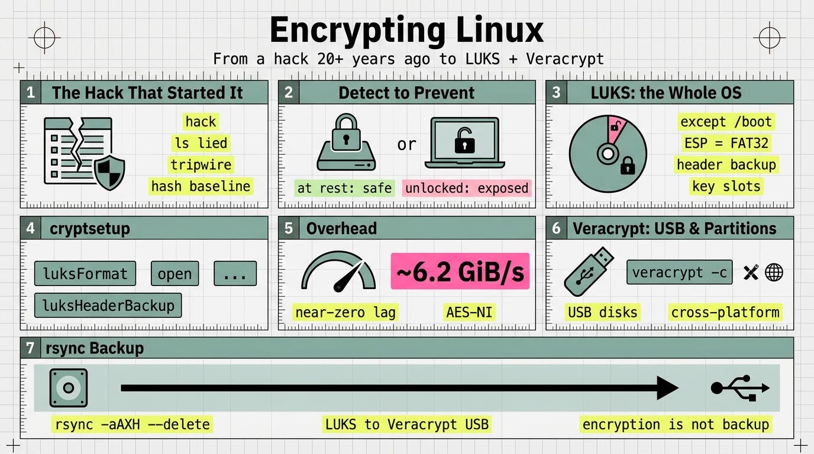

# Encrypting Linux: from a hack 20+ years ago to LUKS and Veracrypt

*Arch Linux. LUKS-encrypted root (xfs), unencrypted `/boot` (vfat), Veracrypt USB volume (btrfs).*

My experience with Linux dates from about 20+ years ago. This is a personal account of how a break-in pushed me from *detecting* tampering to *preventing* it — and why I now encrypt every disk I own.



## 1. The hack that started it

- My account: installing over a modem about 20+ years ago, hacked several times. The tell was `ls` — the listing did not match the files I knew surely were there, so the binaries had been replaced. (This story is also told in the Linux birthday piece: [`260828-happy-birthday-linux-from-aix-to-arch.md`](https://github.com/j3ffyang/ai-thoughts/blob/main/docs/260828-happy-birthday-linux-from-aix-to-arch.md).)
- The response was `tripwire`: it builds a database of hashes for installed binaries (e.g. `/bin/ls`), then protects that database so an intruder cannot quietly rewrite it — the original kept a human-readable database guarded by file permissions and offline or read-only copies, while today's Open Source Tripwire **signs** it with passphrase-derived site and local keys. A check compares the current binaries against the baseline; if a binary was upgraded or tampered with, it shows up, and you re-hash and update the baseline.
- Context from those years: package management was weak, so installing a standalone driver sometimes meant compiling the kernel.
- Note: `tripwire` is not installed on this machine today (historical tool). Modern file-integrity monitoring: AIDE, or a hand-rolled `sha256sum` baseline. (`pacman -Qk` only checks that a package's files are *present*; `-Qkk` adds permissions, size and mtime — neither hashes contents, so a same-size swapped `/bin/ls` slips through.)

## 2. The shift: from detection to prevention

- "After that, I became quite sensitive to database privacy and security" — and spent real time figuring out how data can be secured on disk, and what happens if the laptop is stolen.
- A **threat model** framing: what encryption does and does not defend against.
  - Protects: data **at rest** — a powered-off or stolen disk.
  - Does not protect: a running, unlocked machine; malware with the OS already open; and it is only as strong as the passphrase.

## 3. LUKS: encrypting the operating system

- My rule: LUKS encrypts the entire operating system **except `/boot`**, which must be readable *before* any passphrase is entered.
- Timing: LUKS is enabled **during OS installation** — you set up the encrypted partition before the root filesystem is created. It is not meant to be retrofitted onto a live root disk, short of a reinstall or a risky in-place re-encryption.
- Verified on this machine: `/boot` is `vfat` (the EFI system partition), and the LUKS partition (`crypto_LUKS`) holds an `xfs` root directly (no LVM). `/etc/crypttab` is present.
- Why `/boot` stays cleartext: firmware and the bootloader must read it before the disk can be unlocked; the UEFI **ESP** is FAT32 by specification. (To be precise: "`/boot` must be fat32" really describes the ESP — a separate `/boot` can be ext4 in non-UEFI setups.)
- The `cryptsetup` commands involved: `luksFormat`, `luksOpen`, `luksAddKey` / `luksChangeKey`, `luksDump`, `luksHeaderBackup`, and `/etc/crypttab` for unlocking at boot.
- In practice, at install time and for the header backup:
  ```bash
  cryptsetup luksFormat <partition>
  cryptsetup open <partition> root          # unlock, then mkfs + mount
  cryptsetup luksHeaderBackup <partition> --header-backup-file luks-header.img
  ```
  **Caution:** `luksFormat` **destroys** the target partition — confirm the device before running it.
- The gotcha that matters most: **back up the LUKS header** — lose it and the data is unrecoverable. Multiple **key slots** allow more than one passphrase.
- Performance: with hardware AES (AES-NI, or ARMv8 crypto extensions) the overhead is small. This machine benches `aes-xts` 512b at ~6 GiB/s (`cryptsetup benchmark`) — faster than the NVMe's typical throughput, so the disk, not the crypto, is the bottleneck. Expect **near-zero** lag on sequential I/O and low single-digit percentages on random 4K; without AES acceleration the cost jumps to 2–3× or more.
- TRIM/discard: the NVMe supports discard, `/etc/crypttab` has **no** `discard` option, and `fstrim.timer` is enabled — so this setup uses **periodic batch TRIM**, not continuous discard: it keeps the drive healthy without leaking which blocks are in use in real time.

## 4. Veracrypt: encrypted partitions and USB disks

- My rule: Veracrypt (derived from TrueCrypt) encrypts a **partition**, and is used to encrypt **all** of my USB disks.
- Timing: unlike LUKS, Veracrypt can be applied **later, at any time** — create a volume on a disk, partition, or container file whenever you need it, with no reinstall.
- Verified on this machine: a `veracrypt1` volume (btrfs) is mounted at `/mnt/sda1`.
- Why Veracrypt for removable media rather than LUKS: cross-platform containers (Linux/Windows/macOS), and support for hidden volumes.
- Creating a volume is interactive: `veracrypt -c` walks through volume type (partition vs container file), size, and algorithm. **Caution:** `veracrypt -c` **overwrites** the target — verify the device or path before starting.
- The division of labor: LUKS for the fixed system disk; Veracrypt for portable media you carry between machines.

## 5. What happens if the laptop is stolen

- At rest, a LUKS disk is useless without the passphrase — that is the whole point, and the reason for pre-boot authentication.
- But the unencrypted `/boot` still reveals the kernel/initramfs and can be tampered with (**evil-maid**); a suspended (not shut-down) machine is open to cold-boot/RAM attacks. Those are the honest boundaries.
- Encryption is not backup: a failed disk or a lost header means total loss. The only protection is an encrypted copy elsewhere.

## 6. Daily backup: rsync from the LUKS disk to the Veracrypt USB

- The routine: mount the Veracrypt volume, then mirror the LUKS-encrypted home onto it with `rsync`. Both ends are local block devices decrypted in the kernel, so nothing is handed to a third party — LUKS protects the source at rest, Veracrypt protects the copy at rest.
- With the Veracrypt volume mounted (here it appears as `/mnt/sda1`, btrfs), the daily command is:
  ```bash
  rsync -aAXH --delete --info=progress2 \
    --exclude='.cache/' \
    --exclude='.local/share/Trash/' \
    $HOME/ /mnt/sda1/backup/
  ```
- Flag notes: `-a` archive (which already implies `-r` / `--recursive` — recursion is essential for any directory, so a practical rsync should always have it covered); `-A`/`-X` preserve ACLs and extended attributes; `-H` hard links; `--delete` mirrors deletions (so the copy stays a true mirror); `--info=progress2` shows overall progress. The trailing slash on the source means "contents of".
- First run: add `-n` / `--dry-run` to preview exactly what would change, then drop it.
- To make it truly daily, schedule it (systemd timer or cron) and guard on the USB being present and mounted.

## 7. Habits

- Encryption became **a default**, not a rescue: `veracrypt` + `luks` on every disk, firewall chains with `iptables` (from kernel 2.4+), and no remote session without `openssh`.
- The through-line from back then: security as a habit, not a one-time fix (see [`260828-happy-birthday-linux-from-aix-to-arch.md`](https://github.com/j3ffyang/ai-thoughts/blob/main/docs/260828-happy-birthday-linux-from-aix-to-arch.md) and [`260706-brave-post.md`](https://github.com/j3ffyang/ai-thoughts/blob/main/docs/260706-brave-post.md)).

## Open questions

- LUKS1 or LUKS2? Detached header, or attached?
- Where is the LUKS header backup actually stored, and how is it tested?
- Which integrity tool (if any) replaced `tripwire`?
- Is the daily rsync run by hand, or scheduled (systemd timer / cron)?

## Verification commands

```bash
lsblk -o NAME,FSTYPE,MOUNTPOINT
findmnt -no FSTYPE /
findmnt -no FSTYPE /boot
command -v cryptsetup veracrypt
# requires root; inspect key slots and header info
sudo cryptsetup luksDump <luks-device>
```

## Glossary

- **LUKS** — Linux Unified Key Setup; the standard on-disk format for Linux disk encryption, a front-end over dm-crypt.
- **dm-crypt** — the kernel device-mapper target that performs the actual disk encryption.
- **AES-NI** — CPU instructions that accelerate AES encryption; without them LUKS throughput drops sharply.
- **Veracrypt** — open-source, cross-platform volume encryption, forked from TrueCrypt.
- **tripwire** — a file-integrity monitor; records baseline hashes, protected by a signed database (early versions kept a human-readable one guarded by file permissions).
- **ESP** — EFI System Partition; the FAT32 partition holding the bootloader on UEFI systems.
- **initramfs** — the early-boot filesystem image that unlocks the encrypted root before the real root is mounted.
- **threat model** — the explicit statement of what you are defending against, and what you are not.
- **evil-maid** — an attacker with brief physical access tampering with the boot path.
- **TRIM / discard** — SSD maintenance that also reveals which blocks are in use.

## Sources

- `cryptsetup` documentation and man pages (`luksFormat`, `luksHeaderBackup`, `luksDump`).
- Veracrypt documentation (volume types, hidden volumes, cross-platform support).
- Open Source Tripwire upstream README — for the signed-database behavior: [`Tripwire/tripwire-open-source`](https://github.com/Tripwire/tripwire-open-source).
- Cross-links: [`260828-happy-birthday-linux-from-aix-to-arch.md`](https://github.com/j3ffyang/ai-thoughts/blob/main/docs/260828-happy-birthday-linux-from-aix-to-arch.md), [`260706-brave-post.md`](https://github.com/j3ffyang/ai-thoughts/blob/main/docs/260706-brave-post.md).

btw, i use arch
